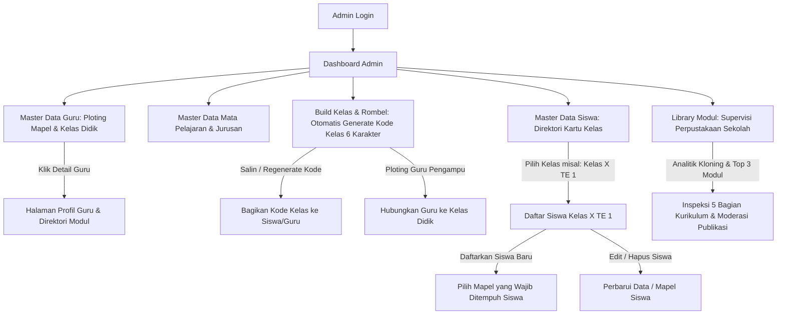
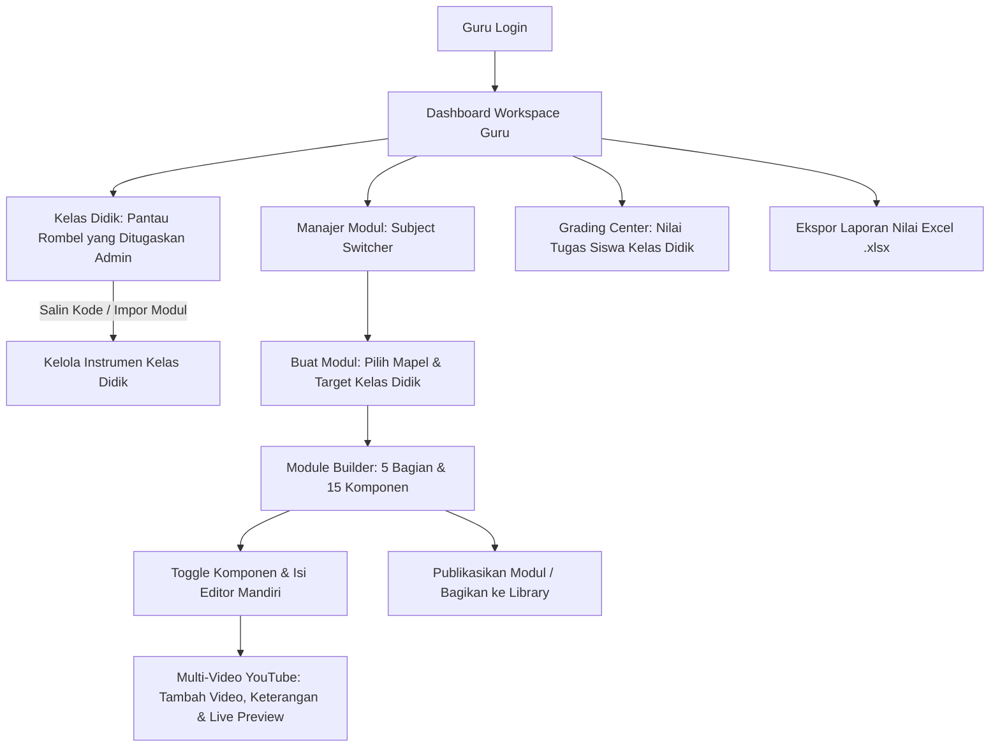
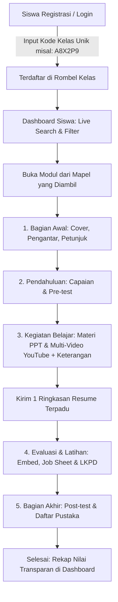
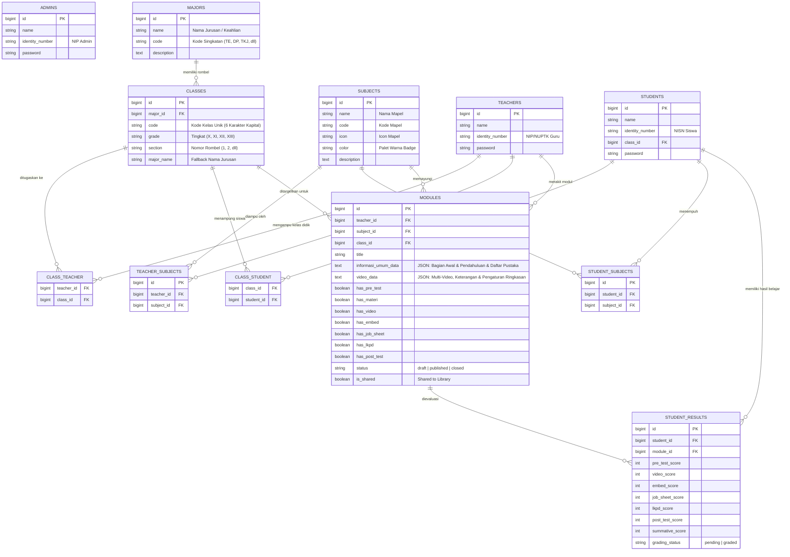

# PRD — Project Requirements Document “Pengembangan CMS E-Modul Berbasis Web dengan Laravel 11 untuk Pengelolaan Materi dan Evaluasi Pembelajaran di SMK Negeri 3 Yogyakarta” 

## 1. **Overview (Tinjauan Umum)**

### 1.1 Latar Belakang Proyek

Aplikasi ini merupakan platform _Content Management System_ (CMS) E-Modul berbasis web yang dirancang secara esensial untuk mendukung dan mengoptimalkan ekosistem pendidikan vokasi di **SMK Negeri 3 Yogyakarta**.

Pengembangan platform ini dilatarbelakangi oleh beberapa kondisi nyata dalam proses belajar mengajar di sekolah:

1. **Fragmentasi Instrumen & Media Pembelajaran:**  
   Penggunaan instrumen dan media pembelajaran sebelumnya masih terpisah-pisah di berbagai platform pihak ketiga. Sebagai contoh, guru menggunakan formulir daring (seperti Google Forms) untuk pelaksanaan _pre-test_, membagikan Lembar Kerja Peserta Didik (LKPD) berformat dokumen Word melalui tautan unduhan terpisah, serta menginstruksikan pengumpulan tugas melalui platform lain. Kerumitan berpindah-pindah tautan ini menyita banyak waktu efektif pembelajaran dan membingungkan siswa.

2. **Karakteristik Pembelajaran Sistem Blok & Ketiadaan Repositori Terpusat:**  
   Materi yang disampaikan di kelas sering kali tidak terdokumentasi dan tersimpan secara terpusat, sehingga menyulitkan siswa untuk melakukan pembelajaran mandiri atau mengulang materi (_review_). Kondisi ini menjadi semakin kritis mengingat alokasi waktu mata pelajaran tertentu (seperti Informatika atau Kejuruan Teknik) menerapkan sistem pembelajaran blok intensif—mencapai 8 jam pelajaran dalam satu hari dan diselesaikan dalam rentang waktu singkat (2 minggu / 14 hari). Siswa sangat rentan melupakan konsep dan keterampilan praktis yang telah dipelajari jika tidak memiliki akses modul digital yang terstruktur dan dapat diakses setiap saat.

3. **Beban Administrasi Guru dalam Monitoring & Evaluasi:**  
   Fragmentasi platform menyita waktu manajemen kelas dan menyulitkan pendidik dalam memantau rekam jejak kognitif maupun progres belajar siswa secara utuh. Proses rekapitulasi nilai menjadi tidak efisien karena guru harus membuka dan menggabungkan data dari berbagai aplikasi yang berbeda.

Berdasarkan permasalahan tersebut, platform E-Modul ini dibangun menggunakan kerangka kerja **Laravel 11** dengan sistem kontrol akses multi-peran (**Admin**, **Guru**, dan **Siswa**). Platform ini hadir sebagai solusi satu pintu (_one-stop solution_) yang mempermudah guru dalam menyusun materi terstruktur serta mengelola penilaian secara komprehensif, sekaligus memberikan pengalaman belajar yang terarah, interaktif, dan mudah diakses kapan saja oleh siswa.

---

### 1.2 Pernyataan Masalah (Problem Statement)

Pengembangan platform ini diinisiasi untuk memecahkan masalah utama (_pain points_) yang dialami oleh pemangku kepentingan di sekolah:

- **Kendala Guru:** Pengelolaan materi dan penilaian saat ini terpencar. Guru sering kali merasa dibatasi oleh _template_ modul digital yang kaku. Selain itu, seorang guru kejuruan sering kali mengampu lebih dari satu mata pelajaran sekaligus (misal: Informatika dan Teknik Elektro) dan memiliki beberapa rombongan belajar kelas tanggung jawab mengajar (**Kelas Didik**). Dibutuhkan sebuah sistem _builder_ yang modular, terstruktur sesuai 5 Bagian Utama E-Modul, mendukung integrasi multimedia multi-video YouTube, isolasi kelas didik yang bersih tanpa terganggu kelas lain di sekolah, dan dilengkapi *Subject Switcher* terintegrasi.
- **Kendala Siswa:** Siswa sering mengalami disorientasi jika materi disajikan dalam satu halaman panjang tak berujung (_scroll_ panjang) atau jika dashboard dipenuhi modul mata pelajaran yang tidak mereka tempuh. Siswa membutuhkan modul digital yang terbagi ke dalam tahapan sistematis (Bagian Awal, Pendahuluan, Kegiatan Belajar, Evaluasi & Latihan, hingga Bagian Akhir), pencarian & filter instan modul yang efisien di dashboard, tampilan modul yang disaring khusus berdasarkan mata pelajaran yang mereka ambil, pemutar video interaktif dengan daftar putar, kemudahan bergabung kelas via Kode Kelas unik, serta transparansi penilaian hasil belajar.
- **Kendala Manajemen Sekolah (Admin & Kurikulum):** Pihak kurikulum memerlukan panel administrasi terpadu untuk mengelola Master Data Pengguna (Guru & Siswa), Master Kurikulum (Mata Pelajaran & Jurusan/Konsentrasi Keahlian), **Sentralisasi Build Rombongan Belajar Kelas dengan Kode Kelas Unik Otomatis**, penugasan Kelas Didik & Mapel bagi guru, penentuan mata pelajaran yang wajib ditempuh siswa, serta supervisi mutu materi modul dari seluruh guru.

---

### 1.3 Tujuan Utama (Objectives)

Tujuan dari proyek ini adalah membangun portal E-Modul terpusat berbasis **Laravel 11** dengan sistem manajemen akses multi-peran (**Admin**, **Guru**, dan **Siswa**).

Sistem ini ditargetkan:
1. Memberikan fasilitas _E-Module Builder_ bagi guru untuk merakit materi secara terstruktur menjadi **5 Bagian Utama Standar E-Modul (13 Komponen Fleksibel)**:
   - **1. Bagian Awal (2 Komponen):** Kata pengantar serta petunjuk penggunaan e-modul bagi siswa dan guru (dikelola mandiri via `BagianAwalController`).
   - **2. Pendahuluan (4 Komponen):** Rumusan tujuan pembelajaran & capaian, peta konsep alur materi, glosarium istilah (dikelola via `PendahuluanController`), serta soal latihan diagnostik / Pre-test (`has_pre_test` dikelola via `PreTestController`).
   - **3. Kegiatan Belajar / Isi Materi (2 Komponen):** Uraian materi pembelajaran berbasis teks & slide PPT (`has_materi`), serta integrasi multimedia **Multi-Video YouTube & Keterangan Video dengan Satu Ringkasan Terpadu** (`has_video` dikelola via `VideoController`).
   - **4. Evaluasi & Latihan (3 Komponen):** Game edukasi interaktif & media embed simulator (`has_embed`), lembar kerja praktik / _Job Sheet_ PDF (`has_job_sheet`), serta tugas lembar kerja peserta didik & umpan balik / LKPD (`has_lkpd`).
   - **5. Bagian Akhir (2 Komponen):** Tes akhir modul / Post-test (`has_post_test`), dan daftar pustaka kepustakaan & rujukan (dikelola mandiri via `DaftarPustakaController`).
2. Menyediakan **Panel Administrasi Master Data & Build Kelas Terpadu** bagi Admin untuk mengelola akun guru, akun siswa per rombel kelas, master mata pelajaran, master jurusan / konsentrasi keahlian, serta membangun rombongan belajar kelas dengan **Generator Kode Unik Kelas Otomatis (6 Karakter Kapital)**.
3. Menyediakan **Sistem Penugasan Kelas Didik & Multi-Mapel Guru oleh Admin**: Admin memploting mata pelajaran yang diampu serta memilihkan rombel kelas yang menjadi tanggung jawab guru (`class_teacher`), sehingga ruang kerja guru hanya menampilkan kelas binaan yang relevan.
4. Mengimplementasikan **Antarmuka Master Data Siswa Berjenjang (Two-Tier Architecture)**: Halaman utama menampilkan direktori kartu rombel kelas (seperti *Kelas X TE 2*, *Kelas X PPLG 1*), diikuti dengan halaman khusus daftar siswa per kelas terpilih untuk mempermudah administrasi.
5. Menerapkan **Ploting Mata Pelajaran Siswa saat Registrasi**: Admin dapat menentukan mata pelajaran apa saja yang harus ditempuh oleh setiap siswa.
6. Menyediakan **Personalisasi Dashboard Siswa dengan Live Filter & Search Toolbar**: Dashboard siswa dilengkapi pencarian instan (Live Search), chip filter tingkat kelas, filter status penyelesaian (*To-Do / Completed*), kartu KPI progres belajar, dan navigasi modular per mata pelajaran yang ditempuh.
7. Menyediakan **Integrasi Multi-Video YouTube & Satu Ringkasan Terpadu**: Guru dapat menambahkan banyak video YouTube lengkap dengan judul, tautan URL, keterangan video khusus, dan tombol hapus individual. Siswa menyimak seluruh video melalui pemutar daftar putar (*playlist switcher*) interaktif dan menyusun **1 (satu) resume intisari terpadu**.
8. Menyediakan **Library Modul (Repositori Kolaboratif Antar-Guru)** untuk saling berbagi dan menduplikasi (*deep clone*) instrumen pembelajaran digital.
9. Memfasilitasi guru dengan **Grading Center Adaptif** dan **Ekspor Spreadsheet Excel (.xlsx)** yang dinamis menyesuaikan komponen aktif pada modul.
10. Mengintegrasikan **Manajemen Multi-Tanggung Jawab Guru**, memungkinkan seorang guru mengampu 2 atau lebih mata pelajaran dengan *Subject Switcher* pada seluruh menu guru.

---

### 1.4 Ruang Lingkup Proyek (Scope of Work)

Untuk fase rilis operasional, ruang lingkup aplikasi mencakup:

- **Multi-Guard Access:** Admin (Supervisi & Master Data), Guru (Pendidik & Kreator Modul), dan Siswa (Peserta Didik).
- **Sentralisasi Build Kelas di Admin:** Pembuatan, pengeditan, dan penghapusan rombel kelas dikelola terpusat oleh Admin dengan otomatisasi kode unik kelas.
- **Isolasi Kelas Didik Guru:** Guru hanya mengakses rombel kelas yang ditugaskan oleh Admin kepadanya.
- **Navigasi Siswa Bertahap (Stepper 5 Bagian):** Akses materi terstruktur dengan tombol navigasi bertahap.
- **Penilaian Hibrida & Grading Center:** Penilaian otomatis (Pre-test & Post-test) dan manual (Resume Video, Praktik Embed, Job Sheet, dan LKPD).
- **Ekspor Nilai Adaptif (.xlsx):** Pembangkit laporan spreadsheet Excel dinamis sesuai komponen aktif pada modul.

---

## 2. **Requirements (Kebutuhan Sistem)**

### 2.1 Manajemen Hak Akses Multi-Peran (Role-Based Access Control)

Sistem memisahkan wewenang dan tampilan antarmuka secara ketat berdasarkan tiga peran utama:

- **Admin (Supervisi, Kurikulum & Master Data):**
  - Mengelola Master Data Guru (registrasi, edit, hapus, plotting multi-mapel, serta penugasan kelas didik yang diampu).
  - Mengelola **Build Kelas & Rombongan Belajar** (pembuatan rombel tingkat X s/d XIII, nomor rombel, jurusan, **otomatis generate kode kelas unik 6 karakter**, tombol 1-click copy kode, acak ulang/regenerate kode kelas, dan ploting guru pengampu kelas).
  - Mengelola Master Data Siswa dengan navigasi berjenjang berbasis rombel kelas, pendaftaran siswa ke kelas tertentu, dan plotting mata pelajaran yang ditempuh.
  - Mengelola Master Data Mata Pelajaran (kode, warna badge, icon, deskripsi).
  - Mengelola Master Data Jurusan / Konsentrasi Keahlian (kode jurusan, nama keahlian).
  - Mengakses **Halaman Khusus Detail Guru & Direktori Modul (`/admin/teachers/{teacher}`)** untuk supervisi menyeluruh profil, kelas didik, dan portofolio modul guru.
  - Mengelola **Supervisi Perpustakaan Modul (Library Modul Overview - `/admin/library`)**: Meninjau modul-modul publik yang dibagikan guru, analitik jumlah kloning/adopsi guru lain, highlight Top 3 Modul Terfavorit, inspeksi 5 bagian kurikulum, riwayat pengadopsi, serta moderasi status berbagi.
  - Meninjau kelayakan konten modul (_Preview Mode_) dan memantau analitik sekolah.
- **Guru (Pendidik/Kreator Modul):**
  - Mengakses direktori **Kelas Didik** (rombel kelas yang ditugaskan oleh Admin) di bawah *Dashboard Workspace*.
  - Mengelola portofolio modul dengan *Subject Switcher*.
  - Merakit konten pada 5 Bagian Utama E-Modul (15 komponen terisolasi).
  - Menambahkan banyak video YouTube dengan keterangan khusus per video serta mengatur panduan ringkasan satu pintu.
  - Mengaktifkan/menonaktifkan komponen evaluasi via sakelar AJAX.
  - Melakukan simulasi pratinjau siswa dan membagikan modul ke Library Bersama.
  - Melakukan penilaian manual di Grading Center dan mengekspor rekapitulasi nilai ke Excel (.xlsx).
- **Siswa (Peserta Didik):**
  - Mengakses Dashboard belajar yang dipersonalisasi dengan Live Search & Multi-Grade Filter Toolbar.
  - Membuka katalog kelas dan modul berdasarkan mata pelajaran yang ditempuh.
  - Membaca E-Modul secara bertahap per bagian (5 Bagian).
  - Menonton video melalui playlist switcher, membaca keterangan video guru, dan mengumpulkan 1 ringkasan resume terpadu.
  - Mengerjakan pre-test/post-test, mengunggah screenshot praktik embed, serta file PDF Job Sheet & LKPD.
  - Melacak progres belajar dan transparansi perolehan nilai.

---

### 2.2 Sentralisasi Fitur Build Kelas & Otomatisasi Kode Kelas

1. **Pembuatan Kelas Terpusat di Admin (`/admin/classes`):**
   - Hak akses pembuatan (`create/store`) dan penghapusan (`destroy`) rombel kelas resmi berada 100% di bawah kendali Admin kurikulum.
   - Menu pada sidebar Admin dinamakan **"Build Kelas"**.
2. **Otomatisasi Generator Kode Kelas (Unique 6-Character Code):**
   - Saat Admin membuat kelas baru, sistem secara otomatis mengeksekusi `SchoolClass::generateUniqueCode()` yang menghasilkan kode alfanumerik kapital acak unik 6 karakter (contoh: `A8X2P9`).
   - Kode kelas ditampilkan pada baris tabel Master Data Kelas, dilengkapi tombol **Salin Kode (1-Click Copy)** dan fitur **Acak Ulang Kode (Regenerate Code)**.
   - Kode kelas digunakan siswa saat registrasi mandiri (`/register/student?code=XXXXXX`) untuk langsung terdaftar di rombel kelas yang sesuai.
3. **Ploting Guru Pengampu & Kelas Didik:**
   - Admin dapat memploting guru yang bertanggung jawab langsung pada modal form *Build Kelas Baru* dan *Edit Rombel Kelas*.
   - Sebaliknya, pada modal *Master Data Guru* (`/admin/teachers`), Admin juga dapat memilihkan rombel kelas didik yang diampu oleh setiap guru.

---

### 2.3 Isolasi Ruang Kerja Guru (Kelas Didik)

1. **Menu Sidebar Guru ("Kelas Didik"):**
   - Menu navigasi pada sidebar guru diubah dari *"Build Kelas"* menjadi **"Kelas Didik"**, diposisikan tepat di bawah *Dashboard Workspace*.
2. **Filter Terisolasi:**
   - Seluruh halaman kerja guru (**Dashboard Workspace**, **Kelas Didik**, **Pembuatan Modul Baru**, **Grading Center**, dan **Laporan Nilai**) terisolasi secara ketat sehingga **hanya menampilkan rombel kelas didik yang ditugaskan oleh Admin** kepada guru tersebut (`$teacher->classes()`).
   - Guru tidak dapat melihat data kelas lain di sekolah yang bukan kelas binaannya.
3. **Katalog Kelas Didik Guru (`/teacher/classes`):**
   - Menampilkan kartu kelas didik guru, kode gabung kelas untuk dibagikan ke siswa, direktori siswa di kelas tersebut, serta tombol impor modul dari kelas lain.

---

### 2.4 Arsitektur Antarmuka Master Data Siswa (Two-Tier Interface)

Untuk menjaga kerapian data pada skala sekolah kejuruan dengan puluhan rombongan belajar dan ribuan siswa:
- **Tingkat 1 (Direktori Rombel Kelas — `/admin/students`):** Menampilkan grid kartu informatif seluruh rombongan belajar kelas (contoh: *Kelas X TE 2*, *Kelas X PPLG 1*), metrik jumlah siswa per kelas, filter tingkat (X, XI, XII, XIII), filter jurusan, dan modal pendaftaran siswa baru secara global.
- **Tingkat 2 (Daftar Siswa Kelas — `/admin/students/class/{class}`):** Halaman khusus yang menampilkan tabel daftar siswa di kelas tersebut, status mata pelajaran yang diambil, tombol kembali (`← Daftar Kelas`), tombol "Daftarkan Siswa ke Kelas Ini", filter pencarian siswa, serta aksi edit & hapus siswa.

---

### 2.5 Personalisasi Portal Belajar Siswa

- **Live Search & Multi-Grade Filter Toolbar:** Siswa dapat mencari modul secara instan berdasarkan judul materi atau nama guru/mata pelajaran, memilih filter chip tingkat kelas (Semua Tingkat, X, XI, XII, XIII), serta menyaring status pengerjaan (*To-Do / Completed*) secara *real-time* berbasis Alpine.js tanpa reload halaman.
- **Filtering Berdasarkan Mata Pelajaran yang Ditempuh:** Siswa hanya melihat kartu mata pelajaran dan modul kelas yang sesuai dengan mata pelajaran yang ditentukan oleh Admin saat registrasi/edit siswa (`student_subjects`).
- **Sidebar Navigasi Siswa Dinamis:** Menu navigasi "Modul Belajar" pada sidebar siswa secara dinamis memuat daftar mata pelajaran yang diambil siswa melalui View Composer `AppServiceProvider`.
- **Proteksi Hak Akses Halaman Modul:** Jika siswa mencoba membuka modul dari mata pelajaran yang tidak ia tempuh (`/student/modules/subject/{subject}`), controller secara otomatis menolak akses dan mengembalikan siswa ke dashboard dengan pesan notifikasi.

---

### 2.6 Struktur 5 Bagian Utama E-Modul (Modular & Paginated System)

Materi E-Modul dikelompokkan ke dalam **5 Bagian Utama**:

```
┌───────────────────────────────────────────────────────────────────────────────────────────────────────┐
│                                       STRUKTUR 5 BAGIAN E-MODUL                                       │
├───────────────────────────────┬───────────────────────────────────────────────────────────────────────┤
│ 1. Bagian Awal                │ • Halaman Sampul (Cover)                                              │
│    (4 Komponen Pengantar)     │ • Kata Pengantar                                                      │
│                               │ • Daftar Isi                                                          │
│                               │ • Petunjuk Penggunaan bagi Siswa & Guru                               │
├───────────────────────────────┼───────────────────────────────────────────────────────────────────────┤
│ 2. Pendahuluan                │ • Tujuan Pembelajaran & Rumusan Capaian                               │
│    (4 Komponen Orientasi)     │ • Peta Konsep (Diagram Alur Materi)                                   │
│                               │ • Glosarium (Kata Kunci & Istilah Penting)                            │
│                               │ • Soal Latihan Diagnostik / Pre-test (has_pre_test)                   │
├───────────────────────────────┼───────────────────────────────────────────────────────────────────────┤
│ 3. Kegiatan Belajar           │ • Uraian Materi Pembelajaran & Slide PPT (has_materi)                 │
│    (2 Komponen Isi Materi)    │ • Multi-Video YouTube + Keterangan & 1 Resume Terpadu (has_video)      │
├───────────────────────────────┼───────────────────────────────────────────────────────────────────────┤
│ 4. Evaluasi & Latihan         │ • Game Edukasi Interaktif & Embed Simulator (has_embed)               │
│    (3 Komponen Praktik/Tugas) │ • Lembar Kerja Praktik / Job Sheet PDF (has_job_sheet)                │
│                               │ • Tugas LKPD & Umpan Balik / Feedback (has_lkpd)                      │
├───────────────────────────────┼───────────────────────────────────────────────────────────────────────┤
│ 5. Bagian Akhir               │ • Tes Akhir Modul / Post-test (has_post_test)                         │
│    (2 Komponen Penutup)       │ • Daftar Pustaka & Referensi Kepustakaan                              │
└───────────────────────────────┴───────────────────────────────────────────────────────────────────────┘
```

---

### 2.7 Fitur Multi-Video YouTube & Keterangan Video (Bagian 3.2)

1. **Multi-Video Card Repeater:**
   - Guru dapat menambahkan lebih dari satu video pembelajaran YouTube dalam satu modul.
   - Setiap kartu video dilengkapi input **Judul Video**, input **Tautan / URL YouTube**, dan input **Keterangan / Catatan Video (Opsional)**.
   - Dilengkapi tombol **"Hapus Video"** pada setiap kartu video untuk menghapus video tertentu dari daftar.
   - Live Embed Player secara otomatis mendeteksi URL YouTube dan menampilkan pemutar video secara langsung pada editor guru.
2. **Satu Ringkasan (Resume) Terpadu Siswa:**
   - Meskipun terdapat banyak video YouTube dalam satu modul, form ringkasan siswa **tetap 1 (satu)** untuk merangkum seluruh video tersebut.
   - Di sisi siswa, antarmuka Bagian 3.2 menyediakan **Playlist Tab Switcher** interaktif untuk berpindah video secara instan tanpa reload halaman, serta menampilkan keterangan video guru secara dinamis.
   - Batasan minimal karakter (*min summary characters*) dapat dikonfigurasi guru untuk menjamin kedalaman rangkuman siswa.
   - Siswa dapat membatalkan dan mengedit resume selama status penilaian masih *pending*.

---

### 2.8 Sistem Penilaian Adaptif & Laporan Excel (.XLSX)

- **Penilaian Adaptif:** Mesin penilaian (_Grading System_) beradaptasi secara dinamis dengan komponen evaluasi yang diaktifkan guru (Pre-test, Video Summary, Embed, Job Sheet, LKPD, Post-test).
- **Kebijakan Unggah Ulang (Re-submission):** Siswa diizinkan membatalkan dan mengunggah ulang tugas selama status penilaian masih `pending`. Jika sudah dinilai (`graded`), form terkunci otomatis.
- **Ekspor Spreadsheet Excel (.xlsx):** Sistem mengagregasi seluruh komponen nilai aktif beserta data siswa ke dalam format `.xlsx` yang kolomnya menyesuaikan komponen modul secara dinamis.

---

## 3. **Core Features (Fitur Utama)**

### 3.1 Dashboard & Panel Administrasi (Admin Workspace)

Pusat kendali operasional sekolah:
- **Statistik & Supervisi Dashboard (`/admin/dashboard`):** Menampilkan metrik total guru, siswa, kelas, jurusan, mapel, modul terbit, dan modul perpustakaan.
- **Master Data Guru (`/admin/teachers`):** Pengelolaan akun guru, penetapan mata pelajaran yang diampu (multi-mapel), serta pemilihan **Kelas Didik (Tanggung Jawab Mengajar)**.
- **Build Kelas & Rombel (`/admin/classes`):**
  - Pembuatan rombel kelas baru (Tingkat X, XI, XII, XIII, Nomor Rombel, dan Jurusan).
  - **Otomatisasi Generator Kode Kelas Unik (6 Karakter Kapital)**.
  - Tombol Salin Kode Kelas & Tombol Regenerate Kode Kelas.
  - Penugasan guru pengampu kelas langsung pada modal build/edit kelas.
- **Master Data Siswa (`/admin/students`):**
  - Direktori kartu rombel kelas dengan ringkasan jumlah siswa dan modul.
  - Halaman khusus daftar siswa per kelas (`/admin/students/class/{class}`).
  - Pendaftaran siswa baru lengkap dengan penentuan mata pelajaran yang harus ditempuh siswa.
- **Master Data Mata Pelajaran (`/admin/subjects`):** Manajemen nama mapel, kode singkatan, icon, dan palet warna badge.
- **Master Data Jurusan (`/admin/majors`):** Manajemen konsentrasi keahlian (PPLG, TE, TITL, TKR, dll).
- **Standardized Modals:** Seluruh modal formulir terstandarisasi (`max-w-lg` untuk create/edit, `max-w-sm` untuk konfirmasi hapus).

---

### 3.2 Dashboard & Workspace Guru (Teacher Portal)

- **Manajer Modul (`/teacher/modules`):** Menampilkan daftar modul dengan *Subject Switcher*, badge mapel, dan progress pengumpulan tugas siswa.
- **Form Pembuatan Modul Baru:** Pilihan mata pelajaran (dengan penanda mapel yang diampu), judul modul, dan **target kelas yang hanya mencakup Kelas Didik guru**.
- **E-Module Detail & Builder (5 Bagian):** Antarmuka terstruktur 5 Bagian Utama E-Modul dengan progress kesiapan komponen dan sakelar AJAX.
- **Dedicated Modular Component Editors:** Editor mandiri untuk Bagian Awal, Pendahuluan, Pre-test, Materi & PPT, Video YouTube (Multi-Video), Embed Praktik, Job Sheet PDF, Tugas LKPD, Post-test, dan Daftar Pustaka.
- **Grading Center (`/teacher/grading`):** Panel penilaian tugas siswa dengan filter mata pelajaran dan matriks nilai adaptif (hanya memuat kelas didik guru).
- **Library Modul (`/teacher/library`):** Repositori publik antar-guru untuk berbagi dan menduplikasi (*deep clone*) modul pembelajaran.
- **Laporan Nilai (`/teacher/reports`):** Rekapitulasi nilai dan ekspor spreadsheet Excel (.xlsx) per kelas didik.
- **Katalog Kelas Didik (`/teacher/classes`):** Pemantauan rombel kelas didik yang ditugaskan oleh Admin, kode kelas, direktori siswa, dan fitur salin modul antar kelas didik.

---

### 3.3 Dashboard & Portal Belajar Siswa (Student Portal)

- **Personalisasi Dashboard (`/student/dashboard`):** Menampilkan ringkasan KPI belajar, Live Search & Filter Toolbar, kartu mata pelajaran yang ditempuh, serta modul yang ditugaskan per mata pelajaran.
- **Navigasi Sidebar Dinamis:** Daftar sub-menu mata pelajaran disaring hanya untuk mata pelajaran yang diambil siswa.
- **Halaman Modul per Mapel (`/student/modules/subject/{subject}`):** Katalog modul khusus untuk mata pelajaran terpilih lengkap dengan batasan 3 modul terbaru/baru dibuka dan filter status (*To-Do / Completed*).
- **Direktori Modul Kelas (`/student/classes/{class}` & `/student/classes/{class}/subjects/{subject}/modules`):** Akses hierarkis materi modul kelas yang terdaftar.
- **Antarmuka Belajar Interaktif Sekuensial Berstruktur Modular Partials (LMS Step-by-Step Learning Path):** Arsitektur view modular dengan 19 sub-komponen terpisah di bawah `partials/` untuk menjamin performa render yang ringan dan cepat. Panel silabus interaktif berbasis Accordion 5 Bagian di sebelah kiri dan lembar kerja aktivitas mandiri di sebelah kanan dengan progres sekuensial terproteksi (*progressive locked steps*).

---

## 4. **User Flow (Alur Pengguna)**

### 4.1 Alur Admin (Supervisi, Build Kelas & Registrasi Siswa)



---

### 4.2 Alur Guru (Perancangan Modul & Penilaian)



---

### 4.3 Alur Siswa (Belajar Bertahap per Mapel)



---

## 5. **Architecture (Arsitektur Sistem)**

### 5.1 Pendekatan Monolithic MVC

Platform ini dibangun menggunakan arsitektur **Monolithic MVC (Model-View-Controller)** berbasis **Laravel 11** yang menggabungkan frontend dan backend dalam satu repositori yang efisien, mudah dirawat, dan berkinerja tinggi.

### 5.2 Multi-Guard Authentication

Sistem menerapkan **Multi-Guard Authentication**:
- **Admin Guard (`auth:admin`):** Akses dasbor supervisi & master data melalui tabel `ADMINS`.
- **Teacher Guard (`auth:teacher`):** Akses workspace perancangan modul & penilaian melalui tabel `TEACHERS`.
- **Student Guard (`auth:student`):** Akses portal belajar siswa melalui tabel `STUDENTS`.

### 5.3 Pemetaan Model & Relasi Basis Data

- **Model `Student`**:
  - Relasi `belongsTo(SchoolClass::class, 'class_id')`.
  - Relasi `belongsToMany(Subject::class, 'student_subjects')` untuk memetakan mata pelajaran yang ditempuh siswa.
  - Relasi `belongsToMany(SchoolClass::class, 'class_student')`.
  - Helper `subjectNames(): string`.
- **Model `Teacher`**:
  - Relasi `belongsToMany(Subject::class, 'teacher_subjects')` untuk mendukung multi-mapel.
  - Relasi `belongsToMany(SchoolClass::class, 'class_teacher')` untuk memetakan **Kelas Didik**.
  - Helper `subjectNames(): string` dan `assignedClasses(?int $subjectId)`.
- **Model `Subject`**:
  - Relasi `belongsToMany(Teacher::class, 'teacher_subjects')`.
  - Relasi `belongsToMany(Student::class, 'student_subjects')`.
  - Relasi `hasMany(Module::class, 'subject_id')`.
  - Helper visual: `badgeClasses()`, `softBgColor()`, `textColor()`.
- **Model `SchoolClass`**:
  - Relasi `belongsTo(Major::class, 'major_id')`.
  - Relasi `belongsToMany(Teacher::class, 'class_teacher')`.
  - Relasi `belongsToMany(Student::class, 'class_student')`.
  - Relasi `hasMany(Module::class, 'class_id')`.
  - Kolom `code` unik dengan auto-generation via `booted()` event.
  - Accessor `full_name` (misal: `"Kelas X TE 1"`) dan `short_name` (misal: `"X TE 1"`).
  - Helper `regenerateCode(): string`.
- **Model `Major`**:
  - Relasi `hasMany(SchoolClass::class, 'major_id')`.
- **Model `Module`**:
  - Relasi `belongsTo(Teacher::class)`, `belongsTo(Subject::class)`, `belongsTo(SchoolClass::class, 'class_id')`.
  - Helper Multi-Video: `videosList()`, `totalVideosCount()`, `videoTitle()`, `youtubeId()`, `youtubeEmbedUrl()`.
  - Helper 5 Bagian: `moduleSectionsSummary()`, `bagianAwalComponents()`, `pendahuluanComponents()`, `kegiatanBelajarComponents()`, `evaluasiLatihanComponents()`, `bagianAkhirComponents()`.

---

## 6. **Database Schema (Skema Basis Data)**

### 6.1 Entity Relationship Diagram (ERD)



---

### 6.2 Data Dictionary Struktur Data Video (`video_data` JSON)

```json
{
  "video_title": "Video Pembelajaran: Topik Modul",
  "videos": [
    {
      "title": "Video 1: Pengenalan Konsep & Teori Dasar",
      "url": "https://www.youtube.com/watch?v=dQw4w9WgXcQ",
      "id": "dQw4w9WgXcQ",
      "description": "Keterangan petunjuk khusus menyimak materi video pertama."
    },
    {
      "title": "Video 2: Prosedur Praktik & Langkah Kerja Mandiri",
      "url": "https://www.youtube.com/watch?v=HXV3zeQKqGY",
      "id": "HXV3zeQKqGY",
      "description": "Perhatikan keselamatan kerja dan tahapan instalasi."
    }
  ],
  "instructions": "Simak seluruh video pembelajaran di atas dan susun 1 ringkasan terpadu.",
  "guiding_questions": [
    "Apa konsep utama yang dijelaskan dalam video?",
    "Sebutkan tahapan prosedur kerja krusial!"
  ],
  "min_summary_chars": 100,
  "min_summary_words": 20,
  "youtube_url": "https://www.youtube.com/watch?v=dQw4w9WgXcQ",
  "youtube_id": "dQw4w9WgXcQ"
}
```

---

## 7. **Tech Stack (Teknologi yang Digunakan)**

### 7.1 Backend & Arsitektur
- **Framework:** Laravel 11 (PHP 8.2+) dengan arsitektur Monolithic MVC.
- **Autentikasi:** Laravel Multi-Guard Authentication (`admin`, `teacher`, `student`).
- **ORM & Database Engine:** Eloquent ORM pada MySQL / MariaDB dengan dukungan tipe data JSON dan relasi *Many-to-Many* (`class_teacher`, `teacher_subjects`, `student_subjects`, `class_student`).

### 7.2 Frontend & UI
- **Templating:** Blade Templating Engine dengan arsitektur sub-komponen modular (`partials/`).
- **Styling:** Tailwind CSS dengan estetika visual modern, micro-animation, palet warna berharmonisasi, dan *responsive layout*.
- **Interaktivitas:** Alpine.js untuk manajemen state modal dialog, 1-click clipboard copier, live search, playlist video switcher, dan form dinamis, serta AJAX handler untuk toggle switch builder.
- **Asset Bundler:** Vite 7.

### 7.3 Penyimpanan Berkas & Pelaporan
- **File Storage:** Laravel Storage Symlink dengan validasi MIME-type (Screenshot, PDF Job Sheet / LKPD, Cover Modul).
- **Spreadsheet / Excel Reporting:** `maatwebsite/excel` untuk ekspor laporan rekapitulasi nilai dinamis (.xlsx).

---

## 8. **Project Folder Structure (Struktur Direktori Proyek)**

```
e-modul/
├── app/
│   ├── Exports/                                # Export handler spreadsheet / Excel
│   │   └── ModuleGradesExport.php              # Format kolom adaptif & laporan Excel (.xlsx)
│   ├── Http/
│   │   ├── Controllers/
│   │   │   ├── AuthController.php              # Multi-guard authentication (Admin, Teacher, Student)
│   │   │   ├── Controller.php                  # Base Controller
│   │   │   ├── Admin/                          # Admin Management & Supervision Controllers
│   │   │   │   ├── AdminDashboardController.php # Dasbor Supervisi & Statistik Sekolah
│   │   │   │   ├── TeacherController.php       # Master Data Guru, Multi-Mapel & Ploting Kelas Didik
│   │   │   │   ├── StudentController.php       # Master Data Siswa (Direktori Kelas & Siswa per Kelas)
│   │   │   │   ├── SubjectController.php       # Master Data Mata Pelajaran
│   │   │   │   ├── MajorController.php         # Master Data Jurusan / Konsentrasi Keahlian
│   │   │   │   └── ClassController.php         # Build Kelas, Generator Kode Unik & Regenerate Code
│   │   │   ├── Student/                        # Student Portal Controllers
│   │   │   │   ├── DashboardController.php     # Dashboard Siswa (Personalized Subject, Live Search & Filter)
│   │   │   │   └── ModuleController.php        # Halaman Modul per Mapel & Pembelajaran 5 Bagian
│   │   │   └── Teacher/                        # Dedicated Workspace & Modular Component Editors
│   │   │       ├── BagianAwalController.php    # Editor Bagian 1 (Cover, Kata Pengantar, Petunjuk Penggunaan)
│   │   │       ├── PendahuluanController.php   # Editor Bagian 2 (Tujuan Pembelajaran, Peta Konsep, Glosarium)
│   │   │       ├── PreTestController.php       # Editor Pre-test (Kuis Diagnostik & Builder Soal)
│   │   │       ├── MateriController.php        # Editor Materi Pembelajaran & Upload PPT
│   │   │       ├── VideoController.php         # Editor Multi-Video YouTube, Keterangan & Pengaturan Resume
│   │   │       ├── EmbedController.php         # Editor Simulator Embed & Praktik Interaktif
│   │   │       ├── JobSheetController.php      # Editor Lembar Kerja Praktik (Job Sheet PDF)
│   │   │       ├── LkpdController.php          # Editor Lembar Kerja Peserta Didik (LKPD PDF)
│   │   │       ├── PostTestController.php      # Editor Post-test (Evaluasi Akhir Modul & Builder Soal)
│   │   │       ├── DaftarPustakaController.php # Editor Bagian 5 (Daftar Pustaka & Referensi Rujukan)
│   │   │       ├── DashboardController.php     # Dasbor Workspace Guru (Quick Actions, Live Queue)
│   │   │       ├── GradingController.php       # Matriks Penilaian Adaptif & Rekapitulasi Nilai Siswa
│   │   │       ├── ModuleLibraryController.php # Perpustakaan Modul Bersama & Kloning Kurikulum
│   │   │       ├── ReportController.php        # Ekspor & Laporan Rekap Nilai Excel (.xlsx)
│   │   │       ├── ClassController.php         # Manajemen Kelas Didik Guru & Direktori Akademik Siswa
│   │   │       └── ModuleManagerController.php # Manajer Modul (CRUD, Publish, Close, Subject Switcher)
│   │   └── Middleware/
│   │       └── Authenticate.php                # Multi-guard authentication middleware handler
│   ├── Models/
│   │   ├── Admin.php                           # Model entitas Administrator
│   │   ├── Teacher.php                         # Model entitas Guru (Multi-Mapel & Kelas Didik)
│   │   ├── Student.php                         # Model entitas Siswa (Mapel via student_subjects)
│   │   ├── Subject.php                         # Model entitas Master Mata Pelajaran (Mapel)
│   │   ├── Major.php                           # Model entitas Jurusan / Konsentrasi Keahlian
│   │   ├── SchoolClass.php                     # Model entitas Rombel Kelas, Auto Code & Relasi Major
│   │   ├── Module.php                          # Model E-Modul Sentral, Helper 5 Bagian & Multi-Video List
│   │   ├── PreTest.php                         # Model konfigurasi Pre-test
│   │   ├── PreTestQuestion.php                 # Model butir soal Pre-test
│   │   ├── PostTest.php                        # Model konfigurasi Post-test
│   │   ├── PostTestQuestion.php                # Model butir soal Post-test
│   │   ├── JobSheet.php                        # Model instrumen Job Sheet
│   │   ├── JobSheetSubmission.php              # Model tugas pengumpulan Job Sheet siswa
│   │   ├── Lkpd.php                            # Model instrumen LKPD
│   │   ├── Submission.php                      # Model tugas pengumpulan LKPD siswa
│   │   ├── EmbedSubmission.php                 # Model bukti tangkapan layar praktik embed
│   │   ├── VideoSummary.php                    # Model teks satu ringkasan resume terpadu video
│   │   └── StudentResult.php                   # Model agregasi nilai adaptif per siswa
│   └── Providers/
│       └── AppServiceProvider.php              # View Composer untuk filter dinamis sidebar siswa
├── database/
│   ├── factories/                              # Database model factories
│   ├── migrations/                             # Migration skema tabel basis data
│   └── seeders/
│       └── DatabaseSeeder.php                  # Data awal pengguna, kelas, mapel, jurusan, dan modul demo
├── resources/
│   ├── views/
│   │   ├── layouts/
│   │   │   ├── admin/                          # Layout master dasbor admin
│   │   │   ├── teacher/                        # Layout master workspace guru
│   │   │   └── student/                        # Layout master portal belajar siswa (dengan View Composer)
│   │   └── pages/
│   │       ├── admin/
│   │       │   ├── dashboard.blade.php         # Dasbor supervisi admin
│   │       │   ├── teachers/index.blade.php    # Master data & pendaftaran guru (multi-mapel & kelas didik)
│   │       │   ├── students/
│   │       │   │   ├── index.blade.php         # Master data siswa (Direktori Kartu Rombel Kelas)
│   │       │   │   └── class.blade.php         # Master data siswa (Daftar Siswa per Kelas Terpilih)
│   │       │   ├── subjects/index.blade.php    # Master data mata pelajaran
│   │       │   ├── majors/index.blade.php      # Master data jurusan / keahlian
│   │       │   └── classes/index.blade.php     # Build kelas, generator kode unik & ploting guru
│   │       ├── student/
│   │       │   ├── dashboard.blade.php         # Portal belajar siswa (Live Search & Multi-Grade Toolbar)
│   │       │   ├── classes/
│   │       │   │   ├── show.blade.php          # Direktori mapel kelas siswa
│   │       │   │   └── subject_modules.blade.php # Daftar modul mapel kelas siswa
│   │       │   └── modules/
│   │       │       ├── index.blade.php         # Katalog modul siswa
│   │       │       ├── subject.blade.php       # Modul belajar per mata pelajaran
│   │       │       ├── show.blade.php          # Pembelajaran interaktif 5 bagian orchestrator
│   │       │       └── partials/               # 19 modul parsial antarmuka pembelajaran interaktif
│   │       └── teacher/
│   │           ├── dashboard.blade.php         # Dashboard Workspace Guru (Khusus Kelas Didik)
│   │           ├── library/                    # Katalog perpustakaan modul bersama
│   │           ├── classes/                    # Manajemen kelas didik guru & direktori siswa
│   │           ├── grading/                    # Pusat penilaian Grading Center (Khusus Kelas Didik)
│   │           ├── modules/                    # Manajer & Builder modul pembelajaran 5 bagian
│   │           │   ├── video.blade.php         # Editor Multi-Video YouTube, Keterangan & Resume
│   │           │   └── preview-video.blade.php # Simulasi Playlist Multi-Video & Resume Siswa
│   │           └── reports/                    # Laporan & ekspor spreadsheet Excel (.xlsx)
│   └── routes/
│       ├── web.php                             # Rute aplikasi lengkap (Admin, Guru, Siswa)
│       └── console.php                         # Rute perintah artisan CLI
├── tests/
│   └── Feature/
│       ├── AdminCurriculumManagementTest.php   # Pengujian kurikulum, mapel, jurusan & build kelas
│       ├── AdminUserManagementTest.php         # Pengujian CRUD guru, siswa, rombel, mapel
│       ├── StudentDashboardTest.php            # Pengujian dashboard, live filter, search & status
│       ├── StudentModuleTest.php               # Pengujian akses modul & proteksi mapel
│       ├── StudentInteractiveLearningTest.php  # Pengujian pembelajaran interaktif & submit tugas
│       ├── TeacherVideoManagementTest.php      # Pengujian Multi-Video, Keterangan & Satu Resume
│       ├── TeacherClassTest.php                # Pengujian kelas didik & penugasan admin
│       ├── BagianAwalTest.php                  # Pengujian editor Bagian Awal
│       ├── PendahuluanTest.php                 # Pengujian editor Pendahuluan
│       ├── DaftarPustakaTest.php               # Pengujian editor Daftar Pustaka
│       ├── ModuleShowInterfaceTest.php         # Pengujian antarmuka 5 bagian modul
│       ├── GradingCenterTest.php               # Pengujian matriks adaptif Grading Center
│       ├── ExcelReportTest.php                 # Pengujian ekspor spreadsheet Excel (.xlsx)
│       ├── ModuleLibraryTest.php               # Pengujian repositori bersama & kloning
│       └── TeacherDashboardTest.php            # Pengujian workspace terpadu & metrik dinamis
└── prd.md                                      # Dokumen Spesifikasi Kebutuhan Proyek (PRD)
```
