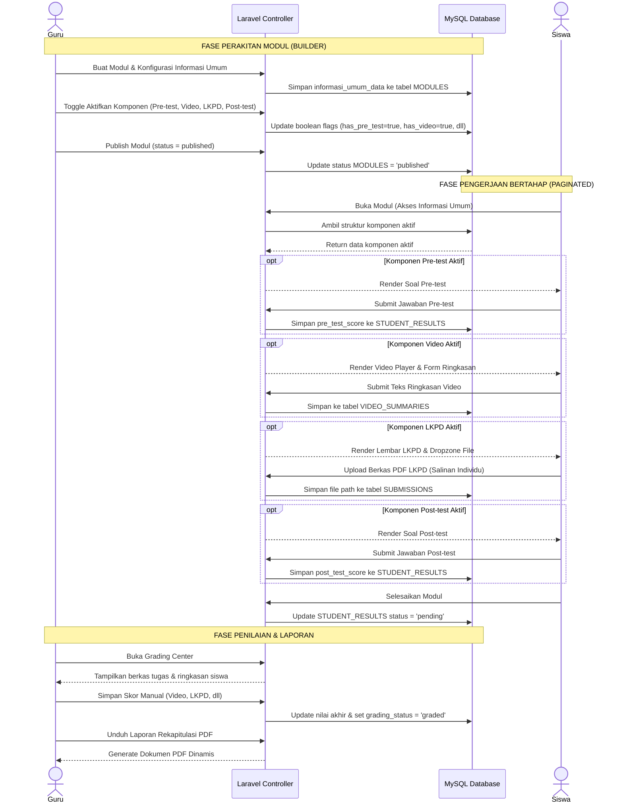
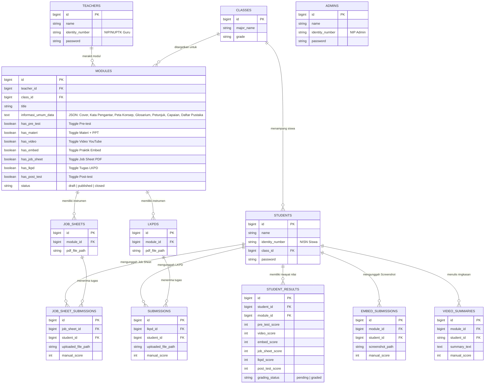

# PRD — Project Requirements Document (Versi E-Modul Modular & Terbagi Halaman)

## 1. **Overview (Tinjauan Umum)**

### 1.1 Latar Belakang Proyek

Aplikasi ini merupakan sebuah platform _Content Management System_ (CMS) E-Modul interaktif berbasis web yang dirancang secara esensial untuk mendukung ekosistem pendidikan vokasi di **SMK Negeri 3 Yogyakarta**. Secara infrastruktur, sekolah ini memiliki area fisik yang sangat luas, mencapai kurang lebih 4 hektar, dan telah difasilitasi dengan pemerataan akses internet nirkabel melalui program Wi-Fi Kominfo.

Potensi infrastruktur digital yang mumpuni ini membuka peluang besar untuk mendigitalkan proses belajar mengajar. Metode konvensional atau penggunaan modul statis (seperti PDF standar) sudah tidak lagi relevan dengan kebutuhan siswa kejuruan. Diperlukan sebuah wadah digital terpusat yang interaktif, di mana materi dapat disajikan secara terstruktur (halaman demi halaman) namun tetap fleksibel menyesuaikan gaya mengajar tiap guru.

### 1.2 Pernyataan Masalah (Problem Statement)

Pengembangan platform ini diinisiasi untuk memecahkan masalah utama (_pain points_) yang dialami oleh pemangku kepentingan di sekolah:

- **Kendala Guru:** Pengelolaan materi dan penilaian saat ini terpencar. Selain itu, guru sering kali merasa dibatasi oleh _template_ modul digital yang kaku. Terkadang guru hanya ingin memberikan materi saja tanpa kuis, atau sebaliknya. Dibutuhkan sebuah sistem _builder_ yang modular (bebas diatur).
- **Kendala Siswa:** Siswa sering mengalami disorientasi jika disuguhkan materi panjang dalam satu halaman penuh (_scroll_ panjang). Siswa membutuhkan modul digital yang terbagi ke dalam halaman-halaman sistematis (Informasi Umum dan alur Komponen Inti terarah) beserta transparansi penilaian di akhir pembelajaran.
- **Kendala Manajemen Sekolah:** Pihak kurikulum tidak memiliki akses terpusat untuk memantau kinerja guru dan kelayakan materi pembelajaran secara _real-time_.

### 1.3 Tujuan Utama (Objectives)

Tujuan dari proyek ini adalah membangun portal E-Modul terpusat berbasis **Laravel** dengan sistem manajemen akses multi-peran (Admin, Guru, dan Siswa).

Sistem ini ditargetkan untuk:

1. Memberikan fasilitas _E-Module Builder_ bagi guru untuk merakit materi secara terstruktur menjadi 2 bagian utama:
   - **Informasi Umum (Mandatori):** Berisi Cover Modul, Kata Pengantar, Daftar Isi, Peta Konsep, Glosarium, Petunjuk Penggunaan, Tujuan Pembelajaran, serta Daftar Pustaka & Referensi (tersimpan dalam `informasi_umum_data`).
   - **Komponen Inti (7 Toggle Opsional):** Guru bebas menghidupkan/mematikan 7 komponen kegiatan belajar yang dikelompokkan dalam alur belajar terstruktur:
     - *Bagian Awal:* 1. _Pre-test_ (Kuis Diagnostik Awal).
     - *Bagian Inti:* 2. Materi + PPT, 3. Video YouTube & Ringkasan, 4. Praktik Interaktif (_Embed Code_).
     - *Bagian Akhir:* 5. Lembar Praktikum (_Job Sheet_ PDF), 6. Tugas LKPD (Studi Kasus Kelompok), 7. _Post-test_ (Kuis Evaluasi Akhir).
2. Menyediakan _Dashboard Personal_ bagi siswa untuk membaca E-Modul layaknya buku digital interaktif, melacak progres belajar, dan melihat transparansi nilai.
3. Memungkinkan sekolah mengekspor seluruh hasil belajar siswa ke dalam satu dokumen laporan (PDF) yang kolomnya otomatis menyesuaikan dengan komponen yang diaktifkan oleh guru.

### 1.4 Ruang Lingkup Proyek (Scope of Work)

Untuk fase peluncuran awal (MVP), ruang lingkup aplikasi dibatasi pada:

- Pengembangan antarmuka untuk 3 peran: Admin, Guru, dan Siswa.
- Pembuatan **Dynamic E-Module Builder** dengan arsitektur 2 panel konfigurasi (Informasi Umum & Komponen Inti 7 Toggle Opsional).
- Sistem navigasi siswa yang berbasis _Pagination_ (Halaman Sebelumnya / Halaman Selanjutnya) agar siswa membaca materi secara bertahap dan terarah.
- Penilaian hibrida: Otomatis (untuk soal pilihan ganda Pre-test & Post-test) dan manual (untuk ringkasan video, bukti _screenshot_ praktik interaktif, serta berkas tugas LKPD dan _Job Sheet_), yang seluruhnya beradaptasi dengan komponen yang diaktifkan oleh guru.

---

## 2. **Requirements (Kebutuhan Sistem)**

Bagian ini mendefinisikan kebutuhan fungsional dan aturan bisnis yang harus dipenuhi oleh platform E-Modul agar dapat berjalan sesuai dengan tujuan ekosistem pembelajaran di SMK Negeri 3 Yogyakarta.

### 2.1 Manajemen Hak Akses Multi-Peran (Role-Based Access Control)

Sistem harus memisahkan wewenang dan tampilan antarmuka secara ketat berdasarkan tiga peran utama pengguna:

- **Admin (Supervisi/Kurikulum):** Memiliki hak istimewa (_privilege_) tertinggi untuk mengelola _Master Data_ pengguna (Akun Guru dan Siswa), manajemen kelas & jurusan, meninjau kelayakan konten modul (_Preview Mode_), dan memantau analitik produktivitas dari seluruh guru.
- **Guru (Pendidik/Kreator):** Memiliki hak penuh atas perakitan modul melalui _Module Builder_. Guru dapat membuat konten, menghidupkan/mematikan fitur opsional di dalam modul, melakukan simulasi pratinjau siswa, dan memberikan penilaian manual terhadap tugas siswa di _Grading Center_.
- **Siswa (Pengguna Modul):** Memiliki hak akses terbatas yang difokuskan pada konsumsi materi secara bertahap (per halaman), pengunggahan tugas, pengerjaan kuis, dan pelacakan riwayat nilai.

### 2.2 Transparansi Dasbor dan Manajemen Portofolio

- **Transparansi Belajar Siswa:** Halaman dasbor siswa memisahkan status modul menjadi _Active/To-Do_ (Tugas Aktif) dan _Completed_ (Riwayat Selesai). Untuk E-Modul di tab _Completed_, sistem menampilkan rincian nilai akhir siswa secara transparan sesuai komponen yang aktif.
- **Manajemen Portofolio Guru:** Dasbor guru dilengkapi dengan halaman "Manajer Modul" untuk melihat riwayat seluruh modul yang pernah dirakit, status publikasinya (_Draft/Published/Closed_), dan memantau persentase pengumpulan tugas siswa secara _real-time_.

### 2.3 Struktur E-Modul Berbasis Halaman (Paginated System)

Untuk menghindari disorientasi akibat _scroll_ yang terlalu panjang, materi di dalam E-Modul tidak ditampilkan dalam satu halaman penuh, melainkan dipecah menjadi bagian-bagian terstruktur:

- **Informasi Umum (Pendahuluan & Kelengkapan):** Menjadi gerbang awal yang dilihat siswa untuk persiapan belajar. Guru diwajibkan (Mandatori) untuk mengisi elemen: Halaman Sampul (_Cover_), Kata Pengantar, Daftar Isi (_Hyperlink_), Peta Konsep, Glosarium, Petunjuk Penggunaan Modul, Tujuan Pembelajaran, serta Daftar Pustaka & Referensi.
- **Komponen Inti (Kegiatan Belajar Berjenjang):** Merupakan substansi pembelajaran yang disajikan per tahapan aktivitas. Komponen di bagian ini bersifat **sepenuhnya opsional (7 Toggle)** dan dikendalikan secara fleksibel oleh guru.

### 2.4 Dinamika Komponen Inti (7 Fitur Opsional) & Alur Belajar

Guru diberikan kebebasan mutlak (_Toggle System_) untuk menghidupkan atau mematikan 7 komponen di Komponen Inti. Siswa hanya akan melihat halaman yang diaktifkan oleh guru, dengan aturan navigasi yang mengikat (tidak bisa melompat ke halaman selanjutnya sebelum instruksi di halaman saat ini selesai). 

Ketujuh komponen opsional tersebut terbagi dalam 3 sub-tahap alur belajar:

#### A. Bagian Awal (Apersepsi)
1. **Pre-test:** Kuis awal pembuka kegiatan belajar untuk mengukur pemahaman awal (*diagnostic assessment*).

#### B. Bagian Inti (Eksplorasi Materi & Praktik)
2. **Materi + PPT:** Uraian konsep materi pembelajaran (_Rich Text_) beserta sematan slide presentasi.
3. **Video & Ringkasan:** Integrasi YouTube. Jika diaktifkan, sistem mewajibkan siswa mengisi kolom teks "Ringkasan Video" sebelum dapat melanjutkan ke halaman berikutnya.
4. **Praktik Interaktif:** Media simulasi interaktif (_Embed Code_ HTML/CSS/JS). Jika diaktifkan, sistem memfasilitasi form unggah gambar untuk bukti eksekusi praktik. **(Batasan: JPG/PNG, Maksimal 2 MB)**.

#### C. Bagian Akhir (Aplikasi & Evaluasi)
5. **Lembar Praktikum (Job Sheet):** Lembar kerja teknis mandiri berformat PDF beserta area unggah hasil pengerjaan. **(Batasan: PDF, Maksimal 5 MB)**.
6. **Tugas LKPD (Kerjasama Kelompok):** Penugasan studi kasus kelompok. Meskipun dikerjakan berkelompok, **setiap siswa wajib mengunggah salinan berkas hasil diskusi secara individu** ke akun masing-masing agar nilai tercatat personal. **(Batasan: PDF, Maksimal 5 MB)**.
7. **Post-test:** Kuis evaluasi formatif penutup kegiatan belajar untuk mengukur capaian pemahaman akhir siswa.

### 2.5 Sistem Penilaian Adaptif, Laporan, & Kebijakan Revisi

- **Penilaian Adaptif:** Mesin penilaian (_Grading System_) beradaptasi dengan komponen yang diaktifkan guru pada Komponen Inti (Pre-test, Video, Embed, Job Sheet, LKPD, Post-test). Sistem menggunakan kombinasi penilaian otomatis (kuis) dan manual (berkas tugas/screenshot/ringkasan teks).
- **Kebijakan Unggah Ulang (Re-submission):** Siswa diizinkan membatalkan dan mengunggah ulang file _Job Sheet_, LKPD, atau _Screenshot_ Praktik **hanya jika** guru belum memberikan nilai (status di database masih `pending`). Jika guru sudah menilainya (status `graded`), form unggah terkunci otomatis.
- **Pembuatan Laporan Dinamis (PDF Generator):** Sistem mampu mengagregasi seluruh komponen nilai yang diaktifkan beserta data siswa ke dalam satu laporan PDF siap cetak. Kolom tabel pada PDF otomatis menyesuaikan (menambah atau menyembunyikan kolom) berdasarkan pengaturan 7 fitur opsional di Komponen Inti.

---

## 3. **Core Features (Fitur Utama)**

Bagian ini menguraikan fitur-fitur inti yang membangun fungsionalitas platform CMS E-Modul.

### 3.1 Dashboard Admin (Supervision Panel)

Pusat kendali bagi pihak manajemen sekolah (Kurikulum atau Kepala Sekolah) untuk mengelola data operasional dan mengawasi jalannya proses pembelajaran digital secara terpusat:

- **Manajemen Master Data:** Menu untuk mengelola entitas pengguna (Akun Guru dan Siswa) serta struktur akademik (Daftar Kelas dan Jurusan).
- **Monitoring Produktivitas Guru:** Panel statistik yang menampilkan daftar guru aktif beserta jumlah E-Modul yang telah dibuat dan didistribusikan.
- **Quality Control (Pratinjau Modul):** Admin memiliki akses pratinjau (_Preview Mode_) untuk meninjau seluruh konten modul (Informasi Umum dan Komponen Inti) tanpa hak mengubah, guna menjamin standar mutu materi.

### 3.2 Dashboard Guru (Teacher Workspace)

Ruang kerja eksklusif bagi pendidik untuk merancang, mendistribusikan, dan mengevaluasi modul pembelajaran:

- **Manajer Modul (Module Manager):** Halaman yang menampilkan seluruh daftar E-Modul milik guru dengan status (_Draft_, _Published_, atau _Closed_) dan _Progress Bar_ pengumpulan tugas siswa secara _real-time_.
- **E-Module Detail & Builder:** Panel visual 2 kolom (Informasi Umum & Komponen Inti) yang dilengkapi sakelar instan (AJAX toggle) untuk mengaktifkan/menonaktifkan 7 komponen inti secara langsung.
- **Dedicated Component Editors:** Setiap komponen memiliki halaman editor khusus (Editor Pre-test, Editor Materi, Editor Video, Editor Embed, Editor Job Sheet, Editor LKPD, Editor Post-test, dan Editor Informasi Umum).
- **Simulation Preview:** Kemudahan guru dalam mensimulasikan tampilan persis seperti yang akan dilihat siswa sebelum modul dipublikasikan.
- **Grading Center (Pusat Penilaian Adaptif):** Panel terpadu bagi guru untuk memeriksa dan memberikan nilai manual terhadap Ringkasan Video, tangkapan layar Praktik Interaktif, serta file tugas PDF _Job Sheet_ dan LKPD.

### 3.3 Dashboard Siswa (Student Portal)

Portal belajar yang transparan dan terstruktur bagi siswa:

- **Tab Tugas Aktif (To-Do):** Menampilkan daftar E-Modul yang ditugaskan untuk kelas siswa dan wajib diselesaikan.
- **Tab Riwayat Nilai (Completed):** Menyimpan rekam jejak E-Modul yang telah diselesaikan beserta rincian nilai transparan untuk setiap komponen yang dinilai oleh guru.

### 3.4 Interactive Student UI (Antarmuka Belajar Paginated & Restriktif)

Antarmuka pengerjaan modul bagi siswa berbasis halaman terpisah (_Pagination_). Navigasi bersifat mengikat (_restriktif_); tombol "Selanjutnya" terkunci jika instruksi pada halaman saat ini belum tuntas (misalnya teks ringkasan video masih kosong atau file tugas belum diunggah).

### 3.5 PDF Report Generator (Pembangkit Laporan Dinamis)

Fitur ekspor data penilaian kelas ke format dokumen PDF siap cetak dengan tata letak kolom tabel yang secara dinamis beradaptasi terhadap komponen aktif pada modul.

---

## 4. **User Flow (Alur Pengguna)**

### 4.1 Alur Guru (Teacher Flow) — Perancangan Modular & Penilaian

1. **Autentikasi & Dasbor Awal:** Guru melakukan _login_. Di halaman utama, guru membuka "Manajer Modul".
2. **Pembuatan Modul:** Guru menekan "Buat Modul Baru", memasukkan judul dan target kelas. Modul tersimpan dengan status `draft`.
3. **Penyusunan Konten (Module Detail & Builder):**
   - **Informasi Umum:** Guru mengisi Cover, Kata Pengantar, Daftar Isi, Peta Konsep, Glosarium, Petunjuk Penggunaan, Tujuan Pembelajaran, dan Daftar Pustaka.
   - **Komponen Inti:** Guru menyalakan sakelar toggle untuk fitur yang dibutuhkan (misal: Pre-test, Materi, Video, Praktik Embed, Job Sheet, LKPD, Post-test) dan menyusun soal/konten pada masing-masing editor.
4. **Simulasi Pratinjau:** Guru membuka fitur Preview pada tiap komponen untuk memastikan kesesuaian materi.
5. **Publikasi:** Guru menekan tombol "Publish Modul" sehingga modul dapat diakses oleh siswa pada kelas target.
6. **Evaluasi di Grading Center:** Guru meninjau penugasan siswa yang masuk, membaca ringkasan video, memeriksa screenshot praktik, mengunduh file tugas, dan memasukkan nilai manual.
7. **Pencetakan Laporan:** Guru mengunduh Rekapitulasi Laporan PDF nilai kelas.

### 4.2 Alur Siswa (Student Flow) — Pengalaman Belajar Bertahap

1. **Pemeriksaan Tugas:** Siswa _login_ menggunakan NISN dan membuka modul yang aktif di tab **"Tugas Aktif"**.
2. **Membaca Informasi Umum:** Siswa membaca halaman pendahuluan (Cover, Kata Pengantar, Peta Konsep, Glosarium, Tujuan Pembelajaran, Petunjuk Belajar).
3. **Menjalani Komponen Inti (Navigasi Bertahap):** Siswa melewati tahapan aktivitas yang diaktifkan oleh guru:
   - *Bagian Awal:* Mengerjakan kuis diagnostik **Pre-test**.
   - *Bagian Inti:* Membaca **Materi + PPT**, menonton **Video Pembelajaran** & mengetik ringkasan pemahaman, serta mencoba simulasi **Praktik Embed** & mengunggah tangkapan layar.
   - *Bagian Akhir:* Mengunduh & mengunggah tugas teknis **Job Sheet PDF**, berdiskusi kelompok & mengunggah salinan jawaban **LKPD PDF** secara individu, dan menyelesaikan evaluasi **Post-test**.
4. **Penyelesaian & Transisi:** Siswa menyelesaikan seluruh alur modul, status modul berpindah ke tab **"Riwayat Selesai"**, dan nilai dapat dilihat secara transparan setelah dinilai oleh guru.

### 4.3 Alur Admin (Supervision Flow) — Pengawasan Mutu

1. **Pengaturan Data:** Admin mengelola data master guru, siswa, kelas, dan jurusan.
2. **Pemantauan:** Admin memantau keaktifan pembuatan modul melalui analitik produktivitas guru.
3. **Quality Control:** Admin membuka pratinjau modul untuk memverifikasi kesesuaian materi ajar dengan standar sekolah.

---

## 5. **Architecture (Arsitektur Sistem)**

### 5.1 Pendekatan Monolithic MVC

Platform ini dibangun menggunakan arsitektur **Monolithic MVC (Model-View-Controller)** berbasis **Laravel 11**. Arsitektur ini menggabungkan frontend dan backend dalam satu repositori yang efisien, mudah dikelola, dan ideal untuk implementasi pada server intranet sekolah maupun hosting cloud.

### 5.2 Multi-Guard Authentication

Sistem menerapkan arsitektur **Multi-Guard Authentication** bawaan Laravel dengan 3 entitas pengguna terpisah:

- **Admin Guard (`auth:admin`):** Mengamankan akses dasbor supervisi melalui tabel `ADMINS`.
- **Teacher Guard (`auth:teacher`):** Mengamankan akses workspace guru dan builder melalui tabel `TEACHERS`.
- **Student Guard (`auth:student`):** Mengamankan akses antarmuka belajar siswa melalui tabel `STUDENTS`.

### 5.3 Pemrosesan Logika MVC pada E-Modul Dinamis

- **Model (`Module.php`):** Mengelola interaksi basis data, melakukan JSON casting pada atribut `informasi_umum_data`, serta menyediakan helper method seperti `activeComponents()` dan `statusLabel()`.
- **View (Blade + Tailwind CSS):** Merender antarmuka responsif dan dinamis, menampilkan form editor, tombol sakelar toggle interaktif, serta wizard belajar bertahap bagi siswa.
- **Controller:** Bertindak sebagai pengontrol logika bisnis, validasi request, pengelolaan status modul, pemrosesan upload berkas, dan kalkulasi skor pada *Grading Center*.

### 5.4 Diagram Sekuensial (Sequence Diagram) Alur Belajar Modular

---

## 6. **Database Schema (Skema Basis Data)**

Sistem menggunakan basis data relasional MySQL / MariaDB dengan dukungan tipe data JSON untuk fleksibilitas metadata Informasi Umum, serta kolom _boolean_ untuk mengontrol aktivasi 7 fitur Komponen Inti.

### 6.1 Entity Relationship Diagram (ERD)

### 6.2 Data Dictionary (Kamus Data Tabel Utama)

**1. Tabel `ADMINS`, `TEACHERS`, `STUDENTS` (Entitas Pengguna Terpisah)**
- `ADMINS`: `id`, `name`, `identity_number` (NIP), `password`.
- `TEACHERS`: `id`, `name`, `identity_number` (NUPTK/NIP), `password`.
- `STUDENTS`: `id`, `name`, `identity_number` (NISN), `class_id` (FK), `password`.

**2. Tabel `MODULES` (Entitas Modul Sentral & Konfigurasi Builder)**
- `id` (BigInt PK): Identitas unik modul.
- `teacher_id` (BigInt FK): Relasi ke guru perakit modul.
- `class_id` (BigInt FK): Relasi ke target kelas siswa.
- `title` (String): Judul modul pembelajaran.
- `informasi_umum_data` (JSON/Text): Menyimpan struktur data Cover, Kata Pengantar, Peta Konsep, Glosarium, Petunjuk Penggunaan, Tujuan Pembelajaran, dan Daftar Pustaka.
- **[ 7 Sakelar Komponen Inti ]**:
  - `has_pre_test` (Boolean)
  - `has_materi` (Boolean)
  - `has_video` (Boolean)
  - `has_embed` (Boolean)
  - `has_job_sheet` (Boolean)
  - `has_lkpd` (Boolean)
  - `has_post_test` (Boolean)
- `status` (Enum): `'draft'`, `'published'`, `'closed'`.

**3. Tabel Rekam Penugasan (Submissions)**
- `VIDEO_SUMMARIES`: `id`, `module_id`, `student_id`, `summary_text`, `manual_score`.
- `EMBED_SUBMISSIONS`: `id`, `module_id`, `student_id`, `screenshot_path`, `manual_score`.
- `JOB_SHEET_SUBMISSIONS`: `id`, `job_sheet_id`, `student_id`, `uploaded_file_path`, `manual_score`.
- `SUBMISSIONS` (LKPD): `id`, `lkpd_id`, `student_id`, `uploaded_file_path`, `manual_score`.

**4. Tabel `STUDENT_RESULTS` (Agregasi Nilai Adaptif Siswa)**
- `id` (BigInt PK)
- `student_id` (BigInt FK)
- `module_id` (BigInt FK)
- `pre_test_score` (Int Nullable)
- `video_score` (Int Nullable)
- `embed_score` (Int Nullable)
- `job_sheet_score` (Int Nullable)
- `lkpd_score` (Int Nullable)
- `post_test_score` (Int Nullable)
- `grading_status` (Enum): `'pending'`, `'graded'`.

---

## 7. **Tech Stack (Teknologi yang Digunakan)**

### 7.1 Backend & Arsitektur
- **Framework:** Laravel 11 (PHP 8.2+) dengan arsitektur Monolithic MVC.
- **Autentikasi:** Laravel Multi-Guard Authentication (`admin`, `teacher`, `student`).
- **ORM & Database Engine:** Eloquent ORM pada MySQL / MariaDB dengan dukungan tipe data JSON.

### 7.2 Frontend & UI
- **Templating:** Blade Templating Engine.
- **Styling:** Tailwind CSS dengan desain modern responsif, transisi micro-animation, dan color palette harmonis.
- **Komponen Interaktif:** TinyMCE / Quill.js untuk editor teks kaya, serta AJAX toggle handler untuk manipulasi sakelar builder tanpa reload.

### 7.3 Penyimpanan Berkas & Pelaporan
- **File Storage:** Laravel Storage Symlink dengan validasi MIME-type (Maksimal 2 MB untuk screenshot praktik, Maksimal 5 MB untuk PDF Job Sheet / LKPD).
- **PDF Reporting:** `barryvdh/laravel-dompdf` untuk konversi laporan penilaian dinamis siap cetak.
