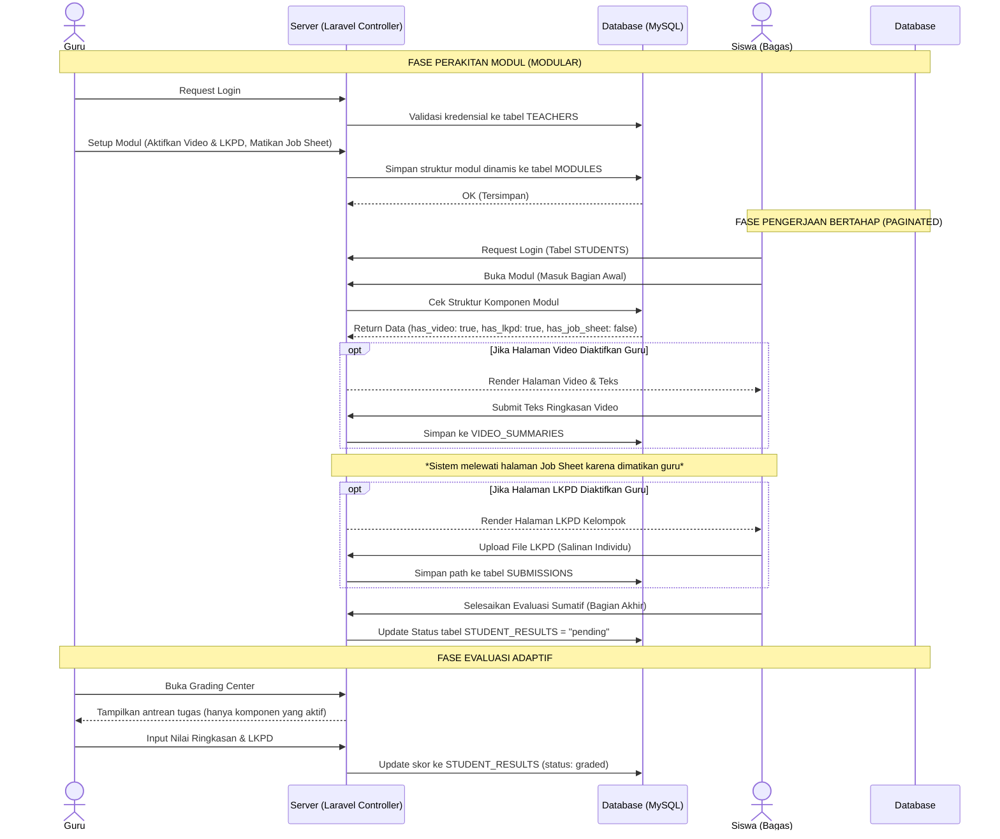
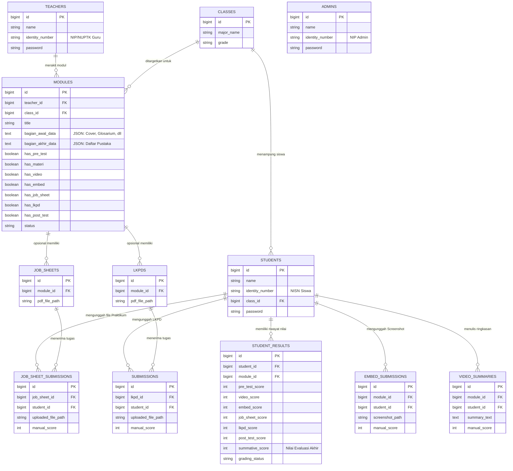

# PRD — Project Requirements Document (Versi E-Modul Modular & Terbagi Halaman)

## 1. **Overview (Tinjauan Umum)**

### 1.1 Latar Belakang Proyek

Aplikasi ini merupakan sebuah platform _Content Management System_ (CMS) E-Modul interaktif berbasis web yang dirancang secara esensial untuk mendukung ekosistem pendidikan vokasi di **SMK Negeri 3 Yogyakarta**. Secara infrastruktur, sekolah ini memiliki area fisik yang sangat luas, mencapai kurang lebih 4 hektar, dan telah difasilitasi dengan pemerataan akses internet nirkabel melalui program Wi-Fi Kominfo.

Potensi infrastruktur digital yang mumpuni ini membuka peluang besar untuk mendigitalkan proses belajar mengajar. Metode konvensional atau penggunaan modul statis (seperti PDF standar) sudah tidak lagi relevan dengan kebutuhan siswa kejuruan. Diperlukan sebuah wadah digital terpusat yang interaktif, di mana materi dapat disajikan secara terstruktur (halaman demi halaman) namun tetap fleksibel menyesuaikan gaya mengajar tiap guru.

### 1.2 Pernyataan Masalah (Problem Statement)

Pengembangan platform ini diinisiasi untuk memecahkan masalah utama (_pain points_) yang dialami oleh pemangku kepentingan di sekolah:

- **Kendala Guru:** Pengelolaan materi dan penilaian saat ini terpencar. Selain itu, guru sering kali merasa dibatasi oleh _template_ modul digital yang kaku. Terkadang guru hanya ingin memberikan materi saja tanpa kuis, atau sebaliknya. Dibutuhkan sebuah sistem _builder_ yang modular (bebas diatur).
- **Kendala Siswa:** Siswa sering mengalami disorientasi jika disuguhkan materi panjang dalam satu halaman penuh (_scroll_ panjang). Siswa membutuhkan modul digital yang terbagi ke dalam halaman-halaman sistematis (Bagian Awal, Inti, Akhir) beserta transparansi penilaian di akhir pembelajaran.
- **Kendala Manajemen Sekolah:** Pihak kurikulum tidak memiliki akses terpusat untuk memantau kinerja guru dan kelayakan materi pembelajaran secara _real-time_.

### 1.3 Tujuan Utama (Objectives)

Tujuan dari proyek ini adalah membangun portal E-Modul terpusat berbasis **Laravel** dengan sistem manajemen akses multi-peran (Admin, Guru, dan Siswa).

Sistem ini ditargetkan untuk:

1. Memberikan fasilitas _E-Module Builder_ bagi guru untuk merakit materi yang halamannya **terbagi-bagi secara sistematis** menjadi 3 babak:

- **Bagian Awal:** Berisi Cover, Kata Pengantar, Peta Konsep, Glosarium, dll.
- **Bagian Inti (Sepenuhnya Opsional):** Guru bebas menghidupkan/mematikan 7 komponen inti (1. _Pre-test_, 2. Materi + PPT, 3. Video & Ringkasan, 4. Praktik Interaktif, 5. Lembar Praktikum, 6. Tugas LKPD, 7. _Post-test_).
- **Bagian Akhir:** Berisi Evaluasi Sumatif, Kunci Jawaban (Self-Assessment), dan Daftar Pustaka.

2. Menyediakan _Dashboard Personal_ bagi siswa untuk membaca E-Modul layaknya buku digital interaktif, melacak progres belajar, dan melihat transparansi nilai.
3. Memungkinkan sekolah mengekspor seluruh hasil belajar siswa ke dalam satu dokumen laporan (PDF) yang kolomnya otomatis menyesuaikan dengan komponen yang diaktifkan oleh guru.

### 1.4 Ruang Lingkup Proyek (Scope of Work)

Untuk fase peluncuran awal (MVP), ruang lingkup aplikasi dibatasi pada:

- Pengembangan antarmuka untuk 3 peran: Admin, Guru, dan Siswa.
- Pembuatan **Dynamic E-Module Builder**. Sistem _builder_ ini tidak lagi kaku, melainkan menggunakan sistem _toggle_ (sakelar opsional) untuk 7 kegiatan di "Bagian Inti", serta memfasilitasi pembuatan "Bagian Awal" dan "Bagian Akhir".
- Sistem navigasi siswa yang berbasis _Pagination_ (Halaman Sebelumnya / Halaman Selanjutnya) agar siswa membaca materi secara bertahap.
- Penilaian hibrida: Otomatis (untuk soal pilihan ganda) dan manual (untuk berkas LKPD/Praktikum dan _screenshot_ interaktif), yang semuanya bergantung pada komponen apa saja yang diaktifkan oleh guru.

## 2. **Requirements (Kebutuhan Sistem)**

Bagian ini mendefinisikan kebutuhan fungsional dan aturan bisnis yang harus dipenuhi oleh platform E-Modul agar dapat berjalan sesuai dengan tujuan ekosistem pembelajaran di SMK Negeri 3 Yogyakarta.

### 2.1 Manajemen Hak Akses Multi-Peran (Role-Based Access Control)

Sistem harus memisahkan wewenang dan tampilan antarmuka secara ketat berdasarkan tiga peran utama pengguna:

- **Admin (Supervisi/Kurikulum):** Memiliki hak istimewa (_privilege_) tertinggi untuk mengelola _Master Data_ pengguna, meninjau kelayakan konten modul, dan memantau analitik produktivitas dari seluruh guru.
- **Guru (Pendidik/Kreator):** Memiliki hak penuh atas perakitan modul. Guru dapat membuat konten, menghidupkan/mematikan fitur opsional di dalam modul, dan memberikan penilaian manual terhadap tugas siswa.
- **Siswa (Pengguna Modul):** Memiliki hak akses terbatas yang difokuskan pada konsumsi materi secara bertahap (per halaman) dan pelacakan riwayat nilai.

### 2.2 Transparansi Dasbor dan Manajemen Portofolio

- **Transparansi Belajar Siswa:** Halaman dasbor siswa harus memisahkan status modul menjadi _Active/To-Do_ (Tugas Aktif) dan _Completed_ (Riwayat Selesai). Untuk E-Modul di tab _Completed_, sistem wajib menampilkan rincian nilai akhir siswa secara transparan.
- **Manajemen Portofolio Guru:** Dasbor guru wajib dilengkapi dengan halaman "Daftar Modul Saya" untuk melihat riwayat seluruh modul yang pernah dirakit, status publikasinya (_Draft/Published/Closed_), dan memantau persentase pengumpulan tugas siswa secara _real-time_.

### 2.3 Struktur E-Modul Berbasis Halaman (Paginated System)

Untuk menghindari disorientasi akibat _scroll_ yang terlalu panjang, materi di dalam E-Modul tidak ditampilkan dalam satu halaman penuh, melainkan dipecah menjadi tiga bagian utama layaknya buku digital interaktif:

- **Bagian Awal (Pendahuluan):** Menjadi halaman pertama yang dilihat siswa untuk persiapan belajar. Guru diwajibkan (Mandatori) untuk mengisi elemen: Halaman Sampul (_Cover_), Kata Pengantar & Daftar Isi (_Hyperlink_), Peta Konsep, Glosarium, Petunjuk Penggunaan Modul, dan Tujuan Pembelajaran.
- **Bagian Inti (Kegiatan Pembelajaran):** Merupakan "daging" dari modul yang disajikan per Kegiatan Belajar. Komponen di bagian ini bersifat **sepenuhnya opsional** dan dikendalikan oleh guru.
- **Bagian Akhir (Penutup):** Menjadi alat ukur keberhasilan belajar secara keseluruhan. Berisi halaman Evaluasi (Tes Sumatif), Kunci Jawaban & Pedoman Penskoran untuk _self-assessment_ (jika nilai di bawah KKTP, sistem menyarankan siswa mengulang materi), serta Daftar Pustaka.

### 2.4 Dinamika Bagian Inti (7 Fitur Opsional) & Batasan Berkas

Guru diberikan kebebasan mutlak (_Toggle System_) untuk menghidupkan atau mematikan 7 komponen di Bagian Inti. Siswa hanya akan melihat halaman yang diaktifkan oleh guru, dengan aturan navigasi yang ketat (tidak bisa melompat ke halaman selanjutnya sebelum instruksi di halaman saat ini selesai). Ketujuh komponen opsional tersebut adalah:

1. **Pre-test:** Kuis awal pembuka kegiatan belajar.
2. **Materi + PPT:** Uraian konsep beserta sematan presentasi.
3. **Video & Ringkasan:** Integrasi YouTube. Jika diaktifkan, sistem memaksa siswa mengisi kolom teks "Ringkasan Video" sebelum bisa lanjut ke halaman berikutnya.
4. **Praktik Interaktif:** Media _embed_ (HTML/CSS). Jika diaktifkan, sistem otomatis memunculkan form unggah gambar untuk bukti eksekusi. **(Batasan: JPG/PNG, Maksimal 2 MB)**.
5. **Lembar Praktikum (Job Sheet):** Lembar kerja teknis mandiri berformat PDF beserta area _dropzone_ unggah hasil. **(Batasan: PDF, Maksimal 5 MB)**.
6. **Tugas LKPD (Kerjasama Kelompok):** Penugasan studi kasus kelompok (tanpa tema alam). Meskipun dikerjakan berkelompok, **setiap siswa wajib mengunggah salinan berkas hasil diskusi secara individu** ke akun masing-masing agar nilai tercatat personal. **(Batasan: PDF, Maksimal 5 MB)**.
7. **Post-test:** Kuis penutup kegiatan belajar.

### 2.5 Sistem Penilaian Adaptif, Laporan, & Kebijakan Revisi

- **Penilaian Adaptif:** Mesin penilaian (_Grading System_) akan beradaptasi dengan komponen yang diaktifkan guru pada Bagian Inti, ditambah dengan skor Tes Sumatif pada Bagian Akhir. Sistem menggunakan hibrida penilaian otomatis (kuis) dan manual (berkas tugas/gambar).
- **Kebijakan Unggah Ulang (Re-submission):** Siswa diizinkan membatalkan dan mengunggah ulang file _Job Sheet_, LKPD, atau _Screenshot_ Praktik **hanya jika** guru belum memberikan nilai (status di _database_ masih `pending`). Jika guru sudah menilainya (status `graded`), tombol unggah ulang akan terkunci otomatis.
- **Pembuatan Laporan Dinamis (PDF Generator):** Sistem mampu mengagregasi seluruh komponen nilai (yang diaktifkan) beserta teks ringkasan video ke dalam satu laporan PDF yang utuh. Kolom tabel pada PDF akan otomatis menyesuaikan (menambah atau menghilang) berdasarkan pengaturan 7 fitur opsional di Bagian Inti tersebut.

## 3. **Core Features (Fitur Utama)**

Bagian ini menguraikan fitur-fitur inti yang membangun fungsionalitas platform CMS E-Modul, dipisahkan berdasarkan antarmuka penggunanya dan kapabilitas modularitasnya.

### 3.1 Dashboard Admin (Supervision Panel)

Pusat komando bagi pihak manajemen sekolah (Kurikulum atau Kepala Sekolah) untuk mengelola data operasional dan mengawasi jalannya proses pembelajaran digital secara terpusat.

- **Manajemen Master Data:** Menu untuk menambah, mengubah, atau menonaktifkan entitas pengguna (akun Guru dan Siswa) serta mengatur struktur akademik (Daftar Kelas dan Jurusan, seperti Sistem Basis Data).
- **Monitoring Produktivitas Guru:** Panel analitik yang menampilkan daftar guru aktif beserta jumlah E-Modul yang telah mereka buat dan distribusikan kepada siswa.
- **Quality Control (Pratinjau Modul):** Admin memiliki tombol khusus (_Preview_) untuk meninjau isi Bagian Awal, Bagian Inti, dan Bagian Akhir modul yang dibuat oleh guru tanpa memiliki hak edit. Hal ini mempermudah proses evaluasi kelayakan materi sesuai standar sekolah.

### 3.2 Dashboard Guru (Teacher Workspace)

Ruang kerja eksklusif bagi pendidik untuk merancang, mendistribusikan, dan mengevaluasi modul pembelajaran secara terorganisir.

- **Manajer Modul (Module Manager):** Halaman yang menampilkan seluruh riwayat E-Modul milik guru terkait. Menampilkan status modul (_Draft_, _Published_, atau _Closed_) dan indikator progres (_Progress Bar_) yang menunjukkan jumlah siswa yang telah mengumpulkan tugas secara _real-time_.
- **Grading Center (Pusat Penilaian Adaptif):** Panel terpadu bagi guru untuk memberikan nilai manual. Kolom penilaian di dalam panel ini akan menyesuaikan dengan fitur opsional yang dihidupkan guru pada modul. Fitur penilaian mencakup menu untuk membaca Ringkasan Video, meninjau _Screenshot_ Praktik Interaktif, serta mengunduh dan menilai file PDF _Job Sheet_ maupun file LKPD.

### 3.3 Dashboard Siswa (Student Portal)

Portal transparan dan terstruktur yang dirancang untuk mencegah siswa kebingungan saat menjalani proses belajar mandiri.

- **Tab Tugas Aktif (To-Do):** Menampilkan daftar E-Modul yang baru ditugaskan oleh guru dan berstatus wajib diselesaikan. Setelah seluruh tahapan (hingga Bagian Akhir) dituntaskan, modul akan otomatis menghilang dari daftar ini.
- **Tab Riwayat Nilai (Completed):** Menyimpan rekam jejak semua E-Modul yang sudah berhasil diselesaikan siswa. Jika guru telah memproses penilaian di _Grading Center_, siswa dapat membuka detail modul di tab ini untuk melihat transparansi rincian nilai secara penuh (yang menyesuaikan dengan komponen E-Modul yang diberikan oleh guru).

### 3.4 E-Module Builder (Pembuat Konten Modular)

Ini adalah jantung dari platform. Sebuah editor visual berkonsep modular bagi guru untuk merakit E-Modul tanpa keahlian _coding_. Fitur di dalam _builder_ ini dipecah menjadi 3 blok:

- **Editor Bagian Awal (Mandatori):** Form terstruktur bagi guru untuk menyusun Halaman Sampul (_Cover_ yang menarik), Kata Pengantar, Daftar Isi interaktif, Peta Konsep, Glosarium (untuk istilah teknis), Petunjuk Penggunaan, dan Tujuan Pembelajaran (Capaian).
- **Panel Bagian Inti (7 Toggle Opsional):** Kumpulan sakelar (hidup/mati) independen. Guru dapat secara bebas memilih untuk memasukkan 1. _Pre-test_ (Quiz Builder), 2. Materi + PPT (Rich Text Editor), 3. Video & Ringkasan (Integrasi Tautan YouTube), 4. Praktik Interaktif (Embed Code HTML/CSS), 5. Lembar Praktikum (Upload PDF _Job Sheet_), 6. Tugas LKPD (Upload PDF Studi Kasus), dan 7. _Post-test_.
- **Editor Bagian Akhir (Mandatori):** Form untuk menyusun Evaluasi (Tes Sumatif), Kunci Jawaban berserta pedoman penskoran (dilengkapi logika rekomendasi pengulangan materi jika di bawah KKTP), dan Daftar Pustaka.

### 3.5 Interactive Student UI (Antarmuka Belajar Paginated & Restriktif)

Antarmuka pengerjaan modul bagi siswa yang didesain dengan konsep navigasi _Pagination_ (berbasis halaman terpisah: Sebelumnya/Selanjutnya) agar siswa tidak kewalahan melihat _scroll_ yang panjang. Navigasi bersifat mengikat (_restriktif_); tombol "Selanjutnya" akan terkunci jika instruksi di halaman saat ini belum terpenuhi (contoh: teks ringkasan video masih kosong atau file LKPD belum diunggah).

### 3.6 PDF Report Generator (Pembangkit Laporan Dinamis)

Fitur ekstraksi dan konversi data penilaian dari basis data ke dalam bentuk dokumen PDF siap cetak untuk pelaporan nilai kelas. Sistem ini menggunakan logika pemrograman _Auto-formatting_ yang cerdas; sistem akan mendeteksi pengaturan "Bagian Inti" pada modul terkait, lalu secara dinamis memunculkan atau menyembunyikan kolom penilaian di tabel PDF agar hasil cetak tetap rapi dan relevan.

## 4. **User Flow (Alur Pengguna)**

Bagian ini memetakan perjalanan langkah demi langkah (_step-by-step journey_) dari setiap peran pengguna saat berinteraksi dengan platform E-Modul, mulai dari proses pembuatan materi yang modular, pelaksanaan belajar berbasis halaman (_pagination_), hingga pengawasan mutu.

### 4.1 Alur Guru (Teacher Flow) — Perancangan Modular & Penilaian

Alur ini menggambarkan bagaimana guru menyusun modul yang terbagi menjadi 3 bagian utama dan melakukan evaluasi.

1. **Autentikasi & Dasbor Awal:** Guru melakukan _login_ ke dalam sistem. Di halaman utama, guru membuka "Manajer Modul" untuk memantau modul lama atau membuat yang baru.
2. **Pembuatan Modul (E-Module Builder):** Guru menekan tombol "Buat Modul Baru", memasukkan judul "Sistem Basis Data", menetapkan kelas/jurusan, dan mulai mengisi 3 blok utama:

- **Setup Bagian Awal:** Guru mengunggah gambar _Cover_, mengetik Kata Pengantar, menyusun Peta Konsep, mengisi Glosarium (contoh: definisi _Query_, _Entity_), dan menetapkan Tujuan Pembelajaran.
- **Setup Bagian Inti (Opsional):** Guru bebas menghidupkan _toggle_ komponen yang diinginkan. Dalam skenario ini, guru menghidupkan semua 7 fitur (1. _Pre-test_, 2. Materi+PPT, 3. Video YouTube, 4. _Embed_ Praktik, 5. _Job Sheet_ PDF, 6. LKPD PDF, 7. _Post-test_).
- **Setup Bagian Akhir:** Guru menginput soal Evaluasi Sumatif, menyusun Kunci Jawaban (beserta pedoman KKTP), dan menulis Daftar Pustaka.

3. **Publikasi & Pemantauan:** Guru menekan tombol "Publish". Selama masa pengerjaan, guru memantau _Progress Bar_ kelulusan siswa.
4. **Evaluasi di Grading Center:** Guru membuka pusat penilaian adaptif untuk:

- Membaca teks ringkasan video.
- Meninjau gambar _screenshot_ keberhasilan praktik _embed_.
- Mengunduh dan menilai file _Job Sheet_ mandiri.
- Mengunduh file LKPD yang diunggah secara individu oleh tiap siswa (meski hasil diskusi kelompok) dan memberikan skor.

5. **Pencetakan Laporan:** Guru mengeklik "Unduh Laporan PDF" untuk mendapatkan rekapitulasi nilai akhir kelas yang kolomnya otomatis menyesuaikan dengan fitur yang tadi diaktifkan.

### 4.2 Alur Siswa (Student Flow) — Pengalaman Belajar Bagas

Alur ini difokuskan pada pengalaman siswa bernama Bagas saat menavigasi E-Modul yang halamannya terbagi-bagi secara sistematis.

1. **Pemeriksaan Tugas Harian:** Bagas _login_ menggunakan NISN. Di _Dashboard Personal_ tab **"Tugas Aktif"**, Bagas mengeklik modul "Sistem Basis Data" dan masuk ke mode layar penuh.
2. **Membaca Bagian Awal (Pendahuluan):** Halaman pertama menampilkan _Cover_, Kata Pengantar, Peta Konsep, Glosarium, dan Tujuan Pembelajaran. Setelah paham arah materi, Bagas mengeklik tombol "Selanjutnya".
3. **Menjalani Bagian Inti (Navigasi Mengikat):** Bagas harus melewati tahapan berikut halaman demi halaman (sesuai yang diaktifkan guru) tanpa bisa melompat:

- **Halaman 1:** Mengerjakan _Pre-test_.
- **Halaman 2:** Membaca uraian materi dan melihat PPT.
- **Halaman 3:** Menonton Video Pembelajaran. Bagas **wajib** mengetik ringkasan di kolom teks agar tombol "Selanjutnya" bisa diklik.
- **Halaman 4:** Melakukan praktik dari _Embed Code_. Setelah simulasi berhasil, Bagas memotret layar dan mengunggah _screenshot_ (Maks 2 MB).
- **Halaman 5 (Job Sheet):** Bagas mengunduh PDF _Job Sheet_, mengerjakan instruksi secara mandiri, dan mengunggah file hasilnya (Maks 5 MB).
- **Halaman 6 (LKPD Kelompok):** Bagas mengunduh instruksi LKPD, berdiskusi dengan teman sekelompoknya. Setelah selesai, **Bagas wajib mengunggah salinan file jawaban final tersebut secara individu** (Maks 5 MB).
- **Halaman 7:** Mengerjakan kuis _Post-test_.

4. **Menyelesaikan Bagian Akhir (Penutup):** Bagas mengerjakan Evaluasi Sumatif secara keseluruhan, lalu melihat Kunci Jawaban. Karena sistem menunjukkan nilainya di atas KKTP, Bagas mengeklik tombol "Selesaikan Modul".
5. **Transisi ke Riwayat Selesai:** Modul otomatis berpindah ke tab **"Riwayat Selesai"**. Keesokan harinya, setelah guru memproses nilai di _Grading Center_, Bagas mengeklik detail modul untuk melihat transparansi rincian nilainya secara penuh.

### 4.3 Alur Admin (Supervision Flow) — Pengawasan Mutu Terstruktur

Alur ini mendeskripsikan bagaimana pihak kurikulum menggunakan sistem ini untuk pengawasan.

1. **Pengaturan Sistem Awal:** Admin _login_, masuk ke menu _Master Data_ untuk meregistrasi akun guru/siswa baru dan mengatur hierarki kelas beserta jurusannya.
2. **Pemantauan Produktivitas:** Admin membuka menu "Monitoring Guru" untuk melihat tabel statistik produktivitas guru dalam merancang E-Modul.
3. **Quality Control (Pratinjau Bertahap):** Admin mengeklik salah satu modul untuk masuk ke mode "Preview". Admin dapat menelusuri halaman demi halaman mulai dari Bagian Awal, mengecek kelengkapan 7 fitur di Bagian Inti, hingga mengecek tingkat kesulitan Evaluasi Sumatif di Bagian Akhir. Hal ini memastikan seluruh bahan ajar sesuai dengan standar mutu sekolah sebelum atau saat diakses oleh siswa.

## 5. **Architecture (Arsitektur Sistem)**

Bagian ini menjelaskan struktur kerangka kerja teknis dan alur komunikasi data antar komponen di dalam aplikasi. Arsitektur ini dirancang secara spesifik untuk menangani logika E-Modul yang terbagi menjadi tiga babak (Bagian Awal, Inti, Akhir) dengan komponen fitur yang bisa dihidupkan atau dimatikan oleh guru.

### 5.1 Pendekatan Monolithic MVC

Platform ini dibangun menggunakan arsitektur **Monolithic MVC (Model-View-Controller)** berbasis _framework_ **Laravel 11**. Pemilihan arsitektur monolitik (di mana _frontend_ dan _backend_ digabung dalam satu wadah/_codebase_) sangat ideal untuk ekosistem sekolah karena stabilitasnya yang tinggi dan kemudahannya untuk di-_hosting_ di _server_ lokal (intranet) maupun _cloud hosting_ standar tanpa perlu konfigurasi _server API_ terpisah.

### 5.2 Multi-Guard Authentication (Autentikasi Terpisah)

Mengingat entitas pengguna telah dinormalisasi menjadi tiga tabel yang berdiri sendiri, sistem keamanan dan sesi _login_ aplikasi akan menerapkan arsitektur **Multi-Guard Authentication** bawaan Laravel.

- **Admin Guard:** Menangani sesi _login_ dan validasi akses ke dasbor supervisi dengan mencocokkan kredensial langsung ke tabel `ADMINS`.
- **Teacher Guard:** Menangani sesi _login_ dan wewenang pembuatan E-Modul modular dengan mencocokkan kredensial ke tabel `TEACHERS`.
- **Student Guard:** Menangani sesi _login_ dan pembatasan akses navigasi per halaman bagi siswa dengan mencocokkan kredensial ke tabel `STUDENTS`.

### 5.3 Pemrosesan Logika MVC pada E-Modul Dinamis

- **Model:** Bertugas mengelola interaksi ke basis data MySQL. _Model_ akan mengekstrak struktur JSON atau relasi _boolean_ dari tabel modul untuk mendeteksi komponen "Bagian Inti" mana saja yang diaktifkan oleh guru (misal: mengecek apakah `has_video = true` dan `has_lkpd = true`).
- **View:** Menggunakan **Blade Templating Engine** (dipadukan dengan Tailwind CSS). _View_ bertugas merender antarmuka E-Modul secara _paginated_ (berbasis halaman terpisah). _View_ akan menyembunyikan atau menonaktifkan (_disable_) tombol "Halaman Selanjutnya" jika persyaratan di halaman tersebut belum dipenuhi siswa.
- **Controller:** Berperan sebagai otak penjaga gerbang (_Gatekeeper_). _Controller_ berisi logika validasi pergerakan siswa. Jika siswa mencoba meretas URL untuk melompat langsung ke Halaman Evaluasi Sumatif (Bagian Akhir) tanpa menyelesaikan tugas unggah LKPD di halaman sebelumnya, _Controller_ akan menolak _request_ tersebut dan mengembalikan siswa ke halaman LKPD.

### 5.4 Diagram Sekuensial (Sequence Diagram) Data Alur Belajar Modular

Diagram _Mermaid_ di bawah ini memvisualisasikan aliran data mulai dari pengaturan modul opsional oleh Guru hingga proses pengerjaan bertahap oleh Siswa, dengan menyoroti logika pengecekan halaman aktif oleh _Controller_.

## 6. **Database Schema (Skema Basis Data)**

Sistem ini menggunakan basis data relasional (MySQL / MariaDB) yang dirancang untuk mendukung tingkat fleksibilitas E-Modul yang dinamis. Tabel `MODULES` dirancang layaknya konfigurasi _builder_ yang menyimpan metadata Bagian Awal dan Bagian Akhir, beserta 7 kolom _boolean_ (sakelar aktif/mati) yang mengontrol fitur opsional di Bagian Inti.

Tabel pengguna tetap dinormalisasi menjadi tiga entitas terpisah: `ADMINS`, `TEACHERS`, dan `STUDENTS` untuk menjamin keamanan akses lintas peran.

### 6.1 Entity Relationship Diagram (ERD)

Diagram di bawah ini memetakan relasi antar entitas utama di dalam sistem, dengan menonjolkan kolom-kolom opsional (_toggles_) pada entitas `MODULES`.

### 6.2 Struktur Tabel Utama & Kolom (Data Dictionary)

Berikut adalah rincian kolom-kolom esensial pada tabel utama untuk memandu proses pengembangan dan migrasi basis data di Laravel:

**1. Tabel Entitas Pengguna Terpisah**

- **Tabel `ADMINS**`: (Kolom: `id`, `name`, `identity_number`[NIP],`password`).
- **Tabel `TEACHERS**`: (Kolom: `id`, `name`, `identity_number`[NUPTK],`password`).
- **Tabel `STUDENTS**`: (Kolom: `id`, `name`, `identity_number`[NISN],`class_id`, `password`).

**2. Tabel `MODULES` (Entitas E-Modul Sentral & Konfigurasi Fitur)**
Tabel ini memuat struktur pengaturan modul secara utuh untuk menopang sistem _builder_ yang dinamis.

- `id` (BigInt): _Primary Key_.
- `teacher_id` (BigInt): _Foreign Key_ ke tabel `TEACHERS`.
- `title` (String): Judul modul E-Learning.
- `bagian_awal_data` (JSON/Text): Menyimpan gabungan teks/path gambar untuk Halaman Sampul, Kata Pengantar, Peta Konsep, Glosarium, dan Tujuan Pembelajaran agar tabel tidak terlalu gemuk.
- `bagian_akhir_data` (JSON/Text): Menyimpan teks Daftar Pustaka dan pengaturan Kunci Jawaban.
- **[ 7 Toggle Bagian Inti ]** (Tipe Boolean): `has_pre_test`, `has_materi`, `has_video`, `has_embed`, `has_job_sheet`, `has_lkpd`, `has_post_test`. (Siswa hanya akan di-render halamannya jika nilai kolom-kolom ini _True_).
- `status` (Enum): `draft`, `published`, `closed`.

**3. Tabel Penyimpanan Rekam Jejak (Submissions)**
Sistem memisahkan tempat penyimpanan (_repository_) berdasarkan jenis aktivitas/halaman. Kolom ini hanya akan terisi jika _toggle_ pada tabel modul diaktifkan oleh guru.

- **`VIDEO_SUMMARIES`**: Menyimpan ketikan pemahaman siswa dari integrasi YouTube. (Kolom: `student_id`, `summary_text`, `manual_score`).
- **`EMBED_SUBMISSIONS`**: Menyimpan lokasi/path gambar tangkapan layar siswa. (Kolom: `student_id`, `screenshot_path`, `manual_score`).
- **`JOB_SHEET_SUBMISSIONS`**: Menyimpan file (Maks 5MB) hasil praktik teknis mandiri siswa. (Kolom: `student_id`, `uploaded_file_path`, `manual_score`).
- **`SUBMISSIONS` (LKPD)**: Menyimpan file (Maks 5MB) salinan individu dari hasil analisis pemecahan masalah kelompok. (Kolom: `student_id`, `uploaded_file_path`, `manual_score`).

**4. Tabel `STUDENT_RESULTS` (Agregasi Nilai Akhir & Adaptif)**
Tabel ini merekam semua nilai (otomatis maupun manual) yang diperoleh siswa dari Bagian Inti hingga Evaluasi Sumatif di Bagian Akhir. Kolom-kolom bernilai _integer_ di bawah ini diatur agar _Nullable_ (dapat bernilai kosong) karena tidak semua E-Modul akan menggunakan komponen tersebut secara penuh.

- `id` (BigInt): _Primary Key_.
- `student_id` (BigInt): _Foreign Key_ ke `STUDENTS`.
- `module_id` (BigInt): _Foreign Key_ ke `MODULES`.
- `pre_test_score` (Int - Nullable)
- `video_score` (Int - Nullable)
- `embed_score` (Int - Nullable)
- `job_sheet_score` (Int - Nullable)
- `lkpd_score` (Int - Nullable)
- `post_test_score` (Int - Nullable)
- `summative_score` (Int): Nilai _mandatory_ (wajib) dari pengerjaan Tes Sumatif di Bagian Akhir modul.
- `grading_status` (Enum): `pending` (menunggu guru menilai) atau `graded` (telah dinilai sepenuhnya).

---

## 7. **Tech Stack (Teknologi yang Digunakan)**

Bagian ini menetapkan standar teknologi pendukung yang akan digunakan oleh tim pengembang untuk membangun platform CMS E-Modul. Pemilihan tumpukan teknologi (_tech stack_) ini disesuaikan dengan kebutuhan E-Modul yang modular, interaktif, dan memerlukan manajemen data (JSON) serta berkas (_file_) yang sangat dinamis.

### 7.1 Backend & Arsitektur Utama

- **Framework Inti:** **Laravel 11 (PHP 8.2+)**
  Laravel dipilih sebagai fondasi utama karena arsitektur _Monolithic_ MVC-nya yang kokoh. _Framework_ ini sangat mumpuni untuk menangani logika validasi langkah-demi-langkah (sistem _Gatekeeper_ pada navigasi _paginated_ siswa), serta memanfaatkan _Eloquent ORM_ untuk mengelola interaksi ke basis data yang kompleks.
- **Autentikasi Keamanan (Multi-Guard Auth):**
  Sistem keamanan aplikasi akan dikonfigurasi menggunakan arsitektur **Laravel Multi-Guard Authentication** untuk mengisolasi jalur akses (_route_) dan sesi _login_ bagi ketiga entitas pengguna yang terpisah (`ADMINS`, `TEACHERS`, dan `STUDENTS`).

### 7.2 Frontend & Antarmuka Pengguna (UI)

- **Templating & Styling:** **Blade Templating + Tailwind CSS**
  Kombinasi ini memastikan antarmuka platform, terutama pada Area Belajar Siswa, dapat dirender dengan sangat cepat dan _mobile-friendly_. Blade akan digunakan untuk membangun antarmuka navigasi _Wizard_/_Pagination_ yang secara dinamis menampilkan atau menyembunyikan halaman materi berdasarkan 7 sakelar opsi yang diaktifkan oleh guru di _database_.
- **Rich Text & Editor Modular:**
  Pustaka JavaScript pendukung seperti **TinyMCE** atau **Quill.js** akan diintegrasikan di dalam halaman _E-Module Builder_. Editor ini sangat krusial untuk memfasilitasi guru saat menyusun elemen di "Bagian Awal" (Kata Pengantar, Glosarium), menyusun "Materi", hingga menempelkan _Embed Code_ pada "Bagian Inti".

### 7.3 Database & Penyimpanan Berkas

- **Basis Data Relasional (JSON Supported):** **MySQL / MariaDB**
  Sistem ini memanfaatkan kemampuan MySQL modern dalam memanipulasi tipe data JSON (_JSON casting_ di Laravel). Hal ini digunakan pada tabel `MODULES` (kolom `bagian_awal_data` dan `bagian_akhir_data`) agar konfigurasi metadata yang panjang dapat disimpan dengan efisien tanpa perlu membuat puluhan kolom tambahan.
- **Manajemen Berkas (File Storage) & Validasi:** **Laravel Local Storage / Symlink**
  Infrastruktur penyimpanan sistem untuk menangani keluar-masuknya berkas secara aman. _Backend_ akan dilengkapi dengan validasi MIME _type_ dan batas ukuran fail yang ketat (maksimal 2 MB untuk format JPG/PNG pada praktik _embed_, dan maksimal 5 MB untuk format PDF pada LKPD/Lembar Praktikum).

### 7.4 Ekspor Laporan & Infrastruktur Server

- **PDF Generator Dinamis:** **`barryvdh/laravel-dompdf`**
  Pustaka krusial untuk mengonversi tampilan rekapitulasi HTML ke PDF siap cetak. Logika _rendering_ diatur secara sangat dinamis; sistem akan membaca status _boolean_ dari 7 fitur di Bagian Inti, lalu menyesuaikan penambahan atau penghapusan kolom nilai (_Pre-test_, Video, _Job Sheet_, dll.) pada dokumen akhir secara otomatis.
- **Konfigurasi Server & Deployment:**
  Aplikasi ini disiapkan untuk _deployment_ pada _server_ Apache standar sekolah. Pengelolaan perutean (_routing_) dan optimasi keamanan akan dikonfigurasi secara maksimal memanfaatkan fail **`.htaccess`** pada direktori _public_ _server_, memastikan dokumen tugas individu siswa dan tangkapan layar praktik terlindungi dari akses publik (URL statis) yang tidak sah.
