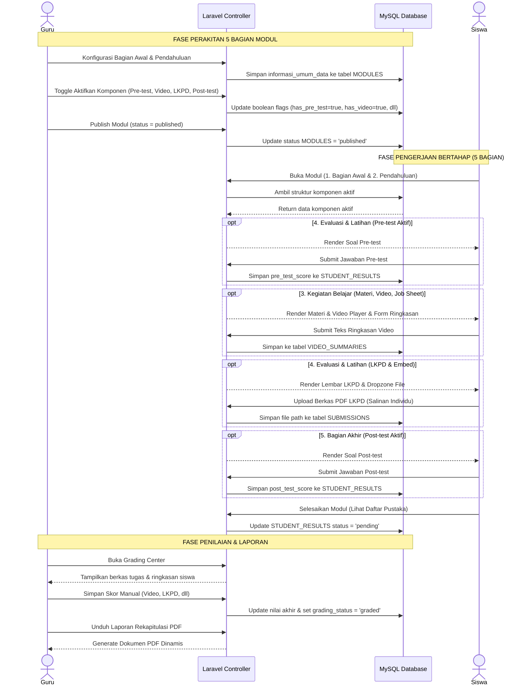
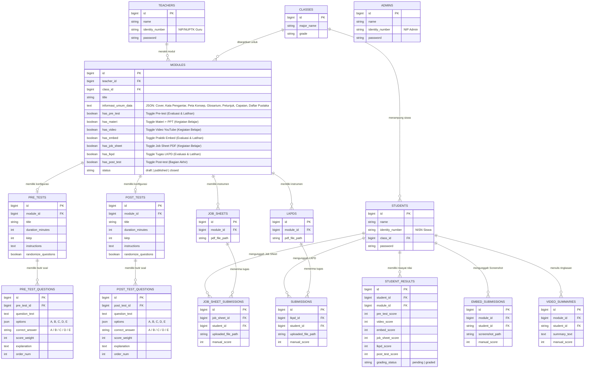

# PRD — Project Requirements Document (Versi Standar 5 Bagian Umum E-Modul)

## 1. **Overview (Tinjauan Umum)**

### 1.1 Latar Belakang Proyek

Aplikasi ini merupakan sebuah platform _Content Management System_ (CMS) E-Modul interaktif berbasis web yang dirancang secara esensial untuk mendukung ekosistem pendidikan vokasi di **SMK Negeri 3 Yogyakarta**. Secara infrastruktur, sekolah ini memiliki area fisik yang sangat luas, mencapai kurang lebih 4 hektar, dan telah difasilitasi dengan pemerataan akses internet nirkabel melalui program Wi-Fi Kominfo.

Potensi infrastruktur digital yang mumpuni ini membuka peluang besar untuk mendigitalkan proses belajar mengajar. Metode konvensional atau penggunaan modul statis (seperti PDF standar) sudah tidak lagi relevan dengan kebutuhan siswa kejuruan. Diperlukan sebuah wadah digital terpusat yang interaktif, di mana materi dapat disajikan secara terstruktur (halaman demi halaman) namun tetap fleksibel menyesuaikan gaya mengajar tiap guru.

### 1.2 Pernyataan Masalah (Problem Statement)

Pengembangan platform ini diinisiasi untuk memecahkan masalah utama (_pain points_) yang dialami oleh pemangku kepentingan di sekolah:

- **Kendala Guru:** Pengelolaan materi dan penilaian saat ini terpencar. Selain itu, guru sering kali merasa dibatasi oleh _template_ modul digital yang kaku. Terkadang guru hanya ingin memberikan materi saja tanpa kuis, atau sebaliknya. Dibutuhkan sebuah sistem _builder_ yang modular dan terstruktur sesuai kaidah pedagogis E-Modul.
- **Kendala Siswa:** Siswa sering mengalami disorientasi jika disuguhkan materi panjang dalam satu halaman penuh (_scroll_ panjang). Siswa membutuhkan modul digital yang terbagi ke dalam halaman-halaman sistematis (Bagian Awal, Pendahuluan, Kegiatan Belajar, Evaluasi & Latihan, hingga Bagian Akhir) beserta transparansi penilaian di akhir pembelajaran.
- **Kendala Manajemen Sekolah:** Pihak kurikulum tidak memiliki akses terpusat untuk memantau kinerja guru dan kelayakan materi pembelajaran secara _real-time_.

### 1.3 Tujuan Utama (Objectives)

Tujuan dari proyek ini adalah membangun portal E-Modul terpusat berbasis **Laravel** dengan sistem manajemen akses multi-peran (Admin, Guru, dan Siswa).

Sistem ini ditargetkan untuk:

1. Memberikan fasilitas _E-Module Builder_ bagi guru untuk merakit materi secara terstruktur menjadi **5 Bagian Umum Standar E-Modul**:
   - **1. Bagian Awal:** Halaman sampul (_cover_), kata pengantar, daftar isi, serta petunjuk penggunaan e-modul bagi siswa dan guru (tersimpan dalam `informasi_umum_data`).
   - **2. Pendahuluan:** Rumusan capaian pembelajaran, tujuan pembelajaran, peta konsep, dan glosarium istilah/kompetensi yang harus dicapai (tersimpan dalam `informasi_umum_data`).
   - **3. Kegiatan Belajar (Isi Materi):** Uraian materi pembelajaran & PPT (`has_materi`), multimedia video pembelajaran YouTube (`has_video`), serta lembar kerja praktik / _Job Sheet_ PDF (`has_job_sheet`).
   - **4. Evaluasi & Latihan:** Soal latihan diagnostik / Pre-test (`has_pre_test`), game edukasi interaktif & kuis online (`has_embed`), serta tugas LKPD & umpan balik / _feedback_ (`has_lkpd`).
   - **5. Bagian Akhir:** Rangkuman materi, tes akhir modul / Post-test (`has_post_test`), dan daftar pustaka rujukan (tersimpan dalam `informasi_umum_data`).
2. Menyediakan _Dashboard Personal_ bagi siswa untuk membaca E-Modul layaknya buku digital interaktif, melacak progres belajar per halaman, dan melihat transparansi nilai.
3. Memfasilitasi guru dengan *Grading Center* adaptif yang otomatis menyesuaikan matriks nilai dengan komponen evaluasi yang diaktifkan.
4. Memungkinkan sekolah mengekspor seluruh hasil belajar siswa ke dalam satu dokumen laporan (PDF) yang kolomnya otomatis menyesuaikan dengan komponen aktif pada modul.

### 1.4 Ruang Lingkup Proyek (Scope of Work)

Untuk fase peluncuran awal (MVP), ruang lingkup aplikasi dibatasi pada:

- Pengembangan antarmuka untuk 3 peran: Admin, Guru, dan Siswa.
- Pembuatan **Dynamic E-Module Builder** dengan arsitektur 5 Bagian Umum E-Modul (15 total komponen terintegrasi).
- Sistem sakelar instan (Toggle Switch) yang memungkinkan guru mengaktifkan/menonaktifkan komponen di setiap bagian.
- Sistem navigasi siswa yang berbasis _Pagination_ (Halaman Sebelumnya / Halaman Selanjutnya) agar siswa membaca materi secara bertahap dan terarah.
- Penilaian hibrida: Otomatis (untuk soal pilihan ganda Pre-test & Post-test) dan manual (untuk ringkasan video, bukti _screenshot_ praktik interaktif, serta berkas tugas LKPD dan _Job Sheet_), yang seluruhnya beradaptasi dengan komponen yang diaktifkan oleh guru.

---

## 2. **Requirements (Kebutuhan Sistem)**

Bagian ini mendefinisikan kebutuhan fungsional dan aturan bisnis yang harus dipenuhi oleh platform E-Modul agar dapat berjalan sesuai dengan tujuan ekosistem pembelajaran di SMK Negeri 3 Yogyakarta.

### 2.1 Manajemen Hak Akses Multi-Peran (Role-Based Access Control)

Sistem harus memisahkan wewenang dan tampilan antarmuka secara ketat berdasarkan tiga peran utama pengguna:

- **Admin (Supervisi/Kurikulum):** Memiliki hak istimewa (_privilege_) tertinggi untuk mengelola _Master Data_ pengguna (Akun Guru dan Siswa), manajemen kelas & jurusan, meninjau kelayakan konten modul (_Preview Mode_), dan memantau analitik produktivitas dari seluruh guru.
- **Guru (Pendidik/Kreator):** Memiliki hak penuh atas perakitan modul melalui _Module Builder_. Guru dapat membuat konten, menghidupkan/mematikan fitur di dalam 5 bagian modul, melakukan simulasi pratinjau siswa, dan memberikan penilaian manual terhadap tugas siswa di _Grading Center_.
- **Siswa (Pengguna Modul):** Memiliki hak akses terbatas yang difokuskan pada konsumsi materi secara bertahap (per halaman), pengunggahan tugas, pengerjaan kuis, dan pelacakan riwayat nilai.

### 2.2 Transparansi Dasbor dan Manajemen Portofolio

- **Transparansi Belajar Siswa:** Halaman dasbor siswa memisahkan status modul menjadi _Active/To-Do_ (Tugas Aktif) dan _Completed_ (Riwayat Selesai). Untuk E-Modul di tab _Completed_, sistem menampilkan rincian nilai akhir siswa secara transparan sesuai komponen yang aktif.
- **Manajemen Portofolio Guru:** Dasbor guru dilengkapi dengan halaman "Manajer Modul" untuk melihat riwayat seluruh modul yang pernah dirakit, status publikasinya (_Draft/Published/Closed_), dan memantau persentase pengumpulan tugas siswa secara _real-time_.

### 2.3 Struktur 5 Bagian Umum E-Modul (Modular & Paginated System)

Untuk menghindari disorientasi akibat _scroll_ yang terlalu panjang dan menerapkan standar kurikulum modul pembelajaran yang ideal, materi E-Modul dikelompokkan ke dalam **5 Bagian Utama**:

```
┌──────────────────────────────────────────────────────────────────────────────────────────┐
│                                STRUKTUR 5 BAGIAN E-MODUL                                 │
├───────────────────────────────┬──────────────────────────────────────────────────────────┤
│ 1. Bagian Awal                │ • Halaman Sampul (Cover)                                 │
│    (Identitas & Pengantar)    │ • Kata Pengantar                                         │
│                               │ • Daftar Isi                                             │
│                               │ • Petunjuk Penggunaan bagi Siswa & Guru                  │
├───────────────────────────────┼──────────────────────────────────────────────────────────┤
│ 2. Pendahuluan                │ • Tujuan Pembelajaran & Rumusan Capaian                  │
│    (Capaian & Kerangka)       │ • Peta Konsep (Diagram Alur Materi)                      │
│                               │ • Glosarium (Kata Kunci & Istilah Penting)               │
├───────────────────────────────┼──────────────────────────────────────────────────────────┤
│ 3. Kegiatan Belajar           │ • Uraian Materi Pembelajaran & Slide PPT (has_materi)    │
│    (Isi Materi Pembelajaran)  │ • Multimedia Video YouTube & Resume (has_video)          │
│                               │ • Lembar Kerja Praktik / Job Sheet PDF (has_job_sheet)   │
├───────────────────────────────┼──────────────────────────────────────────────────────────┤
│ 4. Evaluasi & Latihan         │ • Soal Latihan Awal / Pre-test (has_pre_test)            │
│    (Kuis, Game & Tugas)       │ • Game Edukasi Interaktif & Embed Quiz (has_embed)       │
│                               │ • Tugas LKPD & Umpan Balik / Feedback (has_lkpd)         │
├───────────────────────────────┼──────────────────────────────────────────────────────────┤
│ 5. Bagian Akhir               │ • Tes Akhir Modul / Post-test (has_post_test)            │
│    (Evaluasi Akhir & Rujukan) │ • Daftar Pustaka & Referensi Kepustakaan                 │
└───────────────────────────────┴──────────────────────────────────────────────────────────┘
```

### 2.4 Dinamika Sakelar Toggle (15 Komponen Fleksibel)

Guru diberikan kebebasan mutlak (_Toggle System_) untuk menghidupkan atau mematikan komponen di seluruh 5 bagian modul. Siswa hanya akan melihat halaman/tahapan yang diaktifkan oleh guru, dengan aturan navigasi yang mengikat (tidak bisa melompat ke halaman selanjutnya sebelum instruksi di halaman saat ini selesai).

### 2.5 Sistem Penilaian Adaptif, Laporan, & Kebijakan Revisi

- **Penilaian Adaptif:** Mesin penilaian (_Grading System_) beradaptasi secara dinamis dengan komponen evaluasi yang diaktifkan guru (Pre-test, Video, Embed, Job Sheet, LKPD, Post-test). Sistem menggunakan kombinasi penilaian otomatis (pilihan ganda) dan manual (tugas/berkas PDF/screenshot/ringkasan teks).
- **Kebijakan Unggah Ulang (Re-submission):** Siswa diizinkan membatalkan dan mengunggah ulang file _Job Sheet_, LKPD, atau _Screenshot_ Praktik **hanya jika** guru belum memberikan nilai (status di database masih `pending`). Jika guru sudah menilainya (status `graded`), form unggah terkunci otomatis.
- **Pembuatan Laporan Dinamis (PDF Generator):** Sistem mampu mengagregasi seluruh komponen nilai yang diaktifkan beserta data siswa ke dalam satu laporan PDF siap cetak dengan kolom yang menyesuaikan secara otomatis.

---

## 3. **Core Features (Fitur Utama)**

### 3.1 Dashboard Admin (Supervision Panel)

Pusat kendali bagi pihak manajemen sekolah (Kurikulum atau Kepala Sekolah) untuk mengelola data operasional dan mengawasi jalannya proses pembelajaran digital secara terpusat:

- **Manajemen Master Data:** Menu untuk mengelola entitas pengguna (Akun Guru dan Siswa) serta struktur akademik (Daftar Kelas dan Jurusan).
- **Monitoring Produktivitas Guru:** Panel statistik yang menampilkan daftar guru aktif beserta jumlah E-Modul yang telah dibuat dan didistribusikan.
- **Quality Control (Pratinjau Modul):** Admin memiliki akses pratinjau (_Preview Mode_) untuk meninjau seluruh konten modul di 5 bagian tanpa hak mengubah, guna menjamin standar mutu materi.

### 3.2 Dashboard Guru (Teacher Workspace)

Ruang kerja eksklusif bagi pendidik untuk merancang, mendistribusikan, dan mengevaluasi modul pembelajaran:

- **Manajer Modul (Module Manager):** Halaman yang menampilkan seluruh daftar E-Modul milik guru dengan status (_Draft_, _Published_, atau _Closed_) dan _Progress Bar_ pengumpulan tugas siswa secara _real-time_.
- **E-Module Detail & Builder (5 Bagian):** Antarmuka terstruktur menampilkan 5 Bagian Utama E-Modul, progress bar kesiapan (contoh: `14/15 Komponen Aktif`), kartu 2-kolom seimbang, tombol edit langsung per-elemen, dan sakelar instan (AJAX toggle switch).
- **Dedicated Component Editors:** Setiap bagian memiliki halaman editor terisolasi (Editor 1. Bagian Awal - 4 Komponen: Cover, Kata Pengantar, Daftar Isi, Petunjuk; Editor 2. Pendahuluan - 3 Komponen: Tujuan Pembelajaran & Capaian, Peta Konsep, Glosarium; Editor Pre-test; Editor Materi & PPT; Editor Video; Editor Embed; Editor Job Sheet; Editor LKPD; dan Editor Post-test).
- **Simulation Preview:** Kemudahan guru dalam mensimulasikan tampilan persis seperti yang akan dilihat siswa sebelum modul dipublikasikan.
- **Grading Center (Pusat Penilaian Adaptif):** Panel terpadu bagi guru untuk memeriksa dan memberikan nilai manual terhadap Ringkasan Video, tangkapan layar Praktik Interaktif, serta file tugas PDF _Job Sheet_ dan LKPD.

### 3.3 Dashboard Siswa (Student Portal)

Portal belajar yang transparan dan terstruktur bagi siswa:

- **Tab Tugas Aktif (To-Do):** Menampilkan daftar E-Modul yang ditugaskan untuk kelas siswa dan wajib diselesaikan.
- **Tab Riwayat Nilai (Completed):** Menyimpan rekam jejak E-Modul yang telah diselesaikan beserta rincian nilai transparan untuk setiap komponen yang dinilai oleh guru.

### 3.4 Interactive Student UI (Antarmuka Belajar Paginated & Restriktif)

Antarmuka pengerjaan modul bagi siswa berbasis halaman terpisah (_Pagination_) melewati 5 bagian belajar. Navigasi bersifat mengikat (_restriktif_); tombol "Selanjutnya" terkunci jika instruksi pada halaman saat ini belum tuntas.

### 3.5 PDF Report Generator (Pembangkit Laporan Dinamis)

Fitur ekspor data penilaian kelas ke format dokumen PDF siap cetak dengan tata letak kolom tabel yang secara dinamis beradaptasi terhadap komponen aktif pada modul.

---

## 4. **User Flow (Alur Pengguna)**

### 4.1 Alur Guru (Teacher Flow) — Perancangan 5 Bagian & Penilaian

1. **Autentikasi & Dasbor Awal:** Guru melakukan _login_ dan membuka "Manajer Modul".
2. **Pembuatan Modul:** Guru menekan "Buat Modul Baru", memasukkan judul dan target kelas. Modul tersimpan dengan status `draft`.
3. **Penyusunan Konten (Module Detail 5 Bagian):**
   - **Bagian Awal:** Guru mengisi Cover, Kata Pengantar, Daftar Isi, dan Petunjuk Penggunaan.
   - **Pendahuluan:** Guru menyusun Tujuan Pembelajaran, Capaian Pembelajaran, Peta Konsep, dan Glosarium.
   - **Kegiatan Belajar:** Guru mengisi Materi & PPT, tautan Video YouTube, dan file Job Sheet PDF.
   - **Evaluasi & Latihan:** Guru merakit soal Pre-test, kode embed simulasi/game edukasi, dan instruksi tugas LKPD.
   - **Bagian Akhir:** Guru merakit soal Post-test dan mengisi Daftar Pustaka referensi.
4. **Simulasi Pratinjau:** Guru membuka fitur Preview pada tiap komponen untuk memastikan kesesuaian materi.
5. **Publikasi:** Guru menekan tombol "Publish Modul" sehingga modul dapat diakses oleh siswa pada kelas target.
6. **Evaluasi di Grading Center:** Guru meninjau penugasan siswa yang masuk, membaca ringkasan video, memeriksa screenshot praktik, mengunduh file tugas, dan memasukkan nilai manual.
7. **Pencetakan Laporan:** Guru mengunduh Rekapitulasi Laporan PDF nilai kelas.

### 4.2 Alur Siswa (Student Flow) — Pengalaman Belajar 5 Tahap

1. **Pemeriksaan Tugas:** Siswa _login_ menggunakan NISN dan membuka modul yang aktif di tab **"Tugas Aktif"**.
2. **Tahap 1 — Bagian Awal:** Siswa melihat Cover, membaca Kata Pengantar, memeriksa Daftar Isi, dan memahami Petunjuk Penggunaan.
3. **Tahap 2 — Pendahuluan:** Siswa membaca Rumusan Capaian & Tujuan Pembelajaran, mencermati Peta Konsep, dan membaca Glosarium istilah.
4. **Tahap 3 — Kegiatan Belajar:** Siswa membaca uraian Materi & slide PPT, menyimak Video YouTube & mengetik ringkasan, serta mengunduh/mengerjakan panduan Job Sheet PDF.
5. **Tahap 4 — Evaluasi & Latihan:** Siswa mengerjakan Pre-test diagnostik, memainkan kuis/game interaktif embed & mengunggah screenshot, serta berdiskusi tugas LKPD & mengunggah PDF mandiri.
6. **Tahap 5 — Bagian Akhir:** Siswa mengerjakan Post-test akhir modul dan melihat Daftar Pustaka.
7. **Penyelesaian & Transisi:** Siswa menyelesaikan modul, status modul berpindah ke tab **"Riwayat Selesai"**, dan nilai dapat dipantau secara transparan.

---

## 5. **Architecture (Arsitektur Sistem)**

### 5.1 Pendekatan Monolithic MVC

Platform ini dibangun menggunakan arsitektur **Monolithic MVC (Model-View-Controller)** berbasis **Laravel 11**. Arsitektur ini menggabungkan frontend dan backend dalam satu repositori yang efisien, mudah dikelola, dan ideal untuk implementasi pada server intranet sekolah maupun hosting cloud.

### 5.2 Multi-Guard Authentication

Sistem menerapkan arsitektur **Multi-Guard Authentication** bawaan Laravel dengan 3 entitas pengguna terpisah:

- **Admin Guard (`auth:admin`):** Mengamankan akses dasbor supervisi melalui tabel `ADMINS`.
- **Teacher Guard (`auth:teacher`):** Mengamankan akses workspace guru dan builder melalui tabel `TEACHERS`.
- **Student Guard (`auth:student`):** Mengamankan akses antarmuka belajar siswa melalui tabel `STUDENTS`.

### 5.3 Pemetaan Data & Logika MVC pada 5 Bagian E-Modul

- **Model (`Module.php`):**
  - Mengelola interaksi basis data dan JSON casting pada `informasi_umum_data`.
  - Menyediakan helper terstruktur untuk 5 Bagian: `moduleSectionsSummary()`, `bagianAwalComponents()`, `pendahuluanComponents()`, `kegiatanBelajarComponents()`, `evaluasiLatihanComponents()`, `bagianAkhirComponents()`.
  - Helper status dan penilaian: `statusLabel()`, `activeComponents()`, `activeGradedComponents()`.
- **Controller Pengelola Konten:**
  - `InformasiUmumController`: Mengelola data pembuka & rujukan pada `informasi_umum_data` (Bagian Awal: cover, kata pengantar, daftar isi, petunjuk; Pendahuluan: capaian, tujuan, peta konsep, glosarium; Bagian Akhir: daftar pustaka).
  - `PreTestController`, `MateriController`, `VideoController`, `EmbedController`, `JobSheetController`, `LkpdController`, `PostTestController`: Mengelola konten interaktif dan flag boolean masing-masing.
  - `GradingController`: Mengelola matriks penilaian adaptif dan perhitungan nilai siswa.

### 5.4 Sequence Diagram Alur Belajar 5 Bagian



---

## 6. **Database Schema (Skema Basis Data)**

Sistem menggunakan basis data relasional MySQL / MariaDB dengan dukungan tipe data JSON untuk fleksibilitas metadata Informasi Umum, serta kolom _boolean_ untuk mengontrol aktivasi 7 fitur interaktif.

### 6.1 Entity Relationship Diagram (ERD)



### 6.2 Data Dictionary (Kamus Data Tabel Utama)

**1. Tabel `ADMINS`, `TEACHERS`, `STUDENTS` (Entitas Pengguna Terpisah)**
- `ADMINS`: `id`, `name`, `identity_number` (NIP), `password`.
- `TEACHERS`: `id`, `name`, `identity_number` (NUPTK/NIP), `password`.
- `STUDENTS`: `id`, `name`, `identity_number` (NISN), `class_id` (FK), `password`.

**2. Tabel `MODULES` (Entitas Modul Sentral & Konfigurasi Builder)**
- `id` (BigInt PK): Identitas unik modul.
- `teacher_id` (BigInt FK): Relasi ke guru perakit modul.
- `class_id` (BigInt FK): Relasi ke target kelas siswa.
- `title` (String): Judul modul pembelajaran.
- `informasi_umum_data` (JSON/Text): Menyimpan struktur data Cover, Kata Pengantar, Peta Konsep, Glosarium, Petunjuk Penggunaan, Tujuan Pembelajaran, dan Daftar Pustaka.
- **[ 7 Sakelar Fitur Interaktif ]**:
  - `has_pre_test` (Boolean — Bagian 4. Evaluasi & Latihan)
  - `has_materi` (Boolean — Bagian 3. Kegiatan Belajar)
  - `has_video` (Boolean — Bagian 3. Kegiatan Belajar)
  - `has_embed` (Boolean — Bagian 4. Evaluasi & Latihan)
  - `has_job_sheet` (Boolean — Bagian 3. Kegiatan Belajar)
  - `has_lkpd` (Boolean — Bagian 4. Evaluasi & Latihan)
  - `has_post_test` (Boolean — Bagian 5. Bagian Akhir)
- `status` (Enum): `'draft'`, `'published'`, `'closed'`.

**3. Tabel Rekam Penugasan (Submissions)**
- `VIDEO_SUMMARIES`: `id`, `module_id`, `student_id`, `summary_text`, `manual_score`.
- `EMBED_SUBMISSIONS`: `id`, `module_id`, `student_id`, `screenshot_path`, `manual_score`.
- `JOB_SHEET_SUBMISSIONS`: `id`, `job_sheet_id`, `student_id`, `uploaded_file_path`, `manual_score`.
- `SUBMISSIONS` (LKPD): `id`, `lkpd_id`, `student_id`, `uploaded_file_path`, `manual_score`.

**4. Tabel `STUDENT_RESULTS` (Agregasi Nilai Adaptif Siswa)**
- `id` (BigInt PK)
- `student_id` (BigInt FK)
- `module_id` (BigInt FK)
- `pre_test_score` (Int Nullable)
- `video_score` (Int Nullable)
- `embed_score` (Int Nullable)
- `job_sheet_score` (Int Nullable)
- `lkpd_score` (Int Nullable)
- `post_test_score` (Int Nullable)
- `grading_status` (Enum): `'pending'`, `'graded'`.

---

## 7. **Tech Stack (Teknologi yang Digunakan)**

### 7.1 Backend & Arsitektur
- **Framework:** Laravel 11 (PHP 8.2+) dengan arsitektur Monolithic MVC.
- **Autentikasi:** Laravel Multi-Guard Authentication (`admin`, `teacher`, `student`).
- **ORM & Database Engine:** Eloquent ORM pada MySQL / MariaDB dengan dukungan tipe data JSON.

### 7.2 Frontend & UI
- **Templating:** Blade Templating Engine.
- **Styling:** Tailwind CSS dengan desain modern responsif, transisi micro-animation, dan color palette harmonis.
- **Komponen Interaktif:** TinyMCE / Quill.js untuk editor teks kaya, serta AJAX toggle handler untuk manipulasi sakelar builder tanpa reload.

### 7.3 Penyimpanan Berkas & Pelaporan
- **File Storage:** Laravel Storage Symlink dengan validasi MIME-type (Maksimal 2 MB untuk screenshot praktik, Maksimal 5 MB untuk PDF Job Sheet / LKPD, Maksimal 3 MB untuk Cover).
- **PDF Reporting:** `barryvdh/laravel-dompdf` untuk konversi laporan penilaian dinamis siap cetak.
