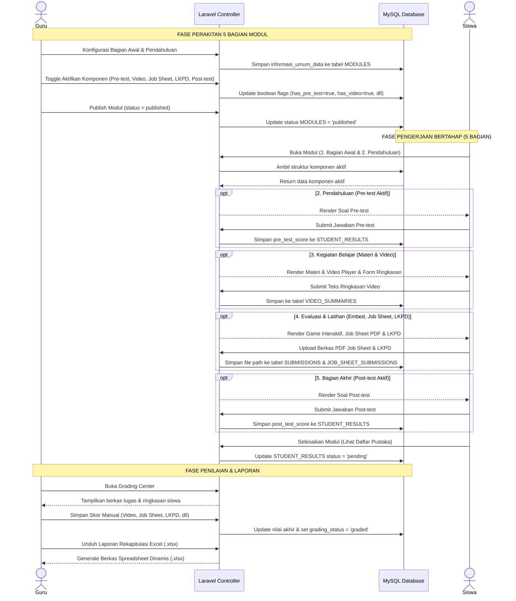
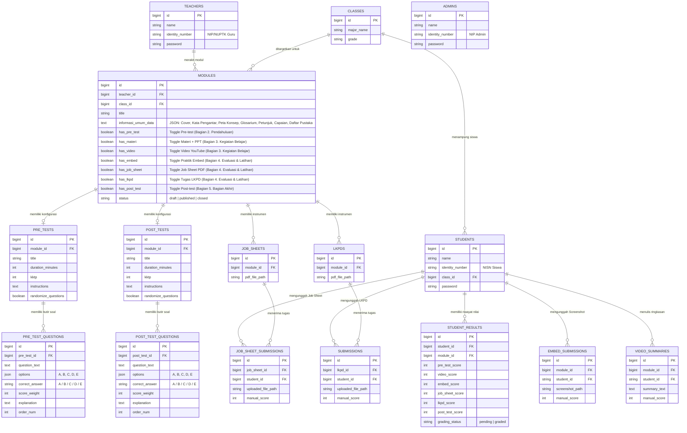

# PRD — Project Requirements Document (Versi Standar 5 Bagian Umum E-Modul)

## 1. **Overview (Tinjauan Umum)**

### 1.1 Latar Belakang Proyek

Aplikasi ini merupakan sebuah platform _Content Management System_ (CMS) E-Modul interaktif berbasis web yang dirancang secara esensial untuk mendukung ekosistem pendidikan vokasi di **SMK Negeri 3 Yogyakarta**. Secara infrastruktur, sekolah ini memiliki area fisik yang sangat luas, mencapai kurang lebih 4 hektar, dan telah difasilitasi dengan pemerataan akses internet nirkabel melalui program Wi-Fi Kominfo.

Potensi infrastruktur digital yang mumpuni ini membuka peluang besar untuk mendigitalkan proses belajar mengajar. Metode konvensional atau penggunaan modul statis (seperti PDF standar) sudah tidak lagi relevan dengan kebutuhan siswa kejuruan. Diperlukan sebuah wadah digital terpusat yang interaktif, di mana materi dapat disajikan secara terstruktur (halaman demi halaman) namun tetap fleksibel menyesuaikan gaya mengajar tiap guru.

### 1.2 Pernyataan Masalah (Problem Statement)

Pengembangan platform ini diinisiasi untuk memecahkan masalah utama (_pain points_) yang dialami oleh pemangku kepentingan di sekolah:

- **Kendala Guru:** Pengelolaan materi dan penilaian saat ini terpencar. Selain itu, guru sering kali merasa dibatasi oleh _template_ modul digital yang kaku. Terkadang guru hanya ingin memberikan materi saja tanpa kuis, atau sebaliknya. Dibutuhkan sebuah sistem _builder_ yang modular dan terstruktur sesuai kaidah pedagogis E-Modul.
- **Kendala Siswa:** Siswa sering mengalami disorientasi jika disuguhkan materi panjang dalam satu halaman penuh (_scroll_ panjang). Siswa membutuhkan modul digital yang terbagi ke dalam halaman-halaman sistematis (Bagian Awal, Pendahuluan, Kegiatan Belajar, Evaluasi & Latihan, hingga Bagian Akhir) beserta transparansi penilaian di akhir pembelajaran.
- **Kendala Manajemen Sekolah:** Pihak kurikulum tidak memiliki akses terpusat untuk memantau kinerja guru dan kelayakan materi pembelajaran secara _real-time_.

### 1.3 Tujuan Utama (Objectives)

Tujuan dari proyek ini adalah membangun portal E-Modul terpusat berbasis **Laravel 11** dengan sistem manajemen akses multi-peran (Admin, Guru, dan Siswa).

Sistem ini ditargetkan untuk:

1. Memberikan fasilitas _E-Module Builder_ bagi guru untuk merakit materi secara terstruktur menjadi **5 Bagian Umum Standar E-Modul (15 Komponen Fleksibel)**:
   - **1. Bagian Awal (4 Komponen):** Halaman sampul (_cover_), kata pengantar, daftar isi, serta petunjuk penggunaan e-modul bagi siswa dan guru (dikelola mandiri via `BagianAwalController`).
   - **2. Pendahuluan (4 Komponen):** Rumusan tujuan pembelajaran & capaian, peta konsep alur materi, glosarium istilah (dikelola via `PendahuluanController`), serta soal latihan diagnostik / Pre-test (`has_pre_test` dikelola via `PreTestController`).
   - **3. Kegiatan Belajar / Isi Materi (2 Komponen):** Uraian materi pembelajaran berbasis teks & slide PPT (`has_materi`), serta multimedia video pembelajaran YouTube & resume (`has_video`).
   - **4. Evaluasi & Latihan (3 Komponen):** Game edukasi interaktif & media embed simulator (`has_embed`), lembar kerja praktik / _Job Sheet_ PDF (`has_job_sheet`), serta tugas lembar kerja peserta didik & umpan balik / LKPD (`has_lkpd`).
   - **5. Bagian Akhir (2 Komponen):** Tes akhir modul / Post-test (`has_post_test`), dan daftar pustaka kepustakaan & rujukan (dikelola mandiri via `DaftarPustakaController`).
2. Menyediakan _Dashboard Personal_ bagi siswa untuk membaca E-Modul layaknya buku digital interaktif, melacak progres belajar per halaman, dan melihat transparansi nilai.
3. Memfasilitasi guru dengan *Grading Center* adaptif yang otomatis menyesuaikan matriks nilai dengan komponen evaluasi yang diaktifkan.
4. Memungkinkan sekolah mengekspor seluruh hasil belajar siswa ke dalam berkas spreadsheet / Excel (.xlsx) yang kolomnya otomatis menyesuaikan dengan komponen aktif pada modul dan dapat diedit atau diolah lebih lanjut di Microsoft Excel.

### 1.4 Ruang Lingkup Proyek (Scope of Work)

Untuk fase peluncuran awal (MVP), ruang lingkup aplikasi dibatasi pada:

- Pengembangan antarmuka untuk 3 peran: Admin, Guru, dan Siswa.
- Pembuatan **Dynamic E-Module Builder** dengan arsitektur 5 Bagian Umum E-Modul (15 total komponen terisolasi).
- Sistem sakelar instan (Toggle Switch) yang memungkinkan guru mengaktifkan/menonaktifkan komponen di setiap bagian.
- Sistem navigasi siswa yang berbasis _Pagination_ (Halaman Sebelumnya / Halaman Selanjutnya) agar siswa membaca materi secara bertahap dan terarah.
- Penilaian hibrida: Otomatis (untuk soal pilihan ganda Pre-test & Post-test) dan manual (untuk ringkasan video, bukti _screenshot_ praktik interaktif, serta berkas tugas LKPD dan _Job Sheet_), yang seluruhnya beradaptasi dengan komponen yang diaktifkan oleh guru.

---

## 2. **Requirements (Kebutuhan Sistem)**

Bagian ini mendefinisikan kebutuhan fungsional dan aturan bisnis yang harus dipenuhi oleh platform E-Modul agar dapat berjalan sesuai dengan tujuan ekosistem pembelajaran di SMK Negeri 3 Yogyakarta.

### 2.1 Manajemen Hak Akses Multi-Peran (Role-Based Access Control)

Sistem harus memisahkan wewenang dan tampilan antarmuka secara ketat berdasarkan tiga peran utama pengguna:

- **Admin (Supervisi/Kurikulum):** Memiliki hak istimewa (_privilege_) tertinggi untuk mengelola _Master Data_ pengguna (Akun Guru dan Siswa), manajemen kelas & jurusan, meninjau kelayakan konten modul (_Preview Mode_), dan memantau analitik produktivitas dari seluruh guru.
- **Guru (Pendidik/Kreator):** Memiliki hak penuh atas perakitan modul melalui _Module Builder_. Guru dapat membuat konten, menghidupkan/mematikan fitur di dalam 5 bagian modul, melakukan simulasi pratinjau siswa, dan memberikan penilaian manual terhadap tugas siswa di _Grading Center_.
- **Siswa (Pengguna Modul):** Memiliki hak akses terbatas yang difokuskan pada konsumsi materi secara bertahap (per halaman), pengunggahan tugas, pengerjaan kuis, dan pelacakan riwayat nilai.

### 2.2 Transparansi Dasbor dan Manajemen Portofolio

- **Transparansi Belajar Siswa:** Halaman dasbor siswa memisahkan status modul menjadi _Active/To-Do_ (Tugas Aktif) dan _Completed_ (Riwayat Selesai). Untuk E-Modul di tab _Completed_, sistem menampilkan rincian nilai akhir siswa secara transparan sesuai komponen yang aktif.
- **Manajemen Portofolio Guru:** Dasbor guru dilengkapi dengan halaman "Manajer Modul" untuk melihat riwayat seluruh modul yang pernah dirakit, status publikasinya (_Draft/Published/Closed_), dan memantau persentase pengumpulan tugas siswa secara _real-time_.

### 2.3 Struktur 5 Bagian Umum E-Modul (Modular & Paginated System)

Untuk menghindari disorientasi akibat _scroll_ yang terlalu panjang dan menerapkan standar kurikulum modul pembelajaran yang ideal, materi E-Modul dikelompokkan ke dalam **5 Bagian Utama**:

```
┌──────────────────────────────────────────────────────────────────────────────────────────┐
│                                STRUKTUR 5 BAGIAN E-MODUL                                 │
├───────────────────────────────┬──────────────────────────────────────────────────────────┤
│ 1. Bagian Awal                │ • Halaman Sampul (Cover)                                 │
│    (4 Komponen Pengantar)     │ • Kata Pengantar                                         │
│                               │ • Daftar Isi                                             │
│                               │ • Petunjuk Penggunaan bagi Siswa & Guru                  │
├───────────────────────────────┼──────────────────────────────────────────────────────────┤
│ 2. Pendahuluan                │ • Tujuan Pembelajaran & Rumusan Capaian                  │
│    (4 Komponen Orientasi)     │ • Peta Konsep (Diagram Alur Materi)                      │
│                               │ • Glosarium (Kata Kunci & Istilah Penting)               │
│                               │ • Soal Latihan Diagnostik / Pre-test (has_pre_test)      │
├───────────────────────────────┼──────────────────────────────────────────────────────────┤
│ 3. Kegiatan Belajar           │ • Uraian Materi Pembelajaran & Slide PPT (has_materi)    │
│    (2 Komponen Isi Materi)    │ • Multimedia Video YouTube & Resume (has_video)          │
├───────────────────────────────┼──────────────────────────────────────────────────────────┤
│ 4. Evaluasi & Latihan         │ • Game Edukasi Interaktif & Embed Simulator (has_embed)  │
│    (3 Komponen Praktik/Tugas) │ • Lembar Kerja Praktik / Job Sheet PDF (has_job_sheet)   │
│                               │ • Tugas LKPD & Umpan Balik / Feedback (has_lkpd)         │
├───────────────────────────────┼──────────────────────────────────────────────────────────┤
│ 5. Bagian Akhir               │ • Tes Akhir Modul / Post-test (has_post_test)            │
│    (2 Komponen Penutup)       │ • Daftar Pustaka & Referensi Kepustakaan                 │
└───────────────────────────────┴──────────────────────────────────────────────────────────┘
```

### 2.4 Dinamika Sakelar Toggle (15 Komponen Fleksibel)

Guru diberikan kebebasan mutlak (_Toggle System_) untuk menghidupkan atau mematikan komponen di seluruh 5 bagian modul. Siswa hanya akan melihat halaman/tahapan yang diaktifkan oleh guru, dengan aturan navigasi yang mengikat (tidak bisa melompat ke halaman selanjutnya sebelum instruksi di halaman saat ini selesai).

### 2.5 Sistem Penilaian Adaptif, Laporan, & Kebijakan Revisi

- **Penilaian Adaptif:** Mesin penilaian (_Grading System_) beradaptasi secara dinamis dengan komponen evaluasi yang diaktifkan guru (Pre-test, Video, Embed, Job Sheet, LKPD, Post-test). Sistem menggunakan kombinasi penilaian otomatis (pilihan ganda) dan manual (tugas/berkas PDF/screenshot/ringkasan teks).
- **Kebijakan Unggah Ulang (Re-submission):** Siswa diizinkan membatalkan dan mengunggah ulang file _Job Sheet_, LKPD, atau _Screenshot_ Praktik **hanya jika** guru belum memberikan nilai (status di database masih `pending`). Jika guru sudah menilainya (status `graded`), form unggah terkunci otomatis.
- **Pembuatan Laporan Dinamis (Spreadsheet / Excel .XLSX Generator):** Sistem mampu mengagregasi seluruh komponen nilai yang diaktifkan beserta data siswa ke dalam berkas spreadsheet Excel (`.xlsx`) yang dapat diedit dan diolah secara leluasa oleh guru/sekolah, dengan tata letak kolom yang menyesuaikan secara dinamis terhadap komponen aktif pada modul.

---

## 3. **Core Features (Fitur Utama)**

### 3.1 Dashboard Admin (Supervision Panel)

Pusat kendali bagi pihak manajemen sekolah (Kurikulum atau Kepala Sekolah) untuk mengelola data operasional dan mengawasi jalannya proses pembelajaran digital secara terpusat:

- **Manajemen Master Data:** Menu untuk mengelola entitas pengguna (Akun Guru dan Siswa) serta struktur akademik (Daftar Kelas dan Jurusan).
- **Monitoring Produktivitas Guru:** Panel statistik yang menampilkan daftar guru aktif beserta jumlah E-Modul yang telah dibuat dan didistribusikan.
- **Quality Control (Pratinjau Modul):** Admin memiliki akses pratinjau (_Preview Mode_) untuk meninjau seluruh konten modul di 5 bagian tanpa hak mengubah, guna menjamin standar mutu materi.

### 3.2 Dashboard Guru (Teacher Workspace)

Ruang kerja eksklusif bagi pendidik untuk merancang, mendistribusikan, dan mengevaluasi modul pembelajaran:

- **Manajer Modul (Module Manager):** Halaman yang menampilkan seluruh daftar E-Modul milik guru dengan status (_Draft_, _Published_, atau _Closed_) dan _Progress Bar_ pengumpulan tugas siswa secara _real-time_.
- **E-Module Detail & Builder (5 Bagian):** Antarmuka terstruktur menampilkan 5 Bagian Utama E-Modul, progress bar kesiapan (contoh: `14/15 Komponen Aktif`), kartu 2-kolom seimbang, tombol edit langsung per-elemen, dan sakelar instan (AJAX toggle switch).
- **Dedicated Modular Component Editors:** Setiap bagian memiliki halaman editor terisolasi:
  - `Editor Bagian Awal` (4 Komponen: Cover, Kata Pengantar, Daftar Isi, Petunjuk).
  - `Editor Pendahuluan` (3 Komponen: Tujuan Pembelajaran & Capaian, Peta Konsep, Glosarium).
  - `Editor Pre-test Diagnostik` (Quiz Builder Soal Pilihan Ganda).
  - `Editor Materi Pembelajaran & PPT` (Rich text editor & PPT embed).
  - `Editor Multimedia Video` (Integrasi YouTube & instruksi resume).
  - `Editor Praktik Interaktif (Embed)` (Kode simulator & embed web).
  - `Editor Lembar Kerja Praktik (Job Sheet)` (Panduan praktikum & berkas PDF).
  - `Editor Tugas LKPD` (Penugasan lembar kerja & instrumen PDF).
  - `Editor Post-test` (Quiz Builder evaluasi akhir modul).
  - `Editor Daftar Pustaka` (Tabel rujukan buku, jurnal, dan sumber digital).
- **Simulation Preview:** Kemudahan guru dalam mensimulasikan tampilan persis seperti yang akan dilihat siswa sebelum modul dipublikasikan.
- **Grading Center (Pusat Penilaian Adaptif):** Panel terpadu bagi guru untuk memeriksa dan memberikan nilai manual terhadap Ringkasan Video, tangkapan layar Praktik Interaktif, serta file tugas PDF _Job Sheet_ dan LKPD.

### 3.3 Dashboard Siswa (Student Portal)

Portal belajar yang transparan dan terstruktur bagi siswa:

- **Tab Tugas Aktif (To-Do):** Menampilkan daftar E-Modul yang ditugaskan untuk kelas siswa dan wajib diselesaikan.
- **Tab Riwayat Nilai (Completed):** Menyimpan rekam jejak E-Modul yang telah diselesaikan beserta rincian nilai transparan untuk setiap komponen yang dinilai oleh guru.

### 3.4 Interactive Student UI (Antarmuka Belajar Paginated & Restriktif)

Antarmuka pengerjaan modul bagi siswa berbasis halaman terpisah (_Pagination_) melewati 5 bagian belajar. Navigasi bersifat mengikat (_restriktif_); tombol "Selanjutnya" terkunci jika instruksi pada halaman saat ini belum tuntas.

### 3.5 Spreadsheet / Excel Report Generator (Pembangkit Laporan Dinamis .XLSX)

Fitur ekspor data penilaian kelas ke format berkas spreadsheet (.xlsx / Microsoft Excel) yang dapat diedit, diformat, dan diolah lebih lanjut oleh guru atau pihak sekolah, dengan tata letak kolom tabel yang secara dinamis beradaptasi terhadap komponen aktif pada modul.

---

## 4. **User Flow (Alur Pengguna)**

### 4.1 Alur Guru (Teacher Flow) — Perancangan 5 Bagian & Penilaian

1. **Autentikasi & Dasbor Awal:** Guru melakukan _login_ dan membuka "Manajer Modul".
2. **Pembuatan Modul:** Guru menekan "Buat Modul Baru", memasukkan judul dan target kelas. Modul tersimpan dengan status `draft`.
3. **Penyusunan Konten (Module Detail 5 Bagian):**
   - **Bagian Awal:** Guru mengedit Cover, Kata Pengantar, Daftar Isi, dan Petunjuk Penggunaan via Editor Bagian Awal.
   - **Pendahuluan:** Guru menyusun Tujuan Pembelajaran, Capaian Pembelajaran, Peta Konsep, dan Glosarium via Editor Pendahuluan, serta menyusun kuis diagnostik via Editor Pre-test.
   - **Kegiatan Belajar:** Guru mengisi Materi & PPT via Editor Materi, serta tautan Video YouTube via Editor Video.
   - **Evaluasi & Latihan:** Guru mengatur game interaktif via Editor Embed, mengunggah panduan via Editor Job Sheet, dan menyusun tugas via Editor LKPD.
   - **Bagian Akhir:** Guru merakit soal tes penutup via Editor Post-test dan menyusun sumber rujukan via Editor Daftar Pustaka.
4. **Simulasi Pratinjau:** Guru membuka fitur Preview pada tiap komponen untuk memastikan kesesuaian materi.
5. **Publikasi:** Guru menekan tombol "Publish Modul" sehingga modul dapat diakses oleh siswa pada kelas target.
6. **Evaluasi di Grading Center:** Guru meninjau penugasan siswa yang masuk, membaca ringkasan video, memeriksa screenshot praktik, mengunduh file tugas, dan memasukkan nilai manual.
7. **Ekspor Laporan Nilai:** Guru mengunduh Rekapitulasi Laporan Spreadsheet Excel (.xlsx) nilai kelas untuk pengolahan lebih lanjut atau arsip nilai.

### 4.2 Alur Siswa (Student Flow) — Pengalaman Belajar 5 Tahap

1. **Pemeriksaan Tugas:** Siswa _login_ menggunakan NISN dan membuka modul yang aktif di tab **"Tugas Aktif"**.
2. **Tahap 1 — Bagian Awal:** Siswa melihat Cover, membaca Kata Pengantar, memeriksa Daftar Isi, dan memahami Petunjuk Penggunaan.
3. **Tahap 2 — Pendahuluan:** Siswa membaca Rumusan Capaian & Tujuan Pembelajaran, mencermati Peta Konsep, membaca Glosarium istilah, dan mengerjakan Pre-test diagnostik jika aktif.
4. **Tahap 3 — Kegiatan Belajar:** Siswa membaca uraian Materi & slide PPT, menyimak Video YouTube & mengetik ringkasan.
5. **Tahap 4 — Evaluasi & Latihan:** Siswa memainkan game interaktif/simulator embed & mengunggah screenshot, mengunduh/mengerjakan Job Sheet praktikum, serta berdiskusi tugas LKPD & mengunggah salinan PDF.
6. **Tahap 5 — Bagian Akhir:** Siswa mengerjakan Post-test akhir modul dan mencermati Daftar Pustaka rujukan.
7. **Penyelesaian & Transisi:** Siswa menyelesaikan modul, status modul berpindah ke tab **"Riwayat Selesai"**, dan nilai dapat dipantau secara transparan.

---

## 5. **Architecture (Arsitektur Sistem)**

### 5.1 Pendekatan Monolithic MVC

Platform ini dibangun menggunakan arsitektur **Monolithic MVC (Model-View-Controller)** berbasis **Laravel 11**. Arsitektur ini menggabungkan frontend dan backend dalam satu repositori yang efisien, mudah dikelola, dan ideal untuk implementasi pada server intranet sekolah maupun hosting cloud.

### 5.2 Multi-Guard Authentication

Sistem menerapkan arsitektur **Multi-Guard Authentication** bawaan Laravel dengan 3 entitas pengguna terpisah:

- **Admin Guard (`auth:admin`):** Mengamankan akses dasbor supervisi melalui tabel `ADMINS`.
- **Teacher Guard (`auth:teacher`):** Mengamankan akses workspace guru dan builder melalui tabel `TEACHERS`.
- **Student Guard (`auth:student`):** Mengamankan akses antarmuka belajar siswa melalui tabel `STUDENTS`.

### 5.3 Pemetaan Data & Logika MVC pada 5 Bagian E-Modul

- **Model (`Module.php`):**
  - Mengelola interaksi basis data dan JSON casting pada `informasi_umum_data`.
  - Menyediakan helper terstruktur untuk 5 Bagian: `moduleSectionsSummary()`, `bagianAwalComponents()`, `pendahuluanComponents()`, `kegiatanBelajarComponents()`, `evaluasiLatihanComponents()`, `bagianAkhirComponents()`.
  - Helper status dan penilaian: `statusLabel()`, `activeComponents()`, `activeGradedComponents()`.
- **Controller Pengelola Konten Mandiri:**
  - `BagianAwalController`: Mengelola 4 komponen awal (cover, kata pengantar, daftar isi, petunjuk penggunaan).
  - `PendahuluanController`: Mengelola 3 komponen orientasi konsep (tujuan pembelajaran, peta konsep, glosarium).
  - `PreTestController`: Mengelola konfigurasi dan butir soal kuis diagnostik Pre-test.
  - `MateriController`: Mengelola naskah materi pembelajaran dan file presentasi slide PPT.
  - `VideoController`: Mengelola integrasi video YouTube dan tugas ringkasan siswa.
  - `EmbedController`: Mengelola media interaktif embed dan bukti pengerjaan siswa.
  - `JobSheetController`: Mengelola lembar kerja praktik (Job Sheet PDF) pada bagian Evaluasi & Latihan.
  - `LkpdController`: Mengelola lembar kerja peserta didik (LKPD PDF) pada bagian Evaluasi & Latihan.
  - `PostTestController`: Mengelola konfigurasi dan butir soal kuis evaluasi akhir modul Post-test.
  - `DaftarPustakaController`: Mengelola daftar referensi buku, modul ajar, jurnal, dan tautan digital pada Bagian Akhir.
  - `GradingController`: Mengelola matriks penilaian adaptif dan rekapitulasi nilai siswa.
  - `ModuleManagerController`: Mengelola siklus hidup modul (CRUD, status draft/publish/closed).

### 5.4 Sequence Diagram Alur Belajar 5 Bagian



---

## 6. **Database Schema (Skema Basis Data)**

Sistem menggunakan basis data relasional MySQL / MariaDB dengan dukungan tipe data JSON untuk fleksibilitas metadata Informasi Umum, serta kolom _boolean_ untuk mengontrol aktivasi 7 fitur interaktif.

### 6.1 Entity Relationship Diagram (ERD)



### 6.2 Data Dictionary (Kamus Data Tabel Utama)

**1. Tabel `ADMINS`, `TEACHERS`, `STUDENTS` (Entitas Pengguna Terpisah)**
- `ADMINS`: `id`, `name`, `identity_number` (NIP), `password`.
- `TEACHERS`: `id`, `name`, `identity_number` (NUPTK/NIP), `password`.
- `STUDENTS`: `id`, `name`, `identity_number` (NISN), `class_id` (FK), `password`.

**2. Tabel `MODULES` (Entitas Modul Sentral & Konfigurasi Builder)**
- `id` (BigInt PK): Identitas unik modul.
- `teacher_id` (BigInt FK): Relasi ke guru perakit modul.
- `class_id` (BigInt FK): Relasi ke target kelas siswa.
- `title` (String): Judul modul pembelajaran.
- `informasi_umum_data` (JSON/Text): Menyimpan struktur data Cover, Kata Pengantar, Peta Konsep, Glosarium, Petunjuk Penggunaan, Tujuan Pembelajaran, dan Daftar Pustaka.
- **[ 7 Sakelar Fitur Interaktif ]**:
  - `has_pre_test` (Boolean — Bagian 2. Pendahuluan)
  - `has_materi` (Boolean — Bagian 3. Kegiatan Belajar)
  - `has_video` (Boolean — Bagian 3. Kegiatan Belajar)
  - `has_embed` (Boolean — Bagian 4. Evaluasi & Latihan)
  - `has_job_sheet` (Boolean — Bagian 4. Evaluasi & Latihan)
  - `has_lkpd` (Boolean — Bagian 4. Evaluasi & Latihan)
  - `has_post_test` (Boolean — Bagian 5. Bagian Akhir)
- `status` (Enum): `'draft'`, `'published'`, `'closed'`.

**3. Tabel Rekam Penugasan (Submissions)**
- `VIDEO_SUMMARIES`: `id`, `module_id`, `student_id`, `summary_text`, `manual_score`.
- `EMBED_SUBMISSIONS`: `id`, `module_id`, `student_id`, `screenshot_path`, `manual_score`.
- `JOB_SHEET_SUBMISSIONS`: `id`, `job_sheet_id`, `student_id`, `uploaded_file_path`, `manual_score`.
- `SUBMISSIONS` (LKPD): `id`, `lkpd_id`, `student_id`, `uploaded_file_path`, `manual_score`.

**4. Tabel `STUDENT_RESULTS` (Agregasi Nilai Adaptif Siswa)**
- `id` (BigInt PK)
- `student_id` (BigInt FK)
- `module_id` (BigInt FK)
- `pre_test_score` (Int Nullable)
- `video_score` (Int Nullable)
- `embed_score` (Int Nullable)
- `job_sheet_score` (Int Nullable)
- `lkpd_score` (Int Nullable)
- `post_test_score` (Int Nullable)
- `grading_status` (Enum): `'pending'`, `'graded'`.

---

## 7. **Tech Stack (Teknologi yang Digunakan)**

### 7.1 Backend & Arsitektur
- **Framework:** Laravel 11 (PHP 8.2+) dengan arsitektur Monolithic MVC.
- **Autentikasi:** Laravel Multi-Guard Authentication (`admin`, `teacher`, `student`).
- **ORM & Database Engine:** Eloquent ORM pada MySQL / MariaDB dengan dukungan tipe data JSON.

### 7.2 Frontend & UI
- **Templating:** Blade Templating Engine.
- **Styling:** Tailwind CSS dengan desain modern responsif, transisi micro-animation, dan color palette harmonis.
- **Asset Bundler:** Vite 7.
- **Komponen Interaktif:** TinyMCE / Quill.js untuk editor teks kaya, serta AJAX toggle handler untuk manipulasi sakelar builder tanpa reload.

### 7.3 Penyimpanan Berkas & Pelaporan
- **File Storage:** Laravel Storage Symlink dengan validasi MIME-type (Maksimal 2 MB untuk screenshot praktik, Maksimal 5 MB untuk PDF Job Sheet / LKPD, Maksimal 3 MB untuk Cover).
- **Spreadsheet / Excel Reporting:** `maatwebsite/excel` (atau `phpoffice/phpspreadsheet`) untuk ekspor laporan rekapitulasi nilai dinamis ke format spreadsheet (.xlsx / Microsoft Excel) yang fleksibel dan dapat diedit.

---

## 8. **Project Folder Structure (Struktur Direktori Proyek)**

Struktur direktori codebase disusun secara bersih, modular, dan mengikuti konvensi standar Laravel 11:

```
e-modul/
├── app/
│   ├── Exports/                                # Export handler spreadsheet / Excel
│   │   └── ModuleGradesExport.php              # Logika penataan kolom adaptif & format Excel (.xlsx)
│   ├── Http/
│   │   ├── Controllers/
│   │   │   ├── AuthController.php              # Multi-guard authentication (Admin, Teacher, Student)
│   │   │   ├── Controller.php                  # Base Controller
│   │   │   └── Teacher/                        # Dedicated Workspace & Modular Component Editors
│   │   │       ├── BagianAwalController.php    # Editor Bagian 1 (Cover, Kata Pengantar, Daftar Isi, Petunjuk)
│   │   │       ├── PendahuluanController.php   # Editor Bagian 2 (Tujuan Pembelajaran, Peta Konsep, Glosarium)
│   │   │       ├── PreTestController.php       # Editor Pre-test (Kuis Diagnostik & Builder Soal)
│   │   │       ├── MateriController.php        # Editor Materi Pembelajaran & Upload PPT
│   │   │       ├── VideoController.php         # Editor Video YouTube & Pengaturan Resume
│   │   │       ├── EmbedController.php         # Editor Simulator Embed & Praktik Interaktif
│   │   │       ├── JobSheetController.php      # Editor Lembar Kerja Praktik (Job Sheet PDF)
│   │   │       ├── LkpdController.php          # Editor Lembar Kerja Peserta Didik (LKPD PDF)
│   │   │       ├── PostTestController.php      # Editor Post-test (Evaluasi Akhir Modul & Builder Soal)
│   │   │       ├── DaftarPustakaController.php # Editor Bagian 5 (Daftar Pustaka & Referensi Rujukan)
│   │   │       ├── GradingController.php       # Matriks Penilaian Adaptif & Rekapitulasi Nilai Siswa
│   │   │       └── ModuleManagerController.php # Manajer Modul (CRUD, Publish, Close, Detail Modul)
│   │   └── Middleware/
│   │       └── Authenticate.php                # Multi-guard authentication middleware handler
│   └── Models/
│       ├── Admin.php                           # Model entitas Administrator
│       ├── Teacher.php                         # Model entitas Guru
│       ├── Student.php                         # Model entitas Siswa
│       ├── SchoolClass.php                     # Model entitas Kelas & Jurusan
│       ├── Module.php                          # Model E-Modul Sentral & Helper 5 Bagian
│       ├── PreTest.php                         # Model konfigurasi Pre-test
│       ├── PreTestQuestion.php                 # Model butir soal Pre-test
│       ├── PostTest.php                        # Model konfigurasi Post-test
│       ├── PostTestQuestion.php                # Model butir soal Post-test
│       ├── JobSheet.php                        # Model instrumen Job Sheet
│       ├── JobSheetSubmission.php              # Model tugas pengumpulan Job Sheet siswa
│       ├── Lkpd.php                            # Model instrumen LKPD
│       ├── Submission.php                      # Model tugas pengumpulan LKPD siswa
│       ├── EmbedSubmission.php                 # Model bukti tangkapan layar praktik embed
│       ├── VideoSummary.php                    # Model teks ringkasan video pembelajaran
│       └── StudentResult.php                   # Model agregasi nilai adaptif per siswa
├── database/
│   ├── factories/                              # Database model factories
│   ├── migrations/                             # Migration skema tabel basis data
│   └── seeders/
│       └── DatabaseSeeder.php                  # Data awal pengguna, kelas, dan modul demonstrasi
├── public/
│   ├── build/                                  # Aset terkompilasi Vite (CSS & JS bundles)
│   └── storage/                                # Symlink ke storage/app/public
├── resources/
│   ├── css/
│   │   └── app.css                             # Tailwind CSS stylesheet
│   ├── js/
│   │   └── app.js                              # JavaScript entry point
│   └── views/
│       ├── layouts/
│       │   ├── admin/                          # Layout master dasbor admin
│       │   ├── teacher/                        # Layout master workspace guru (dashboardteacher.blade.php)
│       │   └── student/                        # Layout master portal belajar siswa
│       └── pages/
│           ├── admin/
│           │   └── dashboard.blade.php         # Dasbor supervisi admin
│           ├── student/
│           │   └── dashboard.blade.php         # Portal belajar & tab tugas/riwayat siswa
│           └── teacher/
│               ├── classes/
│               │   └── index.blade.php         # Daftar kelas binaan guru
│               ├── grading/
│               │   ├── index.blade.php         # Index pusat penilaian guru
│               │   └── show.blade.php          # Matriks penilaian adaptif modul per siswa
│               ├── modules/
│               │   ├── index.blade.php         # Manajer Modul (Daftar seluruh e-modul guru)
│               │   ├── create.blade.php        # Form pembuatan modul baru
│               │   ├── show.blade.php          # Detail Modul Utama & Builder 5 Bagian
│               │   ├── bagian-awal/
│               │   │   └── edit.blade.php      # Editor Bagian Awal (4 Komponen)
│               │   ├── pendahuluan/
│               │   │   └── edit.blade.php      # Editor Pendahuluan (3 Komponen Konsep)
│               │   ├── daftar-pustaka/
│               │   │   └── edit.blade.php      # Editor Daftar Pustaka (Kepustakaan & Rujukan)
│               │   ├── pre-test.blade.php      # Editor Quiz Builder Pre-test Diagnostik
│               │   ├── preview-pre-test.blade.php # Pratinjau simulasi Pre-test
│               │   ├── materi.blade.php        # Editor Materi Pembelajaran & PPT
│               │   ├── preview-materi.blade.php # Pratinjau simulasi Materi
│               │   ├── video.blade.php         # Editor Video YouTube & Resume
│               │   ├── preview-video.blade.php # Pratinjau simulasi Video
│               │   ├── embed.blade.php         # Editor Game Interaktif / Simulator Embed
│               │   ├── preview-embed.blade.php # Pratinjau simulasi Embed
│               │   ├── job-sheet.blade.php     # Editor Lembar Kerja Praktik (Job Sheet PDF)
│               │   ├── preview-job-sheet.blade.php # Pratinjau simulasi Job Sheet
│               │   ├── lkpd.blade.php          # Editor Tugas LKPD PDF
│               │   ├── preview-lkpd.blade.php  # Pratinjau simulasi LKPD
│               │   ├── post-test.blade.php     # Editor Quiz Builder Post-test Akhir Modul
│               │   ├── preview-post-test.blade.php # Pratinjau simulasi Post-test
│               │   └── partials/               # Komponen Blade parsial
│               └── reports/
│                   └── index.blade.php         # Halaman pratinjau & ekspor rekapitulasi laporan nilai (.xlsx)
├── routes/
│   ├── web.php                                 # Rute aplikasi (Multi-guard auth & teacher sub-editors)
│   └── console.php                             # Rute perintah artisan CLI
├── storage/
│   └── app/
│       └── public/
│           ├── covers/                         # Berkas sampul modul pembelajaran
│           ├── job_sheets/                     # Berkas PDF panduan Job Sheet guru
│           ├── job_sheet_submissions/          # Berkas tugas Job Sheet yang diunggah siswa
│           ├── lkpds/                          # Berkas PDF instrumen LKPD guru
│           ├── lkpd_submissions/               # Berkas tugas LKPD yang diunggah siswa
│           ├── ppts/                           # Berkas presentasi PPT modul
│           └── screenshots/                    # Berkas bukti tangkapan layar praktik embed
├── tests/
│   ├── Feature/
│   │   ├── BagianAwalTest.php                  # Pengujian fitur Editor Bagian Awal
│   │   ├── PendahuluanTest.php                 # Pengujian fitur Editor Pendahuluan
│   │   ├── DaftarPustakaTest.php               # Pengujian fitur Editor Daftar Pustaka
│   │   ├── ModuleShowInterfaceTest.php         # Pengujian antarmuka 5 bagian modul
│   │   ├── GradingCenterTest.php               # Pengujian matriks adaptif Grading Center
│   │   └── ExampleTest.php                     # Pengujian respon HTTP dasar
│   └── Unit/
│       └── ExampleTest.php                     # Pengujian unit logic dasar
├── composer.json                               # Dependensi PHP & konfigurasi Laravel
├── package.json                                # Dependensi Node.js, Vite & Tailwind CSS
├── tailwind.config.js                          # Konfigurasi Tailwind CSS
├── vite.config.js                              # Konfigurasi build asset Vite
└── prd.md                                      # Dokumen Spesifikasi Kebutuhan Proyek (PRD)
```
