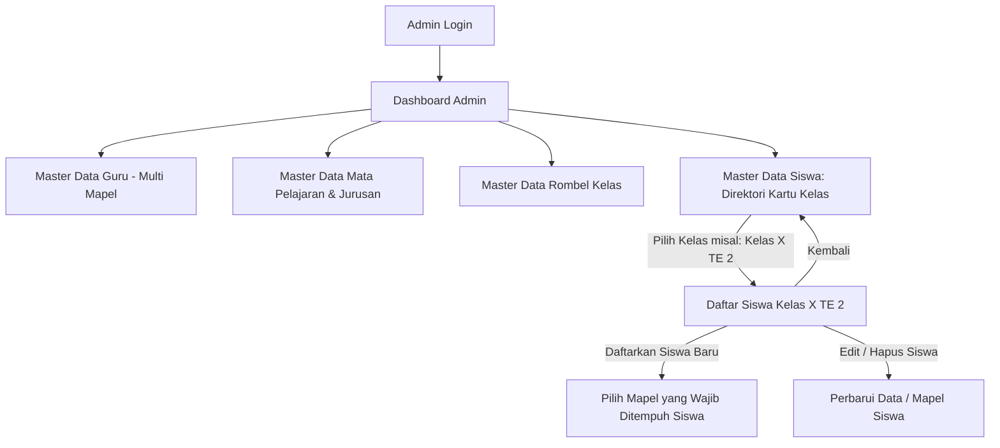
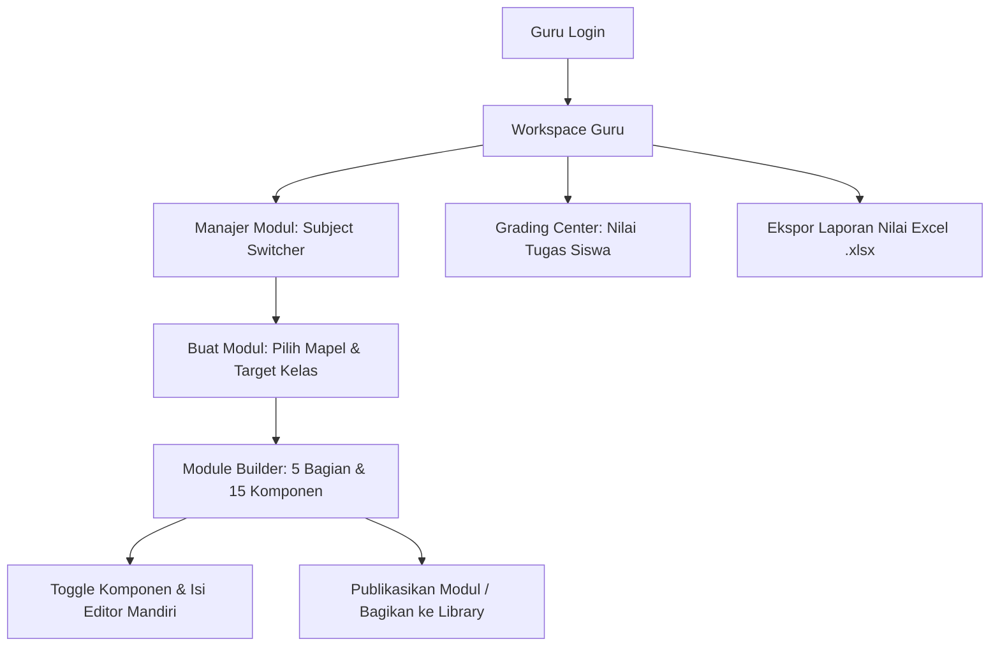
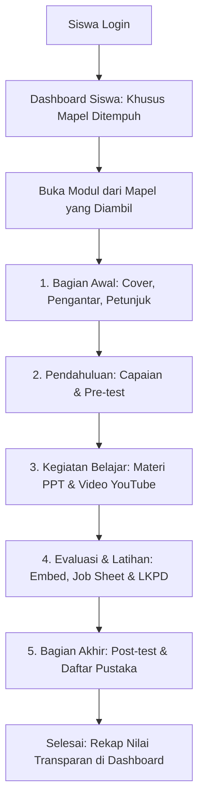
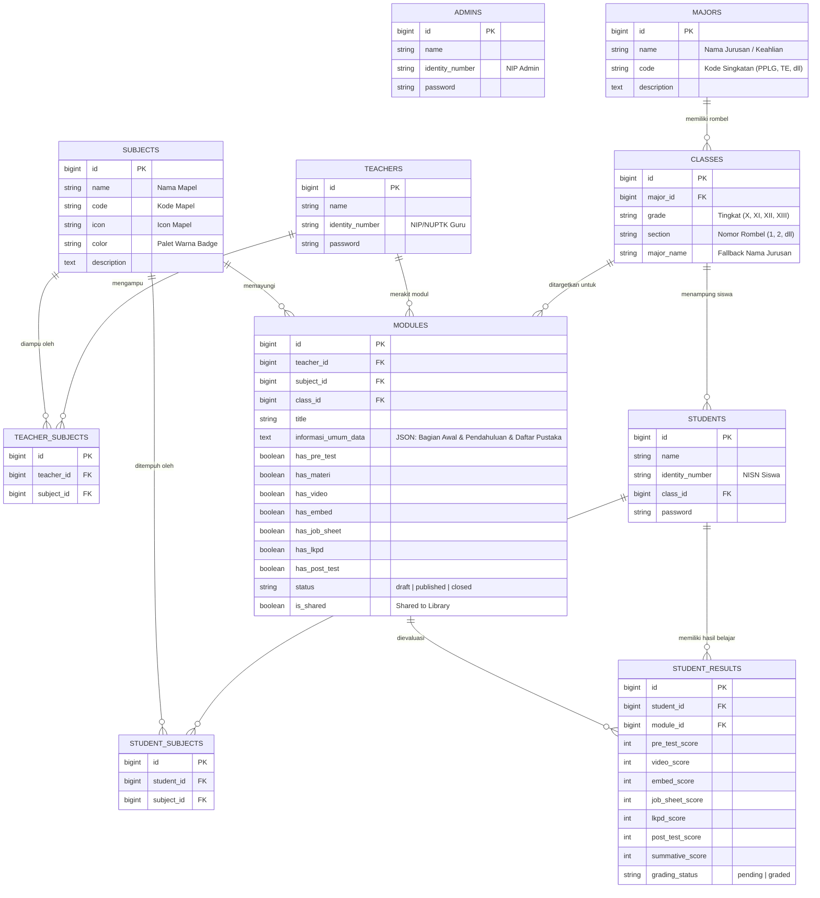

# PRD — Project Requirements Document (Versi Standar 5 Bagian Umum E-Modul & Sistem Akademik Terintegrasi)

## 1. **Overview (Tinjauan Umum)**

### 1.1 Latar Belakang Proyek

Aplikasi ini merupakan platform _Content Management System_ (CMS) E-Modul berbasis web yang dirancang secara esensial untuk mendukung dan mengoptimalkan ekosistem pendidikan vokasi di **SMK Negeri 3 Yogyakarta**.

Pengembangan platform ini dilatarbelakangi oleh beberapa kondisi nyata dalam proses belajar mengajar di sekolah:

1. **Fragmentasi Instrumen & Media Pembelajaran:**  
   Penggunaan instrumen dan media pembelajaran saat ini masih terpisah-pisah di berbagai platform pihak ketiga. Sebagai contoh, guru menggunakan formulir daring (seperti Google Forms) untuk pelaksanaan _pre-test_, membagikan Lembar Kerja Peserta Didik (LKPD) berformat dokumen Word melalui tautan unduhan terpisah, serta menginstruksikan pengumpulan tugas melalui tautan lain. Kerumitan berpindah-pindah tautan ini menyita banyak waktu efektif pembelajaran dan membingungkan siswa.

2. **Karakteristik Pembelajaran Sistem Blok & Ketiadaan Repositori Terpusat:**  
   Materi yang disampaikan di kelas sering kali tidak terdokumentasi dan tersimpan secara terpusat, sehingga menyulitkan siswa untuk melakukan pembelajaran mandiri atau mengulang materi (_review_). Kondisi ini menjadi semakin kritis mengingat alokasi waktu mata pelajaran tertentu (seperti Informatika) menerapkan sistem pembelajaran blok intensif—mencapai 8 jam pelajaran dalam satu hari dan diselesaikan dalam rentang waktu singkat (2 minggu / 14 hari). Akibatnya, siswa sangat rentan melupakan konsep dan keterampilan praktis yang telah dipelajari pada minggu sebelumnya jika tidak memiliki akses modul yang terstruktur dan berkelanjutan.

3. **Beban Administrasi Guru dalam Monitoring & Evaluasi:**  
   Fragmentasi platform menyita waktu manajemen kelas dan menyulitkan pendidik dalam memantau rekam jejak kognitif maupun progres belajar siswa secara utuh. Proses rekapitulasi nilai menjadi tidak efisien karena guru harus membuka dan menggabungkan data dari berbagai aplikasi yang berbeda.

Berdasarkan permasalahan tersebut, platform E-Modul ini dibangun menggunakan kerangka kerja **Laravel 11** dengan sistem kontrol akses multi-peran (**Admin**, **Guru**, dan **Siswa**). Platform ini hadir sebagai solusi satu pintu (_one-stop solution_) yang mempermudah guru dalam menyusun materi terstruktur serta mengelola penilaian secara komprehensif, sekaligus memberikan pengalaman belajar yang terarah, interaktif, dan mudah diakses kapan saja oleh siswa.

### 1.2 Pernyataan Masalah (Problem Statement)

Pengembangan platform ini diinisiasi untuk memecahkan masalah utama (_pain points_) yang dialami oleh pemangku kepentingan di sekolah:

- **Kendala Guru:** Pengelolaan materi dan penilaian saat ini terpencar. Guru sering kali merasa dibatasi oleh _template_ modul digital yang kaku. Selain itu, seorang guru kejuruan sering kali mengampu lebih dari satu mata pelajaran sekaligus (misal: Informatika dan Teknik Elektro). Dibutuhkan sebuah sistem _builder_ yang modular, terstruktur sesuai 5 Bagian Umum E-Modul, dan mendukung *Subject Switcher* terintegrasi.
- **Kendala Siswa:** Siswa sering mengalami disorientasi jika materi disajikan dalam satu halaman panjang tak berujung (_scroll_ panjang) atau jika dashboard dipenuhi modul mata pelajaran yang tidak mereka tempuh. Siswa membutuhkan modul digital yang terbagi ke dalam tahapan sistematis (Bagian Awal, Pendahuluan, Kegiatan Belajar, Evaluasi & Latihan, hingga Bagian Akhir), tampilan modul yang disaring khusus berdasarkan mata pelajaran yang mereka ambil, serta transparansi penilaian hasil belajar.
- **Kendala Manajemen Sekolah (Admin & Kurikulum):** Pihak kurikulum memerlukan panel administrasi terpadu untuk mengelola Master Data Pengguna (Guru & Siswa), Master Kurikulum (Mata Pelajaran & Jurusan/Konsentrasi Keahlian), pembagian Rombongan Belajar (Rombel Kelas), penentuan mata pelajaran yang wajib ditempuh siswa, serta supervisi mutu materi modul dari seluruh guru.

### 1.3 Tujuan Utama (Objectives)

Tujuan dari proyek ini adalah membangun portal E-Modul terpusat berbasis **Laravel 11** dengan sistem manajemen akses multi-peran (**Admin**, **Guru**, dan **Siswa**).

Sistem ini ditargetkan untuk:

1. Memberikan fasilitas _E-Module Builder_ bagi guru untuk merakit materi secara terstruktur menjadi **5 Bagian Umum Standar E-Modul (15 Komponen Fleksibel)**:
   - **1. Bagian Awal (4 Komponen):** Halaman sampul (_cover_), kata pengantar, daftar isi, serta petunjuk penggunaan e-modul bagi siswa dan guru (dikelola mandiri via `BagianAwalController`).
   - **2. Pendahuluan (4 Komponen):** Rumusan tujuan pembelajaran & capaian, peta konsep alur materi, glosarium istilah (dikelola via `PendahuluanController`), serta soal latihan diagnostik / Pre-test (`has_pre_test` dikelola via `PreTestController`).
   - **3. Kegiatan Belajar / Isi Materi (2 Komponen):** Uraian materi pembelajaran berbasis teks & slide PPT (`has_materi`), serta multimedia video pembelajaran YouTube & resume (`has_video`).
   - **4. Evaluasi & Latihan (3 Komponen):** Game edukasi interaktif & media embed simulator (`has_embed`), lembar kerja praktik / _Job Sheet_ PDF (`has_job_sheet`), serta tugas lembar kerja peserta didik & umpan balik / LKPD (`has_lkpd`).
   - **5. Bagian Akhir (2 Komponen):** Tes akhir modul / Post-test (`has_post_test`), dan daftar pustaka kepustakaan & rujukan (dikelola mandiri via `DaftarPustakaController`).
2. Menyediakan **Panel Administrasi Master Data Terpadu** bagi Admin untuk mengelola data akun guru, akun siswa per rombel kelas, master mata pelajaran, master jurusan / konsentrasi keahlian, dan rombongan belajar kelas.
3. Mengimplementasikan **Antarmuka Master Data Siswa Berjenjang (Two-Tier Architecture)**: Halaman utama menampilkan direktori kartu rombel kelas (seperti *Kelas X TE 2*, *Kelas X PPLG 1*), diikuti dengan halaman khusus daftar siswa per kelas terpilih untuk mempermudah administrasi.
4. Menerapkan **Ploting Mata Pelajaran Siswa saat Registrasi**: Admin dapat menentukan mata pelajaran apa saja yang harus ditempuh oleh setiap siswa.
5. Menyediakan **Personalisasi Dashboard Siswa & Proteksi Akses**: Dashboard dan sidebar navigasi siswa hanya menampilkan kartu mata pelajaran dan modul yang didaftarkan untuk siswa tersebut, serta mencegah siswa mengakses modul di luar mata pelajarannya.
6. Menyediakan **Library Modul (Repositori Kolaboratif Antar-Guru)** untuk saling berbagi pemikiran dan instrumen pembelajaran digital, di mana guru dapat membagikan modul karyanya, meninjau kurikulum modul guru lain, dan melakukan penyalinan mendalam (*deep clone*) ke *workspace* pribadi.
7. Memfasilitasi guru dengan **Grading Center Adaptif** dan **Ekspor Spreadsheet Excel (.xlsx)** yang dinamis menyesuaikan komponen aktif pada modul.
8. Mengintegrasikan **Manajemen Multi-Tanggung Jawab Guru**, memungkinkan seorang guru mengampu 2 atau lebih mata pelajaran dengan *Subject Switcher* pada seluruh menu guru.

### 1.4 Ruang Lingkup Proyek (Scope of Work)

Untuk fase rilis operasional, ruang lingkup aplikasi mencakup:

- Pengembangan antarmuka untuk 3 peran: Admin (Supervisi & Master Data), Guru (Pendidik & Kreator Modul), dan Siswa (Peserta Didik).
- Master Data Akademik: Manajemen Guru (Multi-Mapel), Siswa (Berbasis Rombel Kelas & Mapel), Mata Pelajaran, Jurusan/Konsentrasi Keahlian, dan Rombel Kelas.
- Antarmuka berjenjang pada Master Data Siswa (Direktori Rombel Kelas $\rightarrow$ Detail Siswa per Kelas).
- Personalisasi Portal Siswa: Filter modul dan sidebar berdasarkan mata pelajaran yang ditempuh siswa serta validasi hak akses per mapel.
- Pembuatan **Dynamic E-Module Builder** dengan arsitektur 5 Bagian Umum E-Modul (15 komponen terisolasi).
- Sistem sakelar instan (Toggle Switch) yang memungkinkan guru mengaktifkan/menonaktifkan komponen di setiap bagian.
- Sistem **Library Modul & Repositori Kolaboratif** (berbagi izin modul, katalog publik sekolah, pratinjau kurikulum, dan kloning instrumen pembelajaran).
- Sistem penyaringan dinamis (*Subject Switcher & Filters*) pada Manajer Modul, Grading Center, Laporan Nilai, dan Kelas Binaan.
- Sistem navigasi siswa berbasis _Pagination_ dengan aturan restriktif.
- Penilaian hibrida otomatis (Pre-test & Post-test) dan manual (Video, Praktik Interaktif Embed, Job Sheet, dan LKPD).
- Pembangkit laporan spreadsheet Excel (.xlsx) dengan struktur kolom dinamis.

---

## 2. **Requirements (Kebutuhan Sistem)**

### 2.1 Manajemen Hak Akses Multi-Peran (Role-Based Access Control)

Sistem memisahkan wewenang dan tampilan antarmuka secara ketat berdasarkan tiga peran utama:

- **Admin (Supervisi, Kurikulum & Master Data):**
  - Mengelola Master Data Guru (registrasi, edit, hapus, plotting multi-mapel).
  - Mengelola Master Data Siswa dengan navigasi berjenjang berbasis rombel kelas, pendaftaran siswa ke kelas tertentu, dan plotting mata pelajaran yang ditempuh.
  - Mengelola Master Data Mata Pelajaran (kode, warna badge, icon, deskripsi).
  - Mengelola Master Data Jurusan / Konsentrasi Keahlian (kode jurusan, nama keahlian).
  - Mengelola Master Data Rombongan Belajar Kelas (tingkat X s/d XIII, jurusan, nomor rombel).
  - Meninjau kelayakan konten modul (_Preview Mode_) dan memantau analitik sekolah.
- **Guru (Pendidik/Kreator Modul):**
  - Mengelola portofolio modul dengan *Subject Switcher*.
  - Merakit konten pada 5 Bagian Umum E-Modul (15 komponen terisolasi).
  - Mengaktifkan/menonaktifkan komponen evaluasi via sakelar AJAX.
  - Melakukan simulasi pratinjau siswa dan membagikan modul ke Library Bersama.
  - Melakukan penilaian manual di Grading Center dan mengekspor rekapitulasi nilai ke Excel (.xlsx).
- **Siswa (Peserta Didik):**
  - Mengakses Dashboard belajar yang dipersonalisasi sesuai mata pelajaran yang ditempuh.
  - Membaca E-Modul secara bertahap per halaman (5 bagian).
  - Mengerjakan pre-test/post-test, mengunggah ringkasan video, screenshot praktik embed, serta file PDF Job Sheet & LKPD.
  - Melacak progres belajar dan transparansi perolehan nilai.

### 2.2 Arsitektur Antarmuka Master Data Siswa (Two-Tier Interface)

Untuk menjaga kerapian data pada skala sekolah kejuruan dengan puluhan rombongan belajar dan ribuan siswa:
- **Tingkat 1 (Direktori Rombel Kelas — `/admin/students`):** Menampilkan grid kartu informatif seluruh rombongan belajar kelas (contoh: *Kelas X TE 2*, *Kelas X PPLG 1*), metrik jumlah siswa per kelas, filter tingkat (X, XI, XII, XIII), filter jurusan, dan modal pendaftaran siswa baru secara global.
- **Tingkat 2 (Daftar Siswa Kelas — `/admin/students/class/{class}`):** Halaman khusus yang menampilkan tabel daftar siswa di kelas tersebut, status mata pelajaran yang diambil, tombol kembali (`← Daftar Kelas`), tombol "Daftarkan Siswa ke Kelas Ini", filter pencarian siswa, serta aksi edit & hapus siswa.

### 2.3 Personalisasi Portal Belajar Siswa

- **Filtering Berdasarkan Mata Pelajaran yang Ditempuh:** Siswa hanya melihat kartu mata pelajaran dan modul kelas yang sesuai dengan mata pelajaran yang ditentukan oleh Admin saat registrasi/edit siswa (`student_subjects`).
- **Sidebar Navigasi Siswa:** Menu navigasi "Modul Belajar" pada sidebar siswa secara dinamis memuat daftar mata pelajaran yang diambil siswa melalui View Composer `AppServiceProvider`.
- **Proteksi Hak Akses Halaman Modul:** Jika siswa mencoba membuka modul dari mata pelajaran yang tidak ia tempuh (`/student/modules/subject/{subject}`), controller secara otomatis menolak akses dan mengembalikan siswa ke dashboard dengan pesan notifikasi.

### 2.4 Struktur 5 Bagian Umum E-Modul (Modular & Paginated System)

Materi E-Modul dikelompokkan ke dalam **5 Bagian Utama**:

```
┌──────────────────────────────────────────────────────────────────────────────────────────┐
│                                STRUKTUR 5 BAGIAN E-MODUL                                 │
├───────────────────────────────┬──────────────────────────────────────────────────────────┤
│ 1. Bagian Awal                │ • Halaman Sampul (Cover)                                 │
│    (4 Komponen Pengantar)     │ • Kata Pengantar                                         │
│                               │ • Daftar Isi                                             │
│                               │ • Petunjuk Penggunaan bagi Siswa & Guru                  │
├───────────────────────────────┼──────────────────────────────────────────────────────────┤
│ 2. Pendahuluan                │ • Tujuan Pembelajaran & Rumusan Capaian                  │
│    (4 Komponen Orientasi)     │ • Peta Konsep (Diagram Alur Materi)                      │
│                               │ • Glosarium (Kata Kunci & Istilah Penting)               │
│                               │ • Soal Latihan Diagnostik / Pre-test (has_pre_test)      │
├───────────────────────────────┼──────────────────────────────────────────────────────────┤
│ 3. Kegiatan Belajar           │ • Uraian Materi Pembelajaran & Slide PPT (has_materi)    │
│    (2 Komponen Isi Materi)    │ • Multimedia Video YouTube & Resume (has_video)          │
├───────────────────────────────┼──────────────────────────────────────────────────────────┤
│ 4. Evaluasi & Latihan         │ • Game Edukasi Interaktif & Embed Simulator (has_embed)  │
│    (3 Komponen Praktik/Tugas) │ • Lembar Kerja Praktik / Job Sheet PDF (has_job_sheet)   │
│                               │ • Tugas LKPD & Umpan Balik / Feedback (has_lkpd)         │
├───────────────────────────────┼──────────────────────────────────────────────────────────┤
│ 5. Bagian Akhir               │ • Tes Akhir Modul / Post-test (has_post_test)            │
│    (2 Komponen Penutup)       │ • Daftar Pustaka & Referensi Kepustakaan                 │
└───────────────────────────────┴──────────────────────────────────────────────────────────┘
```

### 2.5 Dinamika Sakelar Toggle (15 Komponen Fleksibel)

Guru diberikan kebebasan mutlak (_Toggle System_) untuk menghidupkan atau mematikan komponen di seluruh 5 bagian modul. Siswa hanya akan melihat halaman/tahapan yang diaktifkan oleh guru, dengan aturan navigasi yang mengikat.

### 2.6 Sistem Penilaian Adaptif & Laporan Excel (.XLSX)

- **Penilaian Adaptif:** Mesin penilaian (_Grading System_) beradaptasi secara dinamis dengan komponen evaluasi yang diaktifkan guru (Pre-test, Video, Embed, Job Sheet, LKPD, Post-test).
- **Kebijakan Unggah Ulang (Re-submission):** Siswa diizinkan membatalkan dan mengunggah ulang tugas selama status penilaian masih `pending`. Jika sudah `graded`, form terkunci otomatis.
- **Ekspor Spreadsheet Excel (.xlsx):** Sistem mengagregasi seluruh komponen nilai aktif beserta data siswa ke dalam format `.xlsx` yang kolomnya menyesuaikan komponen modul secara dinamis.

---

## 3. **Core Features (Fitur Utama)**

### 3.1 Dashboard & Panel Administrasi (Admin Workspace)

Pusat kendali operasional sekolah:
- **Statistik & Supervisi Dashboard (`/admin/dashboard`):** Menampilkan metrik total guru, siswa, kelas, jurusan, mapel, modul terbit, dan modul perpustakaan.
- **Master Data Guru (`/admin/teachers`):** Pengelolaan akun guru dan penetapan mata pelajaran yang diampu (multi-mapel dengan multi-select).
- **Master Data Siswa (`/admin/students`):**
  - Direktori kartu rombel kelas (misal: *Kelas X TE 2*, *Kelas X PPLG 1*) dengan ringkasan jumlah siswa dan modul.
  - Halaman khusus daftar siswa per kelas (`/admin/students/class/{class}`).
  - Pendaftaran siswa baru lengkap dengan penentuan mata pelajaran yang harus ditempuh siswa.
- **Master Data Mata Pelajaran (`/admin/subjects`):** Manajemen nama mapel, kode singkatan, icon, dan palet warna badge.
- **Master Data Jurusan (`/admin/majors`):** Manajemen konsentrasi keahlian (PPLG, TE, TITL, TKR, dll).
- **Master Data Rombel Kelas (`/admin/classes`):** Manajemen kelas berdasarkan tingkat dan jurusan dengan format penamaan otomatis (`Kelas X TE 2`).
- **Standardized Modals:** Seluruh modal formulir terstandarisasi (`max-w-md` untuk create/edit, `max-w-sm` untuk konfirmasi hapus).

### 3.2 Dashboard & Workspace Guru (Teacher Portal)

- **Manajer Modul (`/teacher/modules`):** Menampilkan daftar modul dengan *Subject Switcher*, badge mapel, dan progress pengumpulan tugas siswa.
- **Form Pembuatan Modul Baru:** Pilihan mata pelajaran (dengan penanda mapel yang diampu), judul modul, dan target rombel kelas.
- **E-Module Detail & Builder (5 Bagian):** Antarmuka terstruktur 5 Bagian Utama E-Modul dengan progress kesiapan komponen dan sakelar AJAX.
- **Dedicated Modular Component Editors:** Editor mandiri untuk Bagian Awal, Pendahuluan, Pre-test, Materi & PPT, Video YouTube, Embed Praktik, Job Sheet PDF, Tugas LKPD, Post-test, dan Daftar Pustaka.
- **Grading Center (`/teacher/grading`):** Panel penilaian tugas siswa dengan filter mata pelajaran dan matriks nilai adaptif.
- **Library Modul (`/teacher/library`):** Repositori publik antar-guru untuk berbagi dan menduplikasi (*deep clone*) modul pembelajaran.
- **Laporan Nilai (`/teacher/reports`):** Rekapitulasi nilai dan ekspor spreadsheet Excel (.xlsx).
- **Direktori Kelas Binaan (`/teacher/classes`):** Pemantauan rombel kelas yang menerima modul guru bersangkutan.

### 3.3 Dashboard & Portal Belajar Siswa (Student Portal)

- **Personalisasi Dashboard (`/student/dashboard`):** Menampilkan ringkasan KPI belajar, kartu mata pelajaran yang ditempuh, serta modul yang ditugaskan per mata pelajaran.
- **Navigasi Sidebar Dinamis:** Daftar sub-menu mata pelajaran disaring hanya untuk mata pelajaran yang diambil siswa.
- **Halaman Modul per Mapel (`/student/modules/subject/{subject}`):** Katalog modul khusus untuk mata pelajaran terpilih lengkap dengan filter status (*To-Do / Completed*).
- **Antarmuka Belajar Bertahap (Paginated & Restriktif):** Alur pengerjaan berurutan melewati 5 bagian modul dengan tombol navigasi terkunci sebelum aktivitas tuntas.

---

## 4. **User Flow (Alur Pengguna)**

### 4.1 Alur Admin (Supervisi & Registrasi Siswa)



### 4.2 Alur Guru (Perancangan Modul & Penilaian)



### 4.3 Alur Siswa (Belajar Bertahap per Mapel)



---

## 5. **Architecture (Arsitektur Sistem)**

### 5.1 Pendekatan Monolithic MVC

Platform ini dibangun menggunakan arsitektur **Monolithic MVC (Model-View-Controller)** berbasis **Laravel 11** yang menggabungkan frontend dan backend dalam satu repositori yang efisien, mudah dirawat, dan berkinerja tinggi.

### 5.2 Multi-Guard Authentication

Sistem menerapkan **Multi-Guard Authentication**:
- **Admin Guard (`auth:admin`):** Akses dasbor supervisi & master data melalui tabel `ADMINS`.
- **Teacher Guard (`auth:teacher`):** Akses workspace perancangan modul & penilaian melalui tabel `TEACHERS`.
- **Student Guard (`auth:student`):** Akses portal belajar siswa melalui tabel `STUDENTS`.

### 5.3 Pemetaan Model & Relasi Basis Data

- **Model `Student`**:
  - Relasi `belongsTo(SchoolClass::class, 'class_id')`.
  - Relasi `belongsToMany(Subject::class, 'student_subjects')` untuk memetakan mata pelajaran yang ditempuh siswa.
  - Helper `subjectNames(): string`.
- **Model `Teacher`**:
  - Relasi `belongsToMany(Subject::class, 'teacher_subjects')` untuk mendukung multi-mapel.
  - Helper `subjectNames(): string` dan `assignedClasses(?int $subjectId)`.
- **Model `Subject`**:
  - Relasi `belongsToMany(Teacher::class, 'teacher_subjects')`.
  - Relasi `belongsToMany(Student::class, 'student_subjects')`.
  - Relasi `hasMany(Module::class, 'subject_id')`.
  - Helper visual: `badgeClasses()`, `softBgColor()`, `textColor()`.
- **Model `SchoolClass`**:
  - Relasi `belongsTo(Major::class, 'major_id')`.
  - Relasi `hasMany(Student::class, 'class_id')`.
  - Relasi `hasMany(Module::class, 'class_id')`.
  - Accessor `full_name` (misal: `"Kelas X TE 2"`) dan `short_name` (misal: `"X TE 2"`).
- **Model `Major`**:
  - Relasi `hasMany(SchoolClass::class, 'major_id')`.
- **Model `Module`**:
  - Relasi `belongsTo(Teacher::class)`, `belongsTo(Subject::class)`, `belongsTo(SchoolClass::class, 'class_id')`.
  - Helper 5 Bagian: `moduleSectionsSummary()`, `bagianAwalComponents()`, `pendahuluanComponents()`, `kegiatanBelajarComponents()`, `evaluasiLatihanComponents()`, `bagianAkhirComponents()`.

---

## 6. **Database Schema (Skema Basis Data)**

### 6.1 Entity Relationship Diagram (ERD)



### 6.2 Data Dictionary (Kamus Data Tabel Utama)

**1. Tabel `ADMINS`, `TEACHERS`, `STUDENTS`**
- `ADMINS`: `id`, `name`, `identity_number` (NIP), `password`.
- `TEACHERS`: `id`, `name`, `identity_number` (NUPTK/NIP), `password`.
- `STUDENTS`: `id`, `name`, `identity_number` (NISN), `class_id` (FK `classes`), `password`.

**2. Tabel `MAJORS` & `CLASSES`**
- `MAJORS`: `id`, `name`, `code`, `description`.
- `CLASSES`: `id`, `major_id` (FK `majors`), `grade` (`X`, `XI`, `XII`, `XIII`), `section` (`1`, `2`, `3`), `major_name`.

**3. Tabel `SUBJECTS`, `TEACHER_SUBJECTS`, & `STUDENT_SUBJECTS`**
- `SUBJECTS`: `id`, `name`, `code`, `icon`, `color`, `description`.
- `TEACHER_SUBJECTS`: `id`, `teacher_id` (FK `teachers`), `subject_id` (FK `subjects`).
- `STUDENT_SUBJECTS`: `id`, `student_id` (FK `students`), `subject_id` (FK `subjects`).

**4. Tabel `MODULES` & Instrumen Evaluasi**
- `MODULES`: `id`, `teacher_id`, `subject_id`, `class_id`, `title`, `informasi_umum_data`, `has_pre_test`, `has_materi`, `has_video`, `has_embed`, `has_job_sheet`, `has_lkpd`, `has_post_test`, `status`, `is_shared`.
- `PRE_TESTS` & `POST_TESTS`: Konfigurasi kuis, durasi, KKTP, acak soal.
- `PRE_TEST_QUESTIONS` & `POST_TEST_QUESTIONS`: Butir soal pilihan ganda (A s/d E).
- `JOB_SHEETS` & `JOB_SHEET_SUBMISSIONS`: File PDF panduan & berkas tugas siswa.
- `LKPDS` & `SUBMISSIONS`: File PDF instrumen LKPD & berkas tugas siswa.
- `VIDEO_SUMMARIES` & `EMBED_SUBMISSIONS`: Ringkasan video YouTube & screenshot praktik simulator embed.
- `STUDENT_RESULTS`: Agregasi nilai adaptif per instrumen (`pending` / `graded`).

---

## 7. **Tech Stack (Teknologi yang Digunakan)**

### 7.1 Backend & Arsitektur
- **Framework:** Laravel 11 (PHP 8.2+) dengan arsitektur Monolithic MVC.
- **Autentikasi:** Laravel Multi-Guard Authentication (`admin`, `teacher`, `student`).
- **ORM & Database Engine:** Eloquent ORM pada MySQL / MariaDB dengan dukungan tipe data JSON dan relasi *Many-to-Many*.

### 7.2 Frontend & UI
- **Templating:** Blade Templating Engine.
- **Styling:** Tailwind CSS dengan estetika visual modern, micro-animation, palet warna berharmonisasi, dan *responsive layout*.
- **Interaktivitas:** Alpine.js untuk manajemen state modal dialog & form dinamis, serta AJAX handler untuk toggle switch builder.
- **Asset Bundler:** Vite 7.

### 7.3 Penyimpanan Berkas & Pelaporan
- **File Storage:** Laravel Storage Symlink dengan validasi MIME-type (Screenshot, PDF Job Sheet / LKPD, Cover Modul).
- **Spreadsheet / Excel Reporting:** `maatwebsite/excel` (atau `phpoffice/phpspreadsheet`) untuk ekspor laporan rekapitulasi nilai dinamis (.xlsx).

---

## 8. **Project Folder Structure (Struktur Direktori Proyek)**

```
e-modul/
├── app/
│   ├── Exports/                                # Export handler spreadsheet / Excel
│   │   └── ModuleGradesExport.php              # Format kolom adaptif & laporan Excel (.xlsx)
│   ├── Http/
│   │   ├── Controllers/
│   │   │   ├── AuthController.php              # Multi-guard authentication (Admin, Teacher, Student)
│   │   │   ├── Controller.php                  # Base Controller
│   │   │   ├── Admin/                          # Admin Management & Supervision Controllers
│   │   │   │   ├── AdminDashboardController.php # Dasbor Supervisi & Statistik Sekolah
│   │   │   │   ├── TeacherController.php       # Master Data Guru & Multi-Mapel
│   │   │   │   ├── StudentController.php       # Master Data Siswa (Direktori Kelas & Siswa per Kelas)
│   │   │   │   ├── SubjectController.php       # Master Data Mata Pelajaran
│   │   │   │   ├── MajorController.php         # Master Data Jurusan / Konsentrasi Keahlian
│   │   │   │   └── ClassController.php         # Master Data Rombel Kelas
│   │   │   ├── Student/                        # Student Portal Controllers
│   │   │   │   ├── DashboardController.php     # Dashboard Siswa (Personalized Subject & Modules)
│   │   │   │   └── ModuleController.php        # Halaman Modul per Mapel & Pembelajaran 5 Bagian
│   │   │   └── Teacher/                        # Dedicated Workspace & Modular Component Editors
│   │   │       ├── BagianAwalController.php    # Editor Bagian 1 (Cover, Kata Pengantar, Daftar Isi, Petunjuk)
│   │   │       ├── PendahuluanController.php   # Editor Bagian 2 (Tujuan Pembelajaran, Peta Konsep, Glosarium)
│   │   │       ├── PreTestController.php       # Editor Pre-test (Kuis Diagnostik & Builder Soal)
│   │   │       ├── MateriController.php        # Editor Materi Pembelajaran & Upload PPT
│   │   │       ├── VideoController.php         # Editor Video YouTube & Pengaturan Resume
│   │   │       ├── EmbedController.php         # Editor Simulator Embed & Praktik Interaktif
│   │   │       ├── JobSheetController.php      # Editor Lembar Kerja Praktik (Job Sheet PDF)
│   │   │       ├── LkpdController.php          # Editor Lembar Kerja Peserta Didik (LKPD PDF)
│   │   │       ├── PostTestController.php      # Editor Post-test (Evaluasi Akhir Modul & Builder Soal)
│   │   │       ├── DaftarPustakaController.php # Editor Bagian 5 (Daftar Pustaka & Referensi Rujukan)
│   │   │       ├── DashboardController.php     # Dasbor Workspace Guru (Quick Actions, Live Queue)
│   │   │       ├── GradingController.php       # Matriks Penilaian Adaptif & Rekapitulasi Nilai Siswa
│   │   │       ├── ModuleLibraryController.php # Perpustakaan Modul Bersama & Kloning Kurikulum
│   │   │       ├── ReportController.php        # Ekspor & Laporan Rekap Nilai Excel (.xlsx)
│   │   │       ├── ClassController.php         # Manajemen Kelas Binaan & Direktori Akademik Siswa
│   │   │       └── ModuleManagerController.php # Manajer Modul (CRUD, Publish, Close, Subject Switcher)
│   │   └── Middleware/
│   │       └── Authenticate.php                # Multi-guard authentication middleware handler
│   ├── Models/
│   │   ├── Admin.php                           # Model entitas Administrator
│   │   ├── Teacher.php                         # Model entitas Guru (Multi-Mapel via teacher_subjects)
│   │   ├── Student.php                         # Model entitas Siswa (Mapel via student_subjects)
│   │   ├── Subject.php                         # Model entitas Master Mata Pelajaran (Mapel)
│   │   ├── Major.php                           # Model entitas Jurusan / Konsentrasi Keahlian
│   │   ├── SchoolClass.php                     # Model entitas Rombel Kelas & Relasi Major
│   │   ├── Module.php                          # Model E-Modul Sentral & Helper 5 Bagian
│   │   ├── PreTest.php                         # Model konfigurasi Pre-test
│   │   ├── PreTestQuestion.php                 # Model butir soal Pre-test
│   │   ├── PostTest.php                        # Model konfigurasi Post-test
│   │   ├── PostTestQuestion.php                # Model butir soal Post-test
│   │   ├── JobSheet.php                        # Model instrumen Job Sheet
│   │   ├── JobSheetSubmission.php              # Model tugas pengumpulan Job Sheet siswa
│   │   ├── Lkpd.php                            # Model instrumen LKPD
│   │   ├── Submission.php                      # Model tugas pengumpulan LKPD siswa
│   │   ├── EmbedSubmission.php                 # Model bukti tangkapan layar praktik embed
│   │   ├── VideoSummary.php                    # Model teks ringkasan video pembelajaran
│   │   └── StudentResult.php                   # Model agregasi nilai adaptif per siswa
│   └── Providers/
│       └── AppServiceProvider.php              # View Composer untuk filter dinamis sidebar siswa
├── database/
│   ├── factories/                              # Database model factories
│   ├── migrations/                             # Migration skema tabel basis data
│   └── seeders/
│       └── DatabaseSeeder.php                  # Data awal pengguna, kelas, mapel, jurusan, dan modul demo
├── resources/
│   ├── views/
│   │   ├── layouts/
│   │   │   ├── admin/                          # Layout master dasbor admin
│   │   │   ├── teacher/                        # Layout master workspace guru
│   │   │   └── student/                        # Layout master portal belajar siswa (dengan View Composer)
│   │   └── pages/
│   │       ├── admin/
│   │       │   ├── dashboard.blade.php         # Dasbor supervisi admin
│   │       │   ├── teachers/index.blade.php    # Master data & pendaftaran guru (multi-mapel)
│   │       │   ├── students/
│   │       │   │   ├── index.blade.php         # Master data siswa (Direktori Kartu Rombel Kelas)
│   │       │   │   └── class.blade.php         # Master data siswa (Daftar Siswa per Kelas Terpilih)
│   │       │   ├── subjects/index.blade.php    # Master data mata pelajaran
│   │       │   ├── majors/index.blade.php      # Master data jurusan / keahlian
│   │       │   └── classes/index.blade.php     # Master data rombel kelas
│   │       ├── student/
│   │       │   ├── dashboard.blade.php         # Portal belajar siswa (filter mapel terdaftar)
│   │       │   └── modules/
│   │       │       ├── index.blade.php         # Katalog modul siswa
│   │       │       ├── subject.blade.php       # Modul belajar per mata pelajaran
│   │       │       └── show.blade.php          # Pembelajaran interaktif 5 bagian
│   │       └── teacher/
│   │           ├── dashboard.blade.php         # Dashboard Workspace Guru
│   │           ├── library/                    # Katalog perpustakaan modul bersama
│   │           ├── classes/                    # Manajemen kelas & siswa binaan
│   │           ├── grading/                    # Pusat penilaian Grading Center
│   │           ├── modules/                    # Manajer & Builder modul pembelajaran 5 bagian
│   │           └── reports/                    # Laporan & ekspor spreadsheet Excel (.xlsx)
├── routes/
│   ├── web.php                                 # Rute aplikasi lengkap (Admin, Guru, Siswa)
│   └── console.php                             # Rute perintah artisan CLI
├── tests/
│   └── Feature/
│       ├── AdminUserManagementTest.php         # Pengujian CRUD guru, siswa, rombel, mapel
│       ├── StudentDashboardTest.php            # Pengujian dashboard & filter mapel siswa
│       ├── StudentModuleTest.php               # Pengujian akses modul & proteksi mapel
│       ├── BagianAwalTest.php                  # Pengujian editor Bagian Awal
│       ├── PendahuluanTest.php                 # Pengujian editor Pendahuluan
│       ├── DaftarPustakaTest.php               # Pengujian editor Daftar Pustaka
│       ├── ModuleShowInterfaceTest.php         # Pengujian antarmuka 5 bagian modul
│       ├── GradingCenterTest.php               # Pengujian matriks adaptif Grading Center
│       ├── ExcelReportTest.php                 # Pengujian ekspor spreadsheet Excel (.xlsx)
│       ├── ModuleLibraryTest.php               # Pengujian repositori bersama & kloning
│       └── TeacherDashboardTest.php            # Pengujian workspace terpadu & metrik dinamis
└── prd.md                                      # Dokumen Spesifikasi Kebutuhan Proyek (PRD)
```
